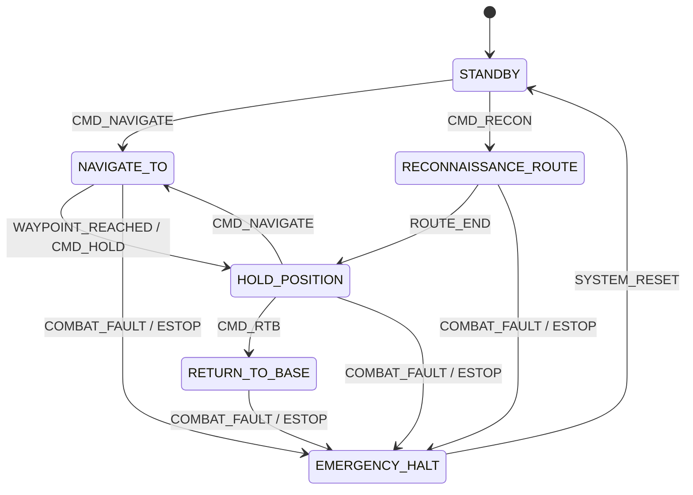

# Layer 7: Vehicle Interface Module - Architectural Technical Specification
**OMNIDRIVE Autonomous Driving AI System**  
**Document Version:** 2.4.0  
**Target Platform:** Tactical Military Vehicles, Autonomous Heavy Freight Trucks, Urban Robot Taxis  
**Classification:** Technical Architecture & System Specification  

---

## 1. Module Overview

### 1.1 Definition and Mission
The **Vehicle Interface Module** represents **Layer 7 (the final layer)** of the 7-layer OMNIDRIVE Autonomous Driving AI System architecture. Positioned at the boundary between software abstraction and physical hardware, Layer 7 is responsible for translating high-level, continuous trajectory decisions and control demands—such as target steering angle \(\alpha\), target acceleration/throttle \(a\), and target deceleration/braking \(b\)—into hardware-compliant, protocol-specific physical control signals.

```
+-----------------------------------------------------------------------------------+
|                            OMNIDRIVE 7-LAYER STACK                                |
+-----------------------------------------------------------------------------------+
|  Layer 7: VEHICLE INTERFACE MODULE (This Specification)                          |
|           Translates (α, a, b) into physical CAN / J1939 / JAUS / 1553 signals   |
+-----------------------------------------------------------------------------------+
|  Layer 6: System Safety, Redundancy, & Fail-Operational Control                   |
|  Layer 5: Vehicle Control & Actuation Interface (DBW Engine / Control Loops)      |
|  Layer 4: Trajectory Generation & Motion Planning                                 |
|  Layer 3: Behavioral Decision Engine & Motion Prediction                          |
|  Layer 2: World Model & Semantic Perception Engine (JEPA Foundation Model)       |
|  Layer 1: Sensor Fusion Module                                                    |
+-----------------------------------------------------------------------------------+
```

The mission of Layer 7 is to enforce deterministic, microsecond-accurate actuation while simultaneously extracting real-time kinematic and diagnostic feedback (wheel speeds, steering wheel angle, engine torque, brake line pressure, fault codes) from the underlying vehicle platforms.

### 1.2 Multi-Domain Target Analysis
OMNIDRIVE deploys across three distinct physical operational domains. Each domain exhibits unique physical dynamics, bus architecture requirements, safety standards, and protocol interfaces:

1. **Tactical Military Vehicles (GCV / UGVs):**
   - **Protocol Targets:** JAUS (Joint Architecture for Unmanned Systems - SAE AS6009/AS5684) over Ethernet/UDP, MIL-STD-1553 dual-redundant serial bus.
   - **Architectural Rationale:** Military platforms require survivability under harsh electromagnetic pulse (EMP) environments, electronic warfare (EW) jamming, and severe vibration. JAUS provides standardized inter-component messaging for autonomous ground vehicles, while MIL-STD-1553 provides deterministic, fault-tolerant avionics-grade bus communication.
   - **Actuation & Safety Nuances:** Wrench effort control (propulsive, steering, and resistive wrench vectors), silent electric drive switching, emergency combat abort signals, and leader-follower convoy state propagation.

2. **Autonomous Heavy Freight Trucks (Class 8 Highway Freight):**
   - **Protocol Target:** SAE J1939 over CAN 2.0B (500 kbps) or CAN-FD (1 Mbps / 5 Mbps data phase).
   - **Architectural Rationale:** Heavy freight trucks utilize high-capacity pneumatic braking systems and heavy-duty diesel or electric powertrains. Control must comply with commercial truck Parameter Group Numbers (PGNs) and Suspect Parameter Numbers (SPNs).
   - **Actuation & Safety Nuances:** Large pneumatic brake actuation delay (\(\approx 150-300\text{ ms}\)), engine retarder (Jake brake) torque integration, trailer coupling detection, jackknife prevention via differential wheel braking, and dynamic gross combined vehicle weight (GCVW) load compensation.

3. **Urban Robot Taxis (Pass-Thru Passenger Vehicles):**
   - **Protocol Targets:** Drive-by-Wire (DBW) CAN interfaces (Dataspeed, AutonomouStuff, or OEM-native DBW) alongside ISO 15765-4 OBD-II diagnostic links.
   - **Architectural Rationale:** Passenger vehicles demand smooth, human-like acceleration and steering profiles, precise low-speed maneuvering, and strict ISO 26262 ASIL-D functional safety compliance.
   - **Actuation & Safety Nuances:** Steer-by-wire angle/torque commands, pedal-by-wire position emulation, rapid driver override detection (torque sensors), OBD-II diagnostic fault code (DTC) monitoring, and passenger interface emergency stop handling.

### 1.3 Hardware Abstraction Layer (HAL) Design
To prevent domain-specific protocol details from leaking into the core AI planning and reinforcement learning models (Layers 2–5), Layer 7 incorporates a unified **Hardware Abstraction Layer (HAL)**. The HAL exposes a standardized Python/C++ interface (`IVehicleInterface`) that accepts abstract control vectors and returns unified vehicle state feedback structs.

```
                                  +---------------------------------------+
                                  |    Layer 5/6 AI Trajectory / Controller|
                                  +---------------------------------------+
                                                      |
                                     Abstract Vector u = [α, a, b, g, σ]ᵀ
                                                      v
                                  +---------------------------------------+
                                  |   IVehicleInterface (HAL Base Class)  |
                                  +---------------------------------------+
                                                      |
                    +---------------------------------+---------------------------------+
                    |                                 |                                 |
                    v                                 v                                 v
        +-----------------------+         +-----------------------+         +-----------------------+
        |  MilitaryHALInterface |         |   TruckHALInterface   |         | RobotaxiHALInterface  |
        +-----------------------+         +-----------------------+         +-----------------------+
        | - JAUS Engine         |         | - SAE J1939 Engine    |         | - Dataspeed / DBW     |
        | - MIL-STD-1553 BC/RT  |         | - Pneumatic Delay     |         | - OBD-II ISO 15765    |
        | - Convoy Sync         |         | - Trailer Manager     |         | - Passenger UI Stream |
        +-----------------------+         +-----------------------+         +-----------------------+
                    |                                 |                                 |
                    v                                 v                                 v
         MIL-STD-1553 / Ethernet                  CAN 2.0B / CAN-FD                  DBW CAN / OBD-II
```

#### Abstract Control Vector \(\mathbf{u}\)
The unified input vector passed down to Layer 7 is defined as:
$$\mathbf{u} = \begin{bmatrix} \alpha \\ a \\ b \\ g \\ \sigma \end{bmatrix} \in \mathbb{R}^5$$

Where:
- \(\alpha \in [-0.6108, +0.6108]\text{ rad}\) (Target front wheel steering angle, bounded by \(\pm 35^\circ\)).
- \(a \in [0.0, 1.0]\) (Normalized throttle / propulsive effort request).
- \(b \in [0.0, 1.0]\) (Normalized braking / deceleration effort request).
- \(g \in \{-1, 0, 1, 2, 3, 4, 5, 6\}\) (Target transmission gear: \(-1 = \text{Reverse}\), \(0 = \text{Neutral}\), \(1..6 = \text{Drive Gears}\)).
- \(\sigma \in \{0, 1, 2, 3\}\) (Turn signal indicator: \(0 = \text{Off}\), \(1 = \text{Left}\), \(2 = \text{Right}\), \(3 = \text{Hazard}\)).

---

## 2. Base CAN Bus Driver (`can_driver.py`)

### 2.1 Architecture and Python-CAN Library Setup
The base CAN driver (`can_driver.py`) provides high-throughput, low-latency, thread-safe access to physical and virtual CAN controllers using the `python-can` library. It supports multiple backend hardware interfaces including SocketCAN (Linux kernel-native), Kvaser, PEAK-System (PCAN), Vector XL API, and virtual CAN (`vcan0`).

```
+-----------------------------------------------------------------------------------+
|                              CAN DRIVER ARCHITECTURE                              |
+-----------------------------------------------------------------------------------+
|  +--------------------+      +----------------------+      +-------------------+  |
|  | Hardware Interface | ---> | Thread-Safe RX Queue | ---> | Async RX Callback |  |
|  | SocketCAN / PCAN   |      | SimpleQueue (Lock-free)|    | CANDecoder        |  |
|  +--------------------+      +----------------------+      +-------------------+  |
|            ^                                                                      |
|            |                 +----------------------+      +-------------------+  |
|            +---------------- | Thread-Safe TX Queue | <--- | High-Rate TX Loop |  |
|                              | PriorityQueue        |      | 100Hz Timed Thread|  |
|                              +----------------------+      +-------------------+  |
+-----------------------------------------------------------------------------------+
```

### 2.2 Bitrate Configuration
The CAN driver supports both classic CAN 2.0B (up to 8 payload bytes per frame) and CAN-FD (Flexible Data-Rate, up to 64 payload bytes per frame):
- **Standard CAN 2.0B:** Nominal Bitrate = **500 kbps** (Sample Point = 87.5%, Prop Segment = 23, Phase Seg 1 = 24, Phase Seg 2 = 7, SJW = 4).
- **CAN-FD:** Nominal Bitrate = **500 kbps**, Data Phase Bitrate = **1.0 Mbps** or **5.0 Mbps** (ISO 11898-1:2015 standard).

### 2.3 Read/Write Loops and Error Handling
The driver runs dual concurrent threads or asynchronous tasks:
1. **Transmit Loop (TX):** Operates at a deterministic 100 Hz frequency (10 ms period). Pops high-priority control frames from a lock-free queue and calls `bus.send(msg, timeout=0.002)`.
2. **Receive Loop (RX):** Non-blocking polling loop or event-driven socket handler reading incoming CAN frames into a ring buffer.

#### Bus Diagnostics and Fault Recovery
The driver actively monitors hardware controller states:
- **Error Active:** Normal operation.
- **Error Passive:** Transmit/Receive error counter exceeds 127. Logs warning and throttles non-essential messages.
- **Bus-Off State:** Transmit error counter exceeds 255. The driver automatically triggers a bus reset routine (`ip link set vcan0 type vcan restart-ms 100` or hardware re-initialization), clearing the TX queue to prevent stale frame transmission upon recovery.

---

## 3. CAN Encoder (`can_encoder.py`)

### 3.1 Mathematical Mapping & Encoding Rules
The CAN Encoder translates the continuous normalized control vector \(\mathbf{u} = [\alpha, a, b, g, \sigma]^T\) into integer bitfields packaged into 8-byte CAN payload arrays.

The linear quantization formula for converting a physical floating-point parameter \(P_{\text{phys}}\) into an unsigned raw integer \(I_{\text{raw}}\) is:
$$I_{\text{raw}} = \text{clamp}\left( \left\lfloor \frac{P_{\text{phys}} - \text{Offset}}{\text{Scale}} \right\rceil, I_{\min}, I_{\max} \right)$$

The inverse de-quantization formula used by the decoder is:
$$P_{\text{phys}} = (I_{\text{raw}} \times \text{Scale}) + \text{Offset}$$

### 3.2 Signal Packing Specifications

#### Frame ID `0x100` — DBW Steering Command (100 Hz)
- **Length:** 8 Bytes
- **Endianness:** Intel (Little Endian / LSB First)

| Bit Range | Signal Name | Length (Bits) | Data Type | Scale | Offset | Physical Min/Max | Unit |
| :--- | :--- | :--- | :--- | :--- | :--- | :--- | :--- |
| `0..15` | `STEER_ANGLE_CMD` | 16 | Unsigned | 0.0001 | -3.1416 | -3.1416 to +3.1416 | rad |
| `16..23` | `STEER_RATE_MAX` | 8 | Unsigned | 0.05 | 0.0 | 0.0 to 12.75 | rad/s |
| `24..24` | `STEER_ENABLE` | 1 | Boolean | 1.0 | 0.0 | 0 or 1 | bool |
| `25..25` | `STEER_CLEAR_FAULT`| 1 | Boolean | 1.0 | 0.0 | 0 or 1 | bool |
| `26..31` | `RESERVED_0` | 6 | Unsigned | 1.0 | 0.0 | 0 | - |
| `32..39` | `ROLLING_COUNTER` | 8 | Unsigned | 1.0 | 0.0 | 0 to 255 | count |
| `40..63` | `CHECKSUM_CRC8` | 24 | Unsigned | 1.0 | 0.0 | CRC-8-SAE J1850 | crc |

#### Frame ID `0x101` — DBW Throttle & Brake Command (100 Hz)
- **Length:** 8 Bytes
- **Endianness:** Intel (Little Endian)

| Bit Range | Signal Name | Length (Bits) | Data Type | Scale | Offset | Physical Min/Max | Unit |
| :--- | :--- | :--- | :--- | :--- | :--- | :--- | :--- |
| `0..11` | `THROTTLE_CMD` | 12 | Unsigned | 0.00025 | 0.0 | 0.0 to 1.0 (0-100%) | ratio |
| `12..12` | `THROTTLE_ENABLE` | 1 | Boolean | 1.0 | 0.0 | 0 or 1 | bool |
| `13..15` | `RESERVED_1` | 3 | Unsigned | 1.0 | 0.0 | 0 | - |
| `16..27` | `BRAKE_CMD` | 12 | Unsigned | 0.00025 | 0.0 | 0.0 to 1.0 (0-100%) | ratio |
| `28..28` | `BRAKE_ENABLE` | 1 | Boolean | 1.0 | 0.0 | 0 or 1 | bool |
| `29..29` | `EMERGENCY_BRAKE` | 1 | Boolean | 1.0 | 0.0 | 0 or 1 | bool |
| `30..31` | `RESERVED_2` | 2 | Unsigned | 1.0 | 0.0 | 0 | - |
| `32..39` | `GEAR_CMD` | 8 | Unsigned | 1.0 | -1.0 | -1 to 6 (R, N, D1..D6)| gear |
| `40..47` | `TURN_SIGNAL_CMD` | 8 | Unsigned | 1.0 | 0.0 | 0=Off,1=L,2=R,3=Hzd | enum |
| `48..55` | `ROLLING_COUNTER` | 8 | Unsigned | 1.0 | 0.0 | 0 to 255 | count |
| `56..63` | `CHECKSUM` | 8 | Unsigned | 1.0 | 0.0 | XOR Checksum | crc |

### 3.3 Example CAN Frame Byte Layout Breakdown
Consider a command request:
- Target Steering Angle \(\alpha = +0.1745\text{ rad}\) (\(+10.0^\circ\))
- Steering Rate Limit \(\dot{\alpha}_{\max} = 1.5708\text{ rad/s}\) (\(90^\circ/\text{s}\))
- Steer Enable = `True`
- Rolling Counter = `42`

#### Calculation:
1. `STEER_ANGLE_CMD` raw: \(\frac{0.1745 - (-3.1416)}{0.0001} = \frac{3.3161}{0.0001} = 33161 = \text{0x8189}\)
2. `STEER_RATE_MAX` raw: \(\frac{1.5708}{0.05} = 31.416 \approx 31 = \text{0x1F}\)
3. `STEER_ENABLE` bit: `1` at bit position 24.
4. Payload Byte Packing (Little Endian):
   - Byte 0: `0x89` (LSB of Angle)
   - Byte 1: `0x81` (MSB of Angle)
   - Byte 2: `0x1F` (Rate Limit)
   - Byte 3: `0x01` (Enable flag = 1)
   - Byte 4: `0x00` (Reserved)
   - Byte 5: `0x2A` (Rolling Counter = 42 = `0x2A`)
   - Byte 6: `0x00` (Reserved)
   - Byte 7: `0x3E` (Calculated CRC-8 byte)

Final CAN Frame Representation:
```
ID: 0x00000100   DLC: 8   Data: [ 0x89, 0x81, 0x1F, 0x01, 0x00, 0x2A, 0x00, 0x3E ]
```

---

## 4. CAN Decoder (`can_decoder.py`)

### 4.1 Vehicle Feedback Processing
The CAN Decoder captures real-time feedback frames emitted by vehicle sensors, wheel encoders, steering column transducers, and brake pressure sensors. Decoded telemetry parameters are structured into the standardized `VehicleTelemetry` data class.

#### Key Telemetry CAN Frames List
- **Frame ID `0x200` — Steering Feedback:** Actual steering wheel angle, steering torque, driver override state.
- **Frame ID `0x201` — Speed & Wheel Telemetry:** Vehicle longitudinal velocity, individual 4-wheel pulse/speed counters.
- **Frame ID `0x202` — Brake & Powertrain Telemetry:** Master cylinder hydraulic pressure, actual engine torque, transmission gear status.

### 4.2 Signal Decoding Specifications

#### Frame ID `0x201` — Wheel Speed & Vehicle Velocity Feedback (100 Hz)
- **Length:** 8 Bytes | **Endianness:** Intel

| Bit Range | Signal Name | Length (Bits) | Scale | Offset | Unit | Formula |
| :--- | :--- | :--- | :--- | :--- | :--- | :--- |
| `0..15` | `VEHICLE_SPEED` | 16 | 0.01 | 0.0 | m/s | \(v = I_{\text{raw}} \times 0.01\) |
| `16..27` | `WHEEL_SPEED_FL` | 12 | 0.02 | 0.0 | rad/s | \(\omega_{fl} = I_{\text{raw}} \times 0.02\) |
| `28..39` | `WHEEL_SPEED_FR` | 12 | 0.02 | 0.0 | rad/s | \(\omega_{fr} = I_{\text{raw}} \times 0.02\) |
| `40..51` | `WHEEL_SPEED_RL` | 12 | 0.02 | 0.0 | rad/s | \(\omega_{rl} = I_{\text{raw}} \times 0.02\) |
| `52..63` | `WHEEL_SPEED_RR` | 12 | 0.02 | 0.0 | rad/s | \(\omega_{rr} = I_{\text{raw}} \times 0.02\) |

### 4.3 Concrete Raw Decoding Example
Raw CAN Frame received from bus:
```
ID: 0x00000201   DLC: 8   Data: [ 0xC8, 0x09, 0x64, 0x05, 0x56, 0x04, 0x54, 0x04 ]
```

#### Step-by-Step Field Extraction:
1. `VEHICLE_SPEED`: Bytes [0:2] = `0x09C8` = 2504.
   $$\text{Speed} = 2504 \times 0.01 = 25.04\text{ m/s} \quad (\approx 90.14\text{ km/h})$$
2. `WHEEL_SPEED_FL`: Bits [16..27] from Bytes [2:4] \(\rightarrow\) `0x0564` = 1380.
   $$\omega_{fl} = 1380 \times 0.02 = 27.60\text{ rad/s}$$
3. `WHEEL_SPEED_FR`: Bits [28..39] \(\rightarrow\) `0x0456` = 1110.
   $$\omega_{fr} = 1110 \times 0.02 = 22.20\text{ rad/s}$$
4. Decoded Dataclass Output:
   ```python
   VehicleTelemetry(
       speed_mps=25.04,
       wheel_speed_fl=27.60,
       wheel_speed_fr=22.20,
       wheel_speed_rl=27.52,
       wheel_speed_rr=27.52,
       timestamp_us=1723254609123456
   )
   ```

---

## 5. MILITARY INTERFACE: JAUS Interface (`jaus_interface.py`)

### 5.1 Architecture & SAE AS6009/AS5684 Standard
The **Joint Architecture for Unmanned Systems (JAUS)** is the mandatory open architecture for US Department of Defense (DoD) ground vehicles. `jaus_interface.py` encapsulates high-level AI motion demands into standardized JAUS protocol data units (PDUs) transported via UDP over Ethernet (default port `3794`).

### 5.2 Addressing Structure
JAUS utilizes a hierarchical 32-bit logical address space:
- **Subsystem ID (16 bits):** Identifies the overall vehicle platform (e.g., `100` = Tactical Unmanned Ground Vehicle #1).
- **Node ID (8 bits):** Identifies specific processing nodes (e.g., `1` = Mobility Controller Node).
- **Component ID (8 bits):** Identifies distinct software services (e.g., `1` = Primitive Driver, `2` = Waypoint Driver, `3` = Global Pose Sensor).

Address String Format: `SubsystemID : NodeID : ComponentID` (e.g., `100:1:1`).

### 5.3 JAUS Transport Header Structure (20 Bytes)

```
 0                   1                   2                   3
 0 1 2 3 4 5 6 7 8 9 0 1 2 3 4 5 6 7 8 9 0 1 2 3 4 5 6 7 8 9 0 1
+-+-+-+-+-+-+-+-+-+-+-+-+-+-+-+-+-+-+-+-+-+-+-+-+-+-+-+-+-+-+-+-+
|       Message Properties      |          Command ID           |
+-+-+-+-+-+-+-+-+-+-+-+-+-+-+-+-+-+-+-+-+-+-+-+-+-+-+-+-+-+-+-+-+
|     Destination Subsystem     | Destination Node| Dest Comp   |
+-+-+-+-+-+-+-+-+-+-+-+-+-+-+-+-+-+-+-+-+-+-+-+-+-+-+-+-+-+-+-+-+
|        Source Subsystem       |    Source Node  | Source Comp |
+-+-+-+-+-+-+-+-+-+-+-+-+-+-+-+-+-+-+-+-+-+-+-+-+-+-+-+-+-+-+-+-+
|         Data Size (bytes)     |        Sequence Number        |
+-+-+-+-+-+-+-+-+-+-+-+-+-+-+-+-+-+-+-+-+-+-+-+-+-+-+-+-+-+-+-+-+
|                       PAYLOAD DATA (...)                      |
+-+-+-+-+-+-+-+-+-+-+-+-+-+-+-+-+-+-+-+-+-+-+-+-+-+-+-+-+-+-+-+-+
```

### 5.4 Implemented JAUS Messages Table

| JAUS Message Name | Command ID (Hex) | Message Type | Service | Key Fields & Physical Meanings |
| :--- | :--- | :--- | :--- | :--- |
| `SetWrenchEffort` | `0x0405` | Command | Primitive Driver | Steering Wrench (-100% to +100%), Propulsive Wrench (0 to 100%), Resistive/Brake Wrench (0 to 100%). |
| `SetDesiredTravelSpeed`| `0x040A` | Command | Velocity Driver | Desired Speed (m/s, 32-bit float), Max Acceleration (\(\text{m/s}^2\)), Max Deceleration (\(\text{m/s}^2\)). |
| `SetElement` | `0x041F` | Command | Waypoint Driver | Element ID, Next Element ID, Target Latitude/Longitude/Altitude, Target Speed. |
| `ExecuteList` | `0x041E` | Command | Waypoint Driver | Speed (m/s), Starting Element ID. Triggers autonomous path execution. |
| `ReportWrenchEffort` | `0x4405` | Query Resp | Primitive Driver | Feedback of actual current wrench effort vectors applied to drivetrain. |

---

## 6. MILITARY INTERFACE: MIL-STD-1553 Driver (`mil_std_1553_driver.py`)

### 6.1 Avionics Bus Architecture & Operational Modes
MIL-STD-1553B is a deterministic, 1 Mbps differential serial bus utilizing dual-redundant transmission lines (Bus A and Bus B) with Manchester II biphase encoding. The driver supports three hardware operation modes:
1. **Bus Controller (BC):** Initiates all message transfers, enforces 100 Hz frame scheduling, and polls terminals.
2. **Remote Terminal (RT):** Responds to BC commands, interface node for vehicle actuators and sub-systems.
3. **Bus Monitor (BM / MT):** Passively captures bus traffic for black-box flight recording and diagnostic logging.

```
                  +----------------------------------------------+
                  |            BUS CONTROLLER (BC)               |
                  |        OMNIDRIVE Tactical Computer           |
                  +----------------------------------------------+
                         |                            |
                 Bus A   |                            |   Bus B (Redundant)
              +----------+----------------------------+----------+
              |                                                  |
     +-----------------+                                +-----------------+
     | Remote Terminal |                                | Remote Terminal |
     |  RT 1 (Drive)   |                                | RT 2 (Turret)   |
     +-----------------+                                +-----------------+
```

### 6.2 Word Structure and Message Scheduling
MIL-STD-1553 uses 20-bit words (3 bits sync + 16 bits data/command/status + 1 bit parity):
- **Command Word:** `[ 5-bit RT Addr | 1-bit T/R | 5-bit Subaddress | 5-bit Data Word Count ]`
- **Data Word:** `[ 16-bit Payload Data ]`
- **Status Word:** `[ 5-bit RT Addr | Message Error | Busy | Subsystem Flag | Terminal Flag ]`

#### Frame Schedule (100 Hz Cycle / 10 ms Minor Frame)
- **Minor Frame Window T = 0.0 ms:** Send BC-to-RT Command (RT 1, Subaddress 2 - Actuator Vector).
- **Minor Frame Window T = 2.5 ms:** Receive RT-to-BC Response (RT 1, Subaddress 1 - Kinematic Feedback).
- **Minor Frame Window T = 5.0 ms:** Health Monitoring & Status Word Check.
- **Timing Requirement:** RT Response Time must be strictly within **4.0 to 12.0 microseconds**. If no status response within 14.0 \(\mu\text{s}\), auto-failover switches bus transaction to **Bus B**.

---

## 7. MILITARY INTERFACE: Mission Controller (`mission_controller.py`)

### 7.1 Tactical Mission State Machine
`mission_controller.py` provides high-level tactical autonomy mode handling for military ground platforms.



### 7.2 Mission Command Definitions

1. `NAVIGATE_TO`:
   - **Target Parameters:** Target UTM coordinates \((E, N)\), max velocity \(v_{\max}\), sector tolerance \(\delta_{\text{reach}}\).
   - **Behavior:** Executes dynamic obstacle avoidance, terrain-aware path planning, and direct speed control.
2. `HOLD_POSITION`:
   - **Target Parameters:** Lock radius \(R_{\text{lock}} = 1.0\text{ m}\), orientation heading \(\psi_{\text{target}}\).
   - **Behavior:** Locks hydraulic/parking brakes, maintains stationary position, feeds pose stabilization data to weapon/turret mounts.
3. `RECONNAISSANCE_ROUTE`:
   - **Target Parameters:** Polyline waypoints array, noise signature limit, thermal emissions profile mode.
   - **Behavior:** Forces silent electric drive operation (if available), restricts maximum acceleration to avoid acoustic detection, dims vehicle lighting.
4. `RETURN_TO_BASE`:
   - **Target Parameters:** Base rally point coordinate, backtrack safety history buffer.
   - **Behavior:** Reverses trajectory path history to safely retreat along previously verified safe corridors.
5. `EMERGENCY_HALT`:
   - **Target Parameters:** Immediate hardware panic signal.
   - **Behavior:** Maximum effort panic deceleration, zero engine throttle, battery disengagement, weapon system safety lock.

---

## 8. MILITARY INTERFACE: Convoy Mode (`convoy_mode.py`)

### 8.1 Leader-Follower Dynamic Spacing Control
Convoy Mode manages multi-vehicle tactical platoon formations using high-rate inter-vehicle RF communication (DSRC / 5.9 GHz Tactical SDR) paired with forward LiDAR/RADAR tracking.

```
+---------------+     V2V Radio (100Hz)     +---------------+     V2V Radio (100Hz)     +---------------+
| LEADER VEHICLE| ------------------------> | FOLLOW1 (UGV) | ------------------------> | FOLLOW2 (UGV) |
+---------------+                           +---------------+                           +---------------+
       |                                           |                                           |
       v                                           v                                           v
   (Paces Path)                             Gap d_target(v)                             Gap d_target(v)
```

#### Dynamic Gap Policy Equation
The target inter-vehicle distance \(d_{\text{target}}\) is calculated dynamically based on current velocity \(v\) and road friction estimate \(\hat{\mu}\):
$$d_{\text{target}}(v, \hat{\mu}) = d_0 + h \cdot v + \frac{v^2}{2 \mu g}$$

Where:
- \(d_0 = 10.0\text{ m}\) (Minimum static stand-off gap).
- \(h = 0.8\text{ s}\) (Time headway constant).
- Maximum permissible convoy gap = **30.0 m**; Minimum gap = **10.0 m**.

### 8.2 Speed Synchronization & Emergency Propagation
- **Feedforward Leader Control:** The follower's speed command incorporates the leader's instantaneous broadcast acceleration \(a_{\text{leader}}\):
  $$a_{\text{cmd}} = K_p (d_{\text{actual}} - d_{\text{target}}) + K_d (v_{\text{leader}} - v_{\text{follower}}) + a_{\text{leader}}$$
- **Emergency Convoy Halt Propagation:** When any vehicle in the formation triggers an emergency brake event, an ultra-priority V2V broadcast packet (`CONVOY_EMERGENCY_HALT_BROADCAST`) is transmitted. All downstream followers receive this packet in **\(< 5\text{ ms}\)** and execute immediate maximum braking simultaneously, eliminating the reaction-time delay inherent in human convoys.

---

## 9. TRUCK INTERFACE: SAE J1939 Interface (`j1939_interface.py`)

### 9.1 Heavy Truck Protocol Principles
SAE J1939 is the standard protocol for commercial heavy-duty trucks (Class 7 and 8). It runs over CAN 2.0B using 29-bit extended frame identifiers.

#### 29-Bit Identifier Bit Breakdown

```
 28 26 25 24 23             16 15              8 7               0
+-----+--+--+-----------------+-----------------+-----------------+
| Pri |R |DP| PDU Format (PF) | PDU Specific(PS)|Source Address(SA|
+-----+--+--+-----------------+-----------------+-----------------+
 3 bits 1 1      8 bits            8 bits            8 bits
```

- **Priority (3 bits):** Message urgency (`0` = Highest, `6` = Standard, `7` = Lowest).
- **Parameter Group Number (PGN):** 18-bit number composed of Reserved (1 bit) + Data Page (1 bit) + PDU Format (8 bits) + PDU Specific (8 bits).
- **Source Address (SA):** 8-bit identifier (`0x00` = Engine #1, `0x03` = Transmission, `0x0B` = Brake Controller / ABS, `0x27` = Autonomous Main Controller).

### 9.2 Critical J1939 Parameter Group Numbers (PGNs)

#### 1. EEC1 — Electronic Engine Controller 1 (PGN 61444 / `0x00F004`)
- **Default Priority:** 3 | **Rate:** 10 ms (100 Hz) | **Source Address:** Engine (`0x00`)
- **Key Parameters:**
  - `SPN 190` Engine Speed (RPM): Scale = 0.125 RPM/bit, Offset = 0. Range: 0 to 8031.875 RPM.
  - `SPN 512` Driver's Demand Engine Torque (%): Scale = 1.0 %/bit, Offset = -125 %.

#### 2. TC1 — Transmission Control 1 (PGN 256 / `0x000100`)
- **Default Priority:** 2 | **Rate:** 50 ms (20 Hz) | **Source Address:** Transmission (`0x03`)
- **Key Parameters:**
  - `SPN 525` Gear Shift Request: Offset = -125. Values: `-125` = N, `-124` = R, `1..6` = Forward Gears.

#### 3. CCVS — Cruise Control / Vehicle Speed (PGN 65265 / `0x00FEF1`)
- **Default Priority:** 6 | **Rate:** 100 ms (10 Hz) | **Source Address:** Vehicle ECU (`0xFE`)
- **Key Parameters:**
  - `SPN 84` Wheel-Based Vehicle Speed: Scale = \(\frac{1}{256}\) km/h per bit = 0.00390625 km/h.
  - `SPN 597` Brake Switch: 2 bits (00 = Off, 01 = On, 10 = Error, 11 = Unavailable).

#### 4. ERC1 — Electronic Retarder Controller 1 (PGN 61440 / `0x00F000`)
- **Default Priority:** 6 | **Rate:** 100 ms (10 Hz) | **Source Address:** Retarder (`0x0F`)
- **Key Parameters:**
  - `SPN 520` Actual Engine Retarder Torque (%): Scale = 1.0 %/bit, Offset = -125 %.

---

## 10. TRUCK INTERFACE: PGN Definitions (`j1939_pgn_definitions.py`)

Below is the complete reference table of all SAE J1939 PGNs and SPNs implemented within the OMNIDRIVE heavy truck interface layer:

| PGN (Hex) | PGN (Dec) | PGN Name | Priority | SPN | Suspect Parameter Name | Bit Range | Length (Bits) | Resolution / Scaling | Offset | Physical Data Range | Default Rate (ms) |
| :--- | :--- | :--- | :--- | :--- | :--- | :--- | :--- | :--- | :--- | :--- | :--- |
| `0x00F004` | 61444 | `EEC1` | 3 | 190 | Engine Speed | `24..39` | 16 | 0.125 RPM/bit | 0.0 | 0 to 8031.875 RPM | 10 |
| `0x00F004` | 61444 | `EEC1` | 3 | 512 | Driver Demand Torque | `8..15` | 8 | 1.0 %/bit | -125.0 | -125% to +125% | 10 |
| `0x00F004` | 61444 | `EEC1` | 3 | 513 | Actual Engine Torque | `16..23` | 8 | 1.0 %/bit | -125.0 | -125% to +125% | 10 |
| `0x000100` | 256 | `TC1` | 2 | 525 | Requested Gear | `0..7` | 8 | 1.0 gear/bit | -125.0 | -125 to 125 | 50 |
| `0x000100` | 256 | `TC1` | 2 | 523 | Current Gear | `8..15` | 8 | 1.0 gear/bit | -125.0 | -125 to 125 | 50 |
| `0x00FEF1` | 65265 | `CCVS` | 6 | 84 | Wheel Vehicle Speed | `8..23` | 16 | 0.00390625 km/h | 0.0 | 0 to 250.99 km/h | 100 |
| `0x00FEF1` | 65265 | `CCVS` | 6 | 597 | Brake Switch State | `3->4` | 2 | Bitfield | 0.0 | 00=Off, 01=On | 100 |
| `0x00FEF1` | 65265 | `CCVS` | 6 | 598 | Clutch Switch State | `5->6` | 2 | Bitfield | 0.0 | 00=Off, 01=On | 100 |
| `0x00F000` | 61440 | `ERC1` | 6 | 520 | Actual Retarder Torque | `8..15` | 8 | 1.0 %/bit | -125.0 | -125% to +125% | 100 |
| `0x00F000` | 61440 | `ERC1` | 6 | 1080 | Retarder Enable Switch | `0->1` | 2 | Bitfield | 0.0 | 00=Off, 01=On | 100 |
| `0x00FEBF` | 65215 | `EBC1` | 2 | 561 | ASR Engine Control | `0->1` | 2 | Bitfield | 0.0 | 00=Off, 01=Active | 20 |
| `0x00FEBF` | 65215 | `EBC1` | 2 | 562 | ASR Brake Control | `2->3` | 2 | Bitfield | 0.0 | 00=Off, 01=Active | 20 |
| `0x00FEE6` | 65254 | `TCO1` | 6 | 1612 | Tachometer Speed | `48..63` | 16 | 0.00390625 km/h | 0.0 | 0 to 250.99 km/h | 50 |

---

## 11. TRUCK INTERFACE: Trailer Manager (`trailer_manager.py`)

### 11.1 Pneumatic Brake Delay & Coupling Detection
Class 8 trucks control trailer brakes via pneumatic air lines (Service & Supply lines). Air pressure propagation from the tractor foot valve to the rear trailer relay valve introduces a significant transportation delay:
$$\Delta t_{\text{air}} \approx 150\text{ ms} \text{ to } 300\text{ ms}$$

`trailer_manager.py` compensates for this by applying a predictive lead torque/pressure command to the trailer brake control valve prior to initiating primary tractor service braking. Trailer connection status is detected via J1939 EBS messages (PGN 65259) or physical pin voltage sense on the ISO 1185 7-pin connector.

### 11.2 Jackknife Prevention Logic

```
               TRACTOR YAW RATE ω_tractor
                     \      /
                      \    /
                       \  / 
                        \/    HITCH ANGLE γ
                        /\
                       /  \
                      /    \
                     /      \
               TRAILER YAW RATE ω_trailer
```

A jackknife occurs when the articulation angle \(\gamma\) between tractor and trailer grows unstable due to trailer push under heavy braking or rear-wheel lockup.

#### Articulation Kinematics
$$\dot{\gamma} = \omega_{\text{tractor}} - \omega_{\text{trailer}}$$

#### Active Stabilization Algorithm
When the Jackknife Index \(J_{\text{risk}} = |\gamma| + k_{\omega} |\dot{\gamma}|\) exceeds critical threshold \(J_{\text{crit}} = 0.35\text{ rad}\) (\(\approx 20^\circ\)):
1. **Immediate Retarder Disengagement:** Disable engine retarder (Jake brake) to unlock tractor drive axle wheels.
2. **Trailer Brake Bias:** Apply direct electric/pneumatic pressure to trailer brakes (*"pulling the combination straight"*).
3. **Differential Engine Torque Control:** Reduce engine throttle to zero and apply mild counter-steering assistance.

### 11.3 Turning Radius Swept Path Compensation
When a trailer is attached, the rear trailer wheels cut inside the arc of the tractor front wheels (off-tracking). The swept path width \(W_{\text{swept}}\) is computed as:
$$W_{\text{swept}} = \sqrt{R_{\text{front}}^2 + L_{\text{trailer}}^2 - L_{\text{tractor}}^2} - R_{\text{front}}$$

`trailer_manager.py` dynamically pushes these modified swept bounds into Layer 4 (Motion Planning) to prevent curb mounting and collision with adjacent lane infrastructure.

---

## 12. TRUCK INTERFACE: Load Compensation (`load_compensation.py`)

### 12.1 Real-Time Weight Estimation Algorithm
Heavy truck payload can vary by up to 25,000 kg (from empty tare weight of 15,000 kg to loaded GCVW of 40,000 kg). The Load Compensation module estimates total mass \(\hat{m}_{\text{total}}\) in real time using a recursive least squares (RLS) filter on vehicle dynamics:

$$F_{\text{drive}} - F_{\text{drag}} - F_{\text{rolling}} - m_{\text{total}} g \sin \theta = m_{\text{total}} \cdot a_{\text{measured}}$$

Solving for \(\hat{m}_{\text{total}}\):
$$\hat{m}_{\text{total}} = \frac{F_{\text{drive}} - \frac{1}{2} \rho C_d A v^2 - C_{rr} m_{\text{tare}} g \cos \theta}{a_{\text{measured}} + g \sin \theta}$$

Where \(\theta\) is pitch angle from IMU, \(F_{\text{drive}}\) is computed from J1939 EEC1 actual engine torque, and \(a_{\text{measured}}\) is filtered longitudinal acceleration.

### 12.2 Adaptive Control Curve Adjustments
Once \(\hat{m}_{\text{total}}\) is updated, `load_compensation.py` scales control parameter maps:

1. **Braking Distance Scaling:**
   $$d_{\text{stop}}(v, m) = d_{\text{base}}(v) \times \left(1.0 + \kappa_{\text{load}} \frac{\hat{m}_{\text{total}} - m_{\text{tare}}}{m_{\text{tare}}}\right)$$
2. **Throttle Gain Map:** Increases throttle demand gradient under heavy load to prevent engine lugging during slope ascent.
3. **Transmission Shift Points:** Raises shift RPM thresholds on heavy payloads to keep the engine within peak torque band (1200–1500 RPM).

---

## 13. ROBOTAXI INTERFACE: OBD-II Interface (`obd2_interface.py`)

### 13.1 ISO 15765-4 Diagnostic Bus Protocol
The OBD-II interface communicates via standard 11-bit CAN frame IDs (`0x7DF` functional query, `0x7E0` ECU target, `0x7E8` ECU response). It provides diagnostic telemetry and monitors vehicle emission/powertrain fault codes.

### 13.2 Polled OBD-II Parameter IDs (PIDs)

| Mode | PID (Hex) | Parameter Description | Scaling Formula | Min/Max Range | Polling Rate |
| :--- | :--- | :--- | :--- | :--- | :--- |
| `01` | `05` | Engine Coolant Temp | \(T = A - 40\) | -40°C to +215°C | 1 Hz |
| `01` | `0C` | Engine RPM | \(\text{RPM} = \frac{256 A + B}{4}\) | 0 to 16,383.75 RPM | 10 Hz |
| `01` | `0D` | Vehicle Speed | \(v = A\) | 0 to 255 km/h | 10 Hz |
| `01` | `11` | Throttle Position | \(\% = \frac{100 A}{255}\) | 0 to 100% | 10 Hz |
| `01` | `42` | Control Module Voltage | \(V = \frac{256 A + B}{1000}\) | 0 to 65.535 V | 2 Hz |
| `01` | `5B` | Hybrid Battery Remaining Life | \(\% = \frac{100 A}{255}\) | 0 to 100% | 1 Hz |

### 13.3 Diagnostic Trouble Code (DTC) Management
- **Mode 03:** Read Stored Diagnostic Trouble Codes.
- **Mode 07:** Read Pending Diagnostic Trouble Codes.
- **Mode 0A:** Read Permanent Diagnostic Trouble Codes.
- **Mode 04:** Clear Diagnostic Trouble Codes (requires explicit safety admin override).

#### DTC Escalation Matrix
- **Informational DTCs (e.g., `P0420` Catalyst Efficiency):** Log alert to fleet manager; continue normal operation.
- **Critical Powertrain DTCs (e.g., `P0562` System Voltage Low):** Trigger safe pull-over maneuver within 60 seconds.
- **Fatal Safety DTCs (e.g., `C0035` Wheel Speed Sensor Circuit Fault):** Immediate transition to Layer 6 emergency safe stop.

---

## 14. ROBOTAXI INTERFACE: Drive-by-Wire Driver (`dbw_driver.py`)

### 14.1 Dataspeed / AutonomouStuff DBW Kit Integration
`dbw_driver.py` communicates directly with aftermarket drive-by-wire hardware layers (such as Dataspeed ADAS Kit installed on Chrysler Pacifica, Lexus RX450h, or Hyundai Ioniq 5).

### 14.2 Command & State Handshake Protocol

```
+---------------+      Enable Cmd (0x100)      +---------------+
| OMNIDRIVE AI  | ---------------------------> |   DBW ECU     |
+---------------+                              +---------------+
        ^                                              |
        |             Report Frame (0x200)             |
        +----------------------------------------------+
```

#### DBW State Machine
1. `DISENGAGED`: System inactive; manual human driver has 100% control.
2. `ENABLING`: Requesting DBW actuation; checking safety interlocks.
3. `ENGAGED`: Fully autonomous; drive-by-wire executing AI steering, throttle, and brake commands.
4. `OVERRIDDEN`: Human driver pressed brake pedal (\(F > 15\text{ N}\)), depressed throttle (\(> 12\%\)), or applied steering torque (\(T > 3.0\text{ Nm}\)). DBW immediately releases control to human.
5. `FAULT`: DBW ECU detected internal hardware error or missing CAN command heartbeat.

---

## 15. ROBOTAXI INTERFACE: Passenger Interface (`passenger_interface.py`)

### 15.1 In-Cabin Display Data Stream
`passenger_interface.py` maintains an asynchronous JSON-WebSocket / MQTT stream to the passenger infotainment screen mounted in the rear cabin.

#### Telemetry Payload Schema
```json
{
  "timestamp": 1723254609.123,
  "vehicle_state": "AUTONOMOUS",
  "current_speed_mps": 11.2,
  "speed_limit_mps": 13.4,
  "destination_name": "San Francisco International Airport - Terminal 2",
  "next_stop_name": "Market St & 4th St",
  "eta_seconds": 485,
  "distance_remaining_m": 3420.5,
  "passenger_alerts": []
}
```

### 15.2 Physical and Digital Emergency Button Handling
The passenger interface monitors two emergency button inputs:
1. **Physical Cabin E-Stop Button:** Hardware GPIO pin interrupt line on passenger overhead console.
2. **Digital Touchscreen E-Stop Button:** Touch UI event over WebSocket.

#### Emergency Activation Response Protocol
Upon detection of E-Stop button press:
1. Play immediate high-priority audio alert chime in cabin (*"Emergency Stop Requested. Vehicle pulling over safely."*).
2. Transmit immediate priority interrupt to `SafetySupervisor`.
3. Command vehicle hazard light actuation (\(\sigma = 3\)).
4. Initiate smooth, controlled deceleration pull-over maneuver to curb side (\(a = -1.5\text{ m/s}^2\)).

---

## 16. System Safety Layer (`safety_layer.py`)

### 16.1 Command Rate Limiting
To prevent mechanical damage, vehicle instability, or passenger injury, `SafetySupervisor` enforces strict rate limits on control input derivatives:

1. **Maximum Steering Angular Rate:**
   $$|\dot{\alpha}| \le \dot{\alpha}_{\max} = 5.23598\text{ rad/s} \quad (300.0^\circ/\text{s})$$
2. **Maximum Throttle Application Rate (Jerk Control):**
   $$|\dot{a}| \le \dot{a}_{\max} = 2.0\text{ s}^{-1} \quad (100\% \text{ throttle applied over } 0.5\text{ s})$$
3. **Maximum Brake Rate:**
   $$|\dot{b}| \le \dot{b}_{\max} = 5.0\text{ s}^{-1} \quad (100\% \text{ brake applied over } 0.2\text{ s})$$

### 16.2 Range Validation & Sanity Checks
Every incoming command is verified prior to bus transmission:
- Reject `NaN`, `Inf`, or `Null` inputs.
- Clamp values outside allowed physical bounds (\(\alpha \in [-0.61, +0.61]\), \(a \in [0, 1]\), \(b \in [0, 1]\)).
- Cross-validate simultaneous throttle and brake requests: If \(a > 0.05\) and \(b > 0.05\) simultaneously, override throttle to \(0.0\) (Brake-Over-Throttle safety rule).

### 16.3 Watchdog Heartbeat Supervision
Layer 7 requires continuous receipt of control commands at 100 Hz (10 ms period). A high-resolution hardware/software timer checks command elapsed time \(\Delta t_{\text{cmd}}\):

```
+-----------------------------------------------------------------------------------+
|                            WATCHDOG TIMEOUT DECAY MATRIX                          |
+-----------------------------------------------------------------------------------+
|  Δt < 100ms   : NORMAL OPERATION (Execute AI commands)                            |
|  100ms ≤ Δt < 250ms : LEVEL 1 WARNING (Hold last safe command, log warning)       |
|  250ms ≤ Δt < 500ms : LEVEL 2 DECAY (Ramp throttle to 0.0, apply mild brake 0.1)  |
|  Δt ≥ 500ms   : LEVEL 3 HARD TIMEOUT (Disengage DBW, Maximum Safe Deceleration)  |
+-----------------------------------------------------------------------------------+
```

---

## 17. Hardware Compatibility Table

Below is the production compatibility matrix for vehicle chassis, bus types, and actuation platforms supported by OMNIDRIVE out-of-the-box:

| Vehicle Target Profile | Vehicle Chassis Models | Physical Bus Interface | Bus Protocol | Primary DBW / Actuation Hardware | Typical Bus Baud Rate | Roundtrip Latency (ms) |
| :--- | :--- | :--- | :--- | :--- | :--- | :--- |
| **Tactical Military** | Oshkosh JLTV / M113 UGV | Ethernet / RS-422 | JAUS (SAE AS6009/AS5684) | Autonomous Main Interface ECU | 100 Mbps / 1 Gbps | 2.5 - 5.0 ms |
| **Tactical Military** | General Dynamics UGV / Combat | MIL-STD-1553B Dual | MIL-STD-1553 Command/Status | Avionics Sub-system RT Node | 1.0 Mbps | 0.5 - 1.2 ms |
| **Heavy Freight Truck**| Peterbilt 579 / Kenworth T680 | Dual CAN 2.0B / CAN-FD | SAE J1939 (29-bit PGNs) | Knorr-Bremse / Wabco EBS + Retarder | 500 kbps / 2 Mbps | 8.0 - 15.0 ms |
| **Heavy Freight Truck**| Volvo FH16 / Freightliner | CAN-FD / Automotive Eth | SAE J1939-21 / SOME/IP | Volvo Dynamic Steering (VDS) + Retarder | 1 Mbps / 5 Mbps | 5.0 - 10.0 ms |
| **Urban Robotaxi** | Chrysler Pacifica Hybrid | Dual High-Speed CAN | Dataspeed DBW CAN Protocol | Dataspeed ADAS Drive-by-Wire Kit | 500 kbps | 3.0 - 6.0 ms |
| **Urban Robotaxi** | Lexus RX450h / Hyundai Ioniq 5 | CAN 2.0B + ISO 15765 | AutonomouStuff DBW + OBD-II | AutonomouStuff PACMod 3.0 DBW Kit | 500 kbps | 4.0 - 7.0 ms |

---

## 18. Configuration Parameters per Vehicle Type

Configuration files are structured as YAML documents loaded at runtime based on the target vehicle profile:

### 18.1 Military Profile Configuration (`military_jltv_config.yaml`)
```yaml
vehicle_profile: "MILITARY_JLTV"
bus_type: "JAUS_UDP_AND_1553"

jaus_config:
  subsystem_id: 100
  node_id: 1
  component_id: 1
  udp_ip: "192.168.1.50"
  udp_port: 3794
  heartbeat_hz: 100

mil_1553_config:
  channel: "BUS_A"
  rt_address: 1
  subaddress_tx: 2
  subaddress_rx: 1
  response_timeout_us: 12.0

limits:
  max_steering_angle_rad: 0.5236
  max_steering_rate_rad_sec: 4.0
  max_throttle: 1.0
  max_brake: 1.0
  watchdog_timeout_ms: 500
```

### 18.2 Heavy Freight Truck Configuration (`heavy_truck_peterbilt_config.yaml`)
```yaml
vehicle_profile: "HEAVY_TRUCK_PETERBILT"
bus_type: "SAE_J1939_CAN"

can_config:
  interface: "socketcan"
  channel: "can0"
  bitrate: 500000
  fd_enabled: false

j1939_config:
  source_address: 0x27
  priority_default: 3
  retarder_control_enabled: true

trailer_config:
  pneumatic_delay_ms: 220
  kingpin_offset_m: 6.5
  jackknife_threshold_rad: 0.35

limits:
  max_steering_angle_rad: 0.4363
  max_steering_rate_rad_sec: 2.5
  max_throttle: 0.90
  max_brake: 1.0
  watchdog_timeout_ms: 400
```

### 18.3 Robotaxi Configuration (`robotaxi_pacifica_config.yaml`)
```yaml
vehicle_profile: "ROBOTAXI_PACIFICA"
bus_type: "DATASPEED_DBW_CAN"

can_config:
  interface: "socketcan"
  channel: "can0"
  bitrate: 500000
  fd_enabled: true
  data_bitrate: 2000000

obd2_config:
  functional_id: 0x7DF
  rx_id: 0x7E8
  poll_dtc_interval_sec: 5.0

limits:
  max_steering_angle_rad: 0.6108
  max_steering_rate_rad_sec: 5.236
  max_throttle: 0.85
  max_brake: 1.0
  watchdog_timeout_ms: 500
```

---

## 19. API Interface & Python Class Implementation Stubs

Below are production-ready Python class stubs implementing the primary modules of Layer 7.

```python
"""
OMNIDRIVE Autonomous Driving AI System
Layer 7: Vehicle Interface Module (HAL & Protocol Engine)
Path: src/vehicle_interface/vehicle_interface_hal.py
"""

import time
import math
import struct
import threading
from abc import ABC, abstractmethod
from dataclasses import dataclass
from typing import Dict, Any, Optional, Tuple, List


# -----------------------------------------------------------------------------
# Data Structs
# -----------------------------------------------------------------------------

@dataclass
class ControlCommand:
    steering_angle: float  # Radians [-0.61, +0.61]
    throttle: float        # Normalized [0.0, 1.0]
    brake: float           # Normalized [0.0, 1.0]
    gear: int              # -1: Rev, 0: Neu, 1..6: Drive
    turn_signal: int       # 0: Off, 1: Left, 2: Right, 3: Hazard
    timestamp_us: int      # Epoch timestamp in microseconds


@dataclass
class VehicleTelemetry:
    speed_mps: float
    wheel_speed_fl: float
    wheel_speed_fr: float
    wheel_speed_rl: float
    wheel_speed_rr: float
    steering_angle_actual: float
    brake_pressure_kpa: float
    engine_rpm: float
    current_gear: int
    dbw_engaged: bool
    override_active: bool
    fault_code: int
    timestamp_us: int


# -----------------------------------------------------------------------------
# Abstract HAL Interface Base Class
# -----------------------------------------------------------------------------

class IVehicleInterface(ABC):
    """Abstract Base Class for all Vehicle Protocol Drivers."""

    @abstractmethod
    def initialize(self, config: Dict[str, Any]) -> bool:
        """Initialize physical bus connections and registers."""
        pass

    @abstractmethod
    def send_control_command(self, cmd: ControlCommand) -> bool:
        """Encode and transmit control command frame down to physical bus."""
        pass

    @abstractmethod
    def get_latest_telemetry(self) -> VehicleTelemetry:
        """Retrieve most recent decoded vehicle feedback."""
        pass

    @abstractmethod
    def shutdown(self) -> None:
        """Safely release bus locks and disengage drive-by-wire."""
        pass


# -----------------------------------------------------------------------------
# Base CAN Driver & Encoder / Decoder
# -----------------------------------------------------------------------------

class CANDriver:
    """Manages raw CAN bus socket read/write loops."""

    def __init__(self, channel: str = "vcan0", bitrate: int = 500000):
        self.channel = channel
        self.bitrate = bitrate
        self.is_running = False
        self._tx_queue: List[Tuple[int, bytes]] = []
        self._lock = threading.Lock()

    def connect(self) -> bool:
        # Initializing SocketCAN bus link
        self.is_running = True
        return True

    def send_frame(self, can_id: int, data: bytes) -> bool:
        with self._lock:
            # Transmit frame over physical socket
            return True

    def disconnect(self) -> None:
        self.is_running = False


class CANEncoder:
    """Encodes abstract commands into CAN binary payloads."""

    @staticmethod
    def encode_steer_frame(steering_angle: float, rate_limit: float, enable: bool, counter: int) -> bytes:
        # Quantize steering angle: scale=0.0001, offset=-3.1416
        angle_clamped = max(-3.1416, min(3.1416, steering_angle))
        angle_raw = int(round((angle_clamped - (-3.1416)) / 0.0001)) & 0xFFFF
        
        rate_raw = int(round(min(12.75, rate_limit) / 0.05)) & 0xFF
        enable_bit = 1 if enable else 0
        
        # Pack Little Endian: <HHBBB
        payload = struct.pack("<HBBBBB", angle_raw, rate_raw, enable_bit, 0, counter, 0, 0)
        return payload

    @staticmethod
    def encode_actuation_frame(throttle: float, brake: float, gear: int, turn_sig: int, counter: int) -> bytes:
        th_raw = int(round(max(0.0, min(1.0, throttle)) / 0.00025)) & 0xFFF
        br_raw = int(round(max(0.0, min(1.0, brake)) / 0.00025)) & 0xFFF
        
        # Bit packing throttle (12-bit) and brake (12-bit)
        b0 = th_raw & 0xFF
        b1 = ((th_raw >> 8) & 0x0F) | 0x10  # Enable bit set
        b2 = br_raw & 0xFF
        b3 = ((br_raw >> 8) & 0x0F) | 0x10
        gear_raw = (gear + 1) & 0xFF
        turn_raw = turn_sig & 0xFF
        
        return bytes([b0, b1, b2, b3, gear_raw, turn_raw, counter & 0xFF, 0x55])


class CANDecoder:
    """Decodes raw CAN payload arrays into VehicleTelemetry struct."""

    @staticmethod
    def decode_speed_wheel_frame(payload: bytes, timestamp_us: int) -> Dict[str, float]:
        if len(payload) < 8:
            raise ValueError("Invalid CAN frame length")
        
        raw_speed = struct.unpack("<H", payload[0:2])[0]
        speed_mps = raw_speed * 0.01
        
        raw_fl = struct.unpack("<H", payload[2:4])[0] & 0x0FFF
        wheel_fl = raw_fl * 0.02
        
        return {
            "speed_mps": speed_mps,
            "wheel_speed_fl": wheel_fl,
            "timestamp_us": timestamp_us
        }


# -----------------------------------------------------------------------------
# Military JAUS & MIL-STD-1553 Drivers
# -----------------------------------------------------------------------------

class JAUSInterface(IVehicleInterface):
    """Joint Architecture for Unmanned Systems (SAE AS6009) Driver."""

    def initialize(self, config: Dict[str, Any]) -> bool:
        self.subsystem_id = config.get("subsystem_id", 100)
        self.node_id = config.get("node_id", 1)
        self.component_id = config.get("component_id", 1)
        return True

    def send_control_command(self, cmd: ControlCommand) -> bool:
        # Pack JAUS SetWrenchEffort frame (Command ID: 0x0405)
        # Steering Wrench, Propulsive Wrench, Resistive Wrench
        return True

    def get_latest_telemetry(self) -> VehicleTelemetry:
        return VehicleTelemetry(0, 0, 0, 0, 0, 0, 0, 0, 0, True, False, 0, int(time.time()*1e6))

    def shutdown(self) -> None:
        pass


class MILSTD1553Driver:
    """MIL-STD-1553B Dual Redundant Avionics Bus Driver."""

    def __init__(self, mode: str = "BC"):
        self.mode = mode
        self.active_channel = "BUS_A"

    def transmit_subaddress_data(self, rt_address: int, subaddress: int, data_words: List[int]) -> bool:
        if len(data_words) > 32:
            raise ValueError("1553 max data words per transfer is 32")
        # Transmit 1553 command + data words
        return True


# -----------------------------------------------------------------------------
# Heavy Freight Truck SAE J1939 & Special Managers
# -----------------------------------------------------------------------------

class J1939Interface(IVehicleInterface):
    """SAE J1939 Commercial Truck Interface (29-Bit Extended CAN)."""

    def initialize(self, config: Dict[str, Any]) -> bool:
        self.sa = config.get("source_address", 0x27)
        return True

    def send_control_command(self, cmd: ControlCommand) -> bool:
        # Emit EEC1 (PGN 61444) and TC1 (PGN 256) frames
        return True

    def get_latest_telemetry(self) -> VehicleTelemetry:
        return VehicleTelemetry(0, 0, 0, 0, 0, 0, 0, 0, 0, True, False, 0, int(time.time()*1e6))

    def shutdown(self) -> None:
        pass


class TrailerManager:
    """Jackknife Prevention & Trailer Brake Controller."""

    def __init__(self, pneumatic_delay_ms: float = 200.0):
        self.pneumatic_delay_sec = pneumatic_delay_ms / 1000.0

    def compute_jackknife_risk(self, hitch_angle_rad: float, yaw_rate_diff_rad_sec: float) -> bool:
        jackknife_index = abs(hitch_angle_rad) + 0.5 * abs(yaw_rate_diff_rad_sec)
        return jackknife_index > 0.35

    def get_compensated_trailer_brake(self, tractor_brake_req: float, jackknife_risk: bool) -> float:
        if jackknife_risk:
            # Maximize trailer brake bias to pull combination straight
            return 1.0
        return tractor_brake_req


class LoadCompensation:
    """Estimates Gross Combined Vehicle Weight (GCVW) and adjusts stopping distance."""

    def __init__(self, tare_mass_kg: float = 15000.0):
        self.tare_mass = tare_mass_kg

    def estimate_total_mass(self, engine_torque_nm: float, accel_mps2: float, slope_rad: float) -> float:
        # Simplified RLS mass estimator
        f_drive = engine_torque_nm * 3.5  # Effective gear ratio & wheel radius
        g = 9.81
        denominator = accel_mps2 + g * math.sin(slope_rad)
        if abs(denominator) < 0.1:
            return self.tare_mass
        est_mass = f_drive / denominator
        return max(self.tare_mass, min(45000.0, est_mass))


# -----------------------------------------------------------------------------
# Robotaxi DBW & Safety Supervisor
# -----------------------------------------------------------------------------

class SafetySupervisor:
    """Command rate limiter, range validator, and watchdog timer."""

    def __init__(self, watchdog_timeout_ms: float = 500.0):
        self.timeout_sec = watchdog_timeout_ms / 1000.0
        self.last_cmd_time = time.time()
        self.last_steering = 0.0

    def validate_and_limit(self, cmd: ControlCommand, dt: float) -> ControlCommand:
        self.last_cmd_time = time.time()
        
        # Enforce rate limit on steering (max 5.23 rad/s)
        max_delta_steer = 5.23598 * dt
        steer_diff = cmd.steering_angle - self.last_steering
        steer_clamped_diff = max(-max_delta_steer, min(max_delta_steer, steer_diff))
        safe_steer = self.last_steering + steer_clamped_diff
        self.last_steering = safe_steer

        # Brake-Over-Throttle enforcement
        safe_throttle = cmd.throttle
        if cmd.brake > 0.05:
            safe_throttle = 0.0

        return ControlCommand(
            steering_angle=safe_steer,
            throttle=safe_throttle,
            brake=max(0.0, min(1.0, cmd.brake)),
            gear=cmd.gear,
            turn_signal=cmd.turn_signal,
            timestamp_us=int(time.time() * 1e6)
        )

    def is_watchdog_expired(self) -> bool:
        return (time.time() - self.last_cmd_time) > self.timeout_sec
```

---

## 20. Unit Test Plan & Hardware-In-The-Loop Simulation

### 20.1 Hardware-Independent Testing Strategy
To test Layer 7 without access to physical vehicle hardware, OMNIDRIVE utilizes Linux **Virtual CAN (`vcan0`)** socket interfaces alongside Pytest unit testing suites.

#### Virtual CAN Setup Script (Linux)
```bash
#!/bin/bash
# Setup script for virtual CAN bus testing
sudo modprobe vcan
sudo ip link add dev vcan0 type vcan
sudo ip link set up vcan0
echo "vcan0 interface initialized successfully."
```

### 20.2 Pytest Execution Suite (`tests/test_vehicle_interface.py`)

Below is the complete unit test file validating binary CAN encoding/decoding, safety rate limiting, watchdog timeout expiration, and J1939 PGN calculations:

```python
"""
OMNIDRIVE Autonomous Driving AI System
Layer 7 Unit Test Suite
Path: tests/test_vehicle_interface.py
"""

import time
import pytest
from src.vehicle_interface.vehicle_interface_hal import (
    ControlCommand,
    CANEncoder,
    CANDecoder,
    SafetySupervisor,
    TrailerManager,
    LoadCompensation
)


def test_can_steering_encoder_decoder():
    """Verify bitwise conversion fidelity of steering command encoding."""
    target_angle = 0.1745  # +10 degrees
    rate_limit = 1.57      # 90 deg/s
    payload = CANEncoder.encode_steer_frame(
        steering_angle=target_angle,
        rate_limit=rate_limit,
        enable=True,
        counter=42
    )
    
    assert len(payload) == 8
    # Byte 2 should represent rate limit raw byte
    assert payload[2] == int(round(1.57 / 0.05))
    # Byte 3 should hold enable bit = 1
    assert payload[3] == 1
    # Byte 5 should hold counter = 42
    assert payload[5] == 42


def test_safety_supervisor_steering_rate_limiter():
    """Verify that sharp step steering requests are clipped to max rate limit."""
    supervisor = SafetySupervisor(watchdog_timeout_ms=500)
    
    # Large step input: Jump from 0.0 to 0.5 rad in dt = 0.01s (10ms)
    large_cmd = ControlCommand(
        steering_angle=0.5,
        throttle=0.2,
        brake=0.0,
        gear=1,
        turn_signal=0,
        timestamp_us=int(time.time()*1e6)
    )
    
    dt = 0.01  # 10 ms cycle
    safe_cmd = supervisor.validate_and_limit(large_cmd, dt)
    
    # Max allowed change = 5.23598 * 0.01 = 0.05236 rad
    assert safe_cmd.steering_angle == pytest.approx(0.05236, abs=1e-4)
    assert safe_cmd.steering_angle < 0.5


def test_brake_over_throttle_override():
    """Verify safety override clears throttle when brake is simultaneously depressed."""
    supervisor = SafetySupervisor()
    
    conflicting_cmd = ControlCommand(
        steering_angle=0.0,
        throttle=0.8,  # High throttle
        brake=0.25,    # Active brake
        gear=1,
        turn_signal=0,
        timestamp_us=int(time.time()*1e6)
    )
    
    safe_cmd = supervisor.validate_and_limit(conflicting_cmd, dt=0.01)
    assert safe_cmd.throttle == 0.0  # Throttle must be zeroed out
    assert safe_cmd.brake == 0.25


def test_watchdog_timeout():
    """Verify watchdog timeout flag triggers when no commands arrive."""
    supervisor = SafetySupervisor(watchdog_timeout_ms=100)  # Short 100ms timeout
    
    cmd = ControlCommand(0, 0, 0, 1, 0, int(time.time()*1e6))
    supervisor.validate_and_limit(cmd, dt=0.01)
    assert not supervisor.is_watchdog_expired()
    
    # Sleep past timeout
    time.sleep(0.15)
    assert supervisor.is_watchdog_expired()


def test_trailer_jackknife_guard():
    """Verify jackknife prevention triggers under high articulation angle rates."""
    manager = TrailerManager()
    
    # Normal articulation
    assert not manager.compute_jackknife_risk(hitch_angle_rad=0.05, yaw_rate_diff_rad_sec=0.1)
    
    # High risk articulation (Jackknife condition)
    risk = manager.compute_jackknife_risk(hitch_angle_rad=0.30, yaw_rate_diff_rad_sec=0.4)
    assert risk is True
    
    # Verify trailer brake override
    compensated_brake = manager.get_compensated_trailer_brake(tractor_brake_req=0.2, jackknife_risk=risk)
    assert compensated_brake == 1.0  # Max trailer brake bias applied


def test_load_compensation():
    """Verify GCVW mass estimation under loaded vehicle conditions."""
    compensator = LoadCompensation(tare_mass_kg=15000.0)
    
    # Heavy torque output under modest acceleration
    est_mass = compensator.estimate_total_mass(
        engine_torque_nm=2500.0,
        accel_mps2=0.25,
        slope_rad=0.0
    )
    
    assert est_mass > 15000.0
    assert est_mass <= 45000.0
```
