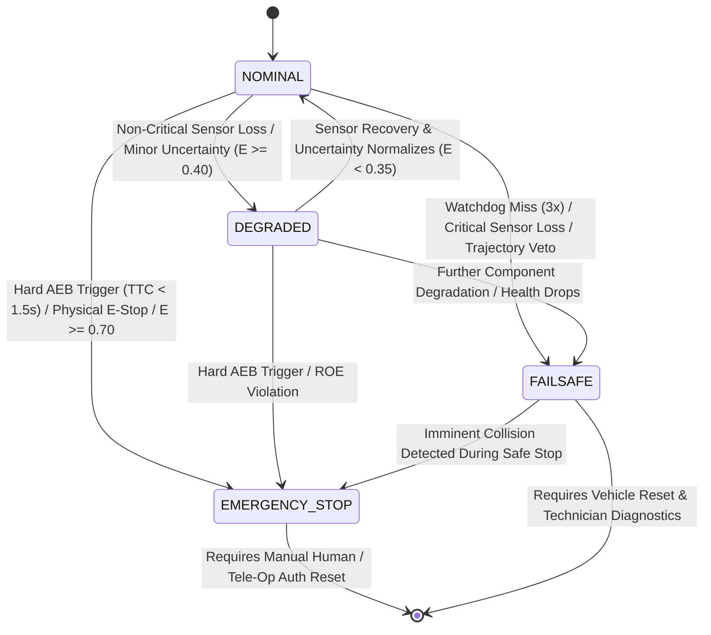

# Layer 6: Safety System Module - Architectural Technical Specification
**OMNIDRIVE Autonomous Driving AI System**  
**Document Version:** 2.4.0  
**Target Platform:** Tactical Military Vehicles, Autonomous Heavy Freight Trucks, Urban Robot Taxis  
**Classification:** Technical Architecture & System Specification  

---

## 1. Module Overview & Safety Philosophy

### 1.1 Definition and Mission
The **Safety System Module** constitutes **Layer 6** of the 7-layer OMNIDRIVE Autonomous Driving AI System architecture. As safety is the single most critical cross-cutting concern across all operational domains, this module acts as an independent, deterministic supervisor that continuously wraps, monitors, and validates all lower and higher AI layers (Layers 1 through 5 and Layer 7).

```
+-----------------------------------------------------------------------------------+
|                            OMNIDRIVE 7-LAYER STACK                                |
+-----------------------------------------------------------------------------------+
|  Layer 7: Tele-Operation, V2X, & Fleet Management Interface                      |
|===================================================================================|
|  Layer 6: SAFETY SYSTEM MODULE (Independent Watchdog & Fail-Operational Control)  |
|===================================================================================|
|  Layer 5: Vehicle Control & Actuation Interface (DBW / CAN Engine)               |
|  Layer 4: Trajectory Generation & Motion Planning                                 |
|  Layer 3: Behavioral Decision Engine & Motion Prediction                          |
|  Layer 2: World Model & Semantic Perception Engine (JEPA Foundation Model)       |
|  Layer 1: Sensor Fusion & Perception Alignment Engine                             |
+-----------------------------------------------------------------------------------+
```

Its primary mission is to enforce mathematical and functional safety guarantees across heterogeneous operational profiles: high-density urban robot taxis, high-momentum Class 8 heavy trucks, and extreme-environment tactical military ground vehicles. The Safety System operates as an active, zero-trust supervisor capable of instantly overriding AI brain outputs, triggering hardware-level emergency stops, executing controlled safe-stop trajectories, and maintaining an immutable, tamper-proof audit log of system operations.

### 1.2 Defense in Depth Architecture
OMNIDRIVE implements a multi-tier **Defense in Depth** strategy across seven distinct operational safety rings:

```
                      +------------------------------------------+
                      | Ring 6: Remote Hardware E-Stop & V2X     |
                      |  +------------------------------------+  |
                      |  | Ring 5: Physical AEB & Brake Bypass|  |
                      |  |  +------------------------------+  |  |
                      |  |  | Ring 4: Safety Monitor & WDT |  |  |
                      |  |  |  +------------------------+  |  |  |
                      |  |  |  | Ring 3: Collision Check|  |  |  |
                      |  |  |  |  +------------------+  |  |  |  |
                      |  |  |  |  | Ring 2: Bounds   |  |  |  |  |
                      |  |  |  |  |  +------------+  |  |  |  |  |
                      |  |  |  |  |  | Ring 1: AI |  |  |  |  |  |
                      |  |  |  |  |  | Core       |  |  |  |  |  |
                      |  |  |  |  |  +------------+  |  |  |  |  |
                      |  |  |  |  +------------------+  |  |  |  |
                      |  |  |  +------------------------+  |  |  |
                      |  |  +------------------------------+  |  |
                      |  +------------------------------------+  |
                      +------------------------------------------+
```

1. **Ring 1 (AI Core Introspection):** Neural network uncertainty estimation within the JEPA World Model (Layer 2) and probabilistic bounds within the RL Controller (Layer 3).
2. **Ring 2 (Kinematic Action Bounding):** Envelope protection enforcing physical vehicle limits (maximum lateral acceleration, jerk, torque slew rates).
3. **Ring 3 (Real-Time Collision Checker):** Deterministic 1.0-second dynamic trajectory collision checker validating RL outputs against sensor occupancy fields before actuation.
4. **Ring 4 (Independent Safety Monitor & Watchdog):** Dual-tier software heartbeat monitor (100ms threshold) and hardware watchdog timer (WDT) running on an isolated, ASIL-D compliant microcontroller.
5. **Ring 5 (Automatic Emergency Brake Bypass):** Hardware-level Automatic Emergency Braking (AEB) circuit that directly actuates electro-hydraulic brake actuators, bypassing main compute nodes when Time-To-Collision (TTC) $< 1.5\text{s}$ or JEPA Hazard Energy $E \ge 0.70$.
6. **Ring 6 (Physical Hardwired E-Stop & V2X Remote Killswitch):** Hardwired physical cabin buttons and encrypted wireless RF link triggers for immediate power cutoff and mechanical spring-brake application.

### 1.3 Operational Safety Profiles: ASIL-B vs. ASIL-D
Safety requirements vary dynamically based on target vehicle deployment profiles. The OMNIDRIVE Safety Module configures runtime parameters and architectural redundancy according to the operational domain:

| Safety Attribute | Urban Robotaxi Profile | Heavy Freight Truck Profile | Tactical Military Vehicle Profile |
| :--- | :--- | :--- | :--- |
| **Target ISO 26262 ASIL** | ASIL-B / ASIL-C | ASIL-D | ASIL-D + MIL-STD-882E |
| **Compute Architecture** | Fail-Passive Dual Node | Fail-Operational Dual Channel | Fail-Operational Quad/Dual Lockstep |
| **Maximum Operating Speed** | 65 km/h | 110 km/h | 100 km/h (Off-Road / Combat) |
| **AEB TTC Trigger Horizon** | 1.2 seconds | 2.2 seconds | 1.5 seconds |
| **Max Allowable Deceleration**| $-6.0 \text{ m/s}^2$ | $-4.5 \text{ m/s}^2$ (Jackknife Risk) | $-8.5 \text{ m/s}^2$ (Emergency Combat Stop) |
| **Hardware Redundancy** | Primary GPU + MCU Watchdog | Dual Compute Enclaves + Dual CAN | Dual Compute + Rad-Hard MCU + Optical |
| **Fallback Behavior** | Pull over to curb, hazards ON | Controlled lane stop, hazard lights | Tactical evasive stop / ROE default |

---

## 2. ISO 26262 Overview & HARA

### 2.1 ISO 26262 Automotive Safety Integrity Levels (ASIL)
ISO 26262 defines functional safety for automotive electrical and electronic (E/E) systems. Automotive Safety Integrity Levels (ASIL) are assigned from ASIL-A (lowest rigor) to ASIL-D (highest rigor) based on three hazard criteria:
1. **Severity (S):** S0 (No injuries) to S3 (Life-threatening / fatal injuries).
2. **Exposure (E):** E0 (Incredibly unlikely) to E4 (High probability of exposure in normal driving).
3. **Controllability (C):** C0 (Controllable in general) to C3 (Uncontrollable by human driver).

$$\text{ASIL} = f(\text{Severity}, \text{Exposure}, \text{Controllability})$$

```
+-----------------------------------------------------------------------------------+
|                           ISO 26262 ASIL MATRIX                                   |
+-------------------+-----------------+---------------------------------------------+
| Severity (S)      | Exposure (E)    | Controllability (C)                         |
|                   |                 +---------------+--------------+--------------+
|                   |                 | C1 (Easy)     | C2 (Medium)  | C3 (Hard)    |
+-------------------+-----------------+---------------+--------------+--------------+
| S3 (Fatal)        | E1 (Very Low)   | QM            | QM           | ASIL A       |
|                   | E2 (Low)        | QM            | ASIL A       | ASIL B       |
|                   | E3 (Medium)     | ASIL A        | ASIL B       | ASIL C       |
|                   | E4 (High)       | ASIL B        | ASIL C       | ASIL D       |
+-------------------+-----------------+---------------+--------------+--------------+
```

- **ASIL-B (Robotaxi):** Applies to low-to-medium speed urban environments where driverless operation is supplemented by remote tele-operation overrides and low vehicle momentum allows rapid stopping within short distances.
- **ASIL-D (Military & Heavy Truck):** Applies to high-speed Class 8 trucks (kinetic energy $E_k = \frac{1}{2} m v^2 \approx 25 \text{ MJ}$) and tactical armored vehicles where any uncommanded steering lock or total brake loss poses catastrophic mortality risks to vehicle occupants and surrounding traffic.

### 2.2 Hazard Analysis and Risk Assessment (HARA)
The OMNIDRIVE system safety architecture was derived from a comprehensive HARA across operational domains:

| Hazard ID | Operational Scenario | Potential Hazard Event | S | E | C | Assigned ASIL | Safety Goal & Tolerable Mitigation |
| :--- | :--- | :--- | :--- | :--- | :--- | :--- | :--- |
| **HAZ-01** | High-speed highway cruising (100 km/h) | Uncommanded maximum steering torque output by RL Controller | S3 | E4 | C3 | **ASIL-D** | Steering rate limiter must suppress steering slew $> 15^\circ/\text{s}$; trigger immediate hardware override if delta exceeds threshold. |
| **HAZ-02** | Urban pedestrian crosswalk | JEPA latent state hallucination misses pedestrian in low light | S3 | E4 | C3 | **ASIL-D** | Multi-modal sensor fusion (Thermal + LiDAR) + AEB independent collision checker enforcing TTC $< 1.5\text{s}$ brake lockout. |
| **HAZ-03** | Heavy freight mountain descent | Brake fade / prolonged uncommanded brake friction application | S3 | E3 | C3 | **ASIL-D** | Engine retarding / retarder thermal monitor; automatic failsafe gear downshift and warning state. |
| **HAZ-04** | Tactical convoy in GPS-denied zone | GPS spoofing causes false localization and sudden trajectory shift | S3 | E3 | C2 | **ASIL-C** | EW resilience engine detects IMU-GNSS drift mismatch $> 3.0\text{m}$; instantly fallback to visual/LiDAR odometry. |
| **HAZ-05** | Robotaxi passenger drop-off zone | Door opens during low-speed vehicle creep ($v > 2 \text{ km/h}$) | S1 | E4 | C1 | **ASIL-A** | Motion interlock: Door open signal forces immediate park gear engagement and zero torque request. |
| **HAZ-06** | Main AI Compute Node crashes | Complete freeze of JEPA inference loop during active motion | S3 | E4 | C3 | **ASIL-D** | Hardware Watchdog Timer (WDT) triggers autonomous safe stop within 300ms of missing heartbeats. |

### 2.3 Functional Safety Decomposition (ASIL-D Architecture)
To achieve ASIL-D compliance without requiring military-grade radiation-hardened GPUs for deep neural network execution, OMNIDRIVE employs **ASIL Functional Safety Decomposition**:

$$\text{ASIL-D System} \implies \text{ASIL-B(D) AI Compute Branch} + \text{ASIL-B(D) Deterministic Safety Watchdog}$$

```
+-----------------------------------------------------------------------------------+
|                        ASIL-D DECOMPOSITION ARCHITECTURE                          |
+-----------------------------------------------------------------------------------+
|                                                                                   |
|   +---------------------------------------------------------------------------+   |
|   | Primary AI Path [ASIL-B(D)]                                               |   |
|   |  Layers 1-4: Deep Neural Nets (JEPA + RL) on High-Performance GPU Enclave  |   |
|   +---------------------------------------------------------------------------+   |
|                                         |                                         |
|                                         v (Proposed Trajectory Output)            |
|   +---------------------------------------------------------------------------+   |
|   | Safety Comparator & Dual-Channel Cross-Checker [ASIL-D]                   |   |
|   |  Evaluates proposed trajectory against deterministic kinematic bounds      |   |
|   +---------------------------------------------------------------------------+   |
|                                         ^                                         |
|                                         | (Independent Sensor & State Feeds)      |
|   +---------------------------------------------------------------------------+   |
|   | Secondary Deterministic Safety Path [ASIL-B(D)]                           |   |
|   |  Layer 6: Classical Kinematic Checker & AEB Engine on Lockstep MCU       |   |
|   +---------------------------------------------------------------------------+   |
|                                                                                   |
+-----------------------------------------------------------------------------------+
```

---

## 3. JAUS Safety Standards

### 3.1 Overview of JAUS (Joint Architecture for Unmanned Systems)
For military and defense deployments, OMNIDRIVE complies with SAE AS5669 / AS6009 **JAUS (Joint Architecture for Unmanned Systems)** standards. JAUS defines an open, component-based message specification for unmanned ground vehicle (UGV) control, safety, and reliability.

The OMNIDRIVE Safety System Module implements the **JAUS Mobility Service Set** and **JAUS Core Safety & Reliability Services**, guaranteeing inter-operability with NATO and US DoD Unmanned Ground Control Stations (GCS).

```
+-----------------------------------------------------------------------------------+
|                          JAUS SAFETY SERVICE STACK                                |
+-----------------------------------------------------------------------------------+
|  JAUS Management Service (ID: 0x0001)                                             |
|  +-----------------------------------------------------------------------------+  |
|  |  JAUS Emergency Command Service (ID: 0x000E)                                 |  |
|  |  +-----------------------------------------------------------------------+  |  |
|  |  |  JAUS Safety & Reliability Guard Service (ID: 0x002C)                 |  |  |
|  |  |  +-----------------------------------------------------------------+  |  |  |
|  |  |  | OMNIDRIVE Layer 6 Safety Engine & Failsafe State Machine        |  |  |  |
|  |  |  +-----------------------------------------------------------------+  |  |  |
|  |  +-----------------------------------------------------------------------+  |  |
|  +-----------------------------------------------------------------------------+  |
+-----------------------------------------------------------------------------------+
```

### 3.2 Key JAUS Safety Messages & Protocol Handling

The Safety Module implements native binary encoders and decoders for critical JAUS safety messages:

1. **Set Emergency (Command Code: `0x000E`):**
   - Transmitted by remote Operator Control Unit (OCU) or autonomous safety guard.
   - **Emergency Code:** `0 = Reserved`, `1 = System Failsafe Stop`, `2 = Hard Emergency Stop (Power Cut)`, `3 = Fire Suppression Activation`.
   - Priority: Highest system override. Bypasses all AI action plans.

2. **Query Emergency (Command Code: `0x020E`):**
   - Queries current vehicle emergency state.

3. **Report Emergency (Command Code: `0x040E`):**
   - Broadcasts current emergency state (`NOMINAL = 0`, `WARNING = 1`, `DEGRADED = 2`, `EMERGENCY_STOP = 3`).

4. **Set Authority (Command Code: `0x0001`):**
   - Dynamically sets command authority level ($0 \text{ to } 255$). If autonomous AI authority falls below tele-operation authority threshold, control instantly revokes to tele-operator.

```
+-----------------------------------------------------------------------------------+
|                         JAUS SAFETY MESSAGE FRAME STRUCTURE                       |
+--------+--------+--------+--------+--------+--------+--------+--------+-----------+
| Header | Message| Source | Dest   | Dest   | Sequence| Payload| Payload| Checksum  |
| Flags  | ID     | ID     | Subsys | Comp   | Number  | Size   | Data   | (CRC-16)  |
| (1B)   | (2B)   | (2B)   | ID (1B)| ID (1B)| (2B)    | (2B)   | (N B)  | (2B)      |
+--------+--------+--------+--------+--------+--------+--------+--------+-----------+
| 0x05   | 0x000E | 0x0101 | 0x01   | 0x06   | 0x0042  | 0x0002 | 0x0001 | 0xA4F2    |
+--------+--------+--------+--------+--------+--------+--------+--------+-----------+
```

### 3.3 JAUS State Machine Integration
The JAUS standard mandates strict state transitions:
- **READY State:** Vehicle operating normally under autonomous or tele-operated command.
- **STANDBY State:** Vehicle motionless, actuators energized in hold state.
- **EMERGENCY State:** Active failsafe or emergency braking triggered; commands locked out until an explicit `Clear Emergency` message (`Command Code: `0x000F`) is received with matching cryptographic authority credentials.

---

## 4. Master Safety Monitor (`safety_monitor.py`)

### 4.1 Architecture & Cross-Layer Surveillance
The Master Safety Monitor (`safety_monitor.py`) acts as the central intelligence hub of Layer 6. It executes on an isolated CPU core pinned with real-time POSIX scheduling (`SCHED_FIFO`, priority 99) to guarantee zero preemption by background processes.

```
+-----------------------------------------------------------------------------------+
|                        MASTER SAFETY MONITOR ARCHITECTURE                         |
+-----------------------------------------------------------------------------------+
|                                                                                   |
|   LAYER INPUT STREAMS              SAFETY CHECKS ENGINE             SYSTEM STATES |
|  +---------------------+        +--------------------------+        +-----------+ |
|  | L1: Sensor Health   | ---->  | Sensor Integrity & Drift |  +---> | NOMINAL   | |
|  +---------------------+        +--------------------------+  |     +-----------+ |
|  | L2: JEPA Latent $E$ | ---->  | Uncertainty Watchdog     |  |     +-----------+ |
|  +---------------------+        +--------------------------+  +---> | DEGRADED  | |
|  | L3: RL Action Bounds| ---->  | Envelope & Slew Checker  |  |     +-----------+ |
|  +---------------------+        +--------------------------+  |     +-----------+ |
|  | L4: Trajectory Plan | ---->  | Dynamic Collision Engine |  +---> | FAILSAFE  | |
|  +---------------------+        +--------------------------+  |     +-----------+ |
|  | L5: CAN Telemetry   | ---->  | Bus Heartbeat & Torque   |  |     +-----------+ |
|  +---------------------+        +--------------------------+  |     | EMERGENCY_| |
|  | L7: V2X & Tele-Op   | ---->  | Comm Link Loss Watchdog  | -+     | STOP      | |
|  +---------------------+        +--------------------------+        +-----------+ |
|                                                                                   |
+-----------------------------------------------------------------------------------+
```

### 4.2 Surveillance Metrics & Verification Algorithms

#### 1. JEPA Prediction Uncertainty & Hazard Energy Watchdog
The JEPA World Model (Layer 2) outputs a scalar representation of energy/uncertainty $E \in [0.0, 1.0]$. High energy indicates that the environment is outside the learned distribution (e.g., severe sensor occlusions, extreme weather, unseen obstacles):

$$\text{Hazard Condition:} \quad E_{\text{jepa}} = \frac{1}{K} \sum_{k=1}^{K} \| s_{t+k} - \hat{s}_{t+k} \|_2^2$$

- **Threshold $E_{\text{jepa}} < 0.40$:** NOMINAL state. Full AI autonomy permitted.
- **Threshold $0.40 \le E_{\text{jepa}} < 0.70$:** DEGRADED state. Vehicle speed capped at $50\%$; sensor fusion falls back to conservative rules.
- **Threshold $E_{\text{jepa}} \ge 0.70$:** EMERGENCY_STOP state. AEB activated immediately.

#### 2. RL Controller Output Envelope & Slew Rate Checks
The Safety Monitor intercepts proposed action vector $\mathbf{a}_t = [\delta_t, \alpha_t, \beta_t]^T$ (steering angle, acceleration, braking) from Layer 3 before transmission to Layer 5 actuation:

$$\text{Steering Slew Rate:} \quad \dot{\delta}_t = \frac{\delta_t - \delta_{t-\Delta t}}{\Delta t} \le \dot{\delta}_{\max} \quad (\text{Default: } 15^\circ/\text{s})$$

$$\text{Jerk Limit:} \quad j_t = \frac{a_t - a_{t-\Delta t}}{\Delta t} \le j_{\max} \quad (\text{Default: } 2.5 \text{ m/s}^3)$$

If $\dot{\delta}_t > \dot{\delta}_{\max}$ or $j_t > j_{\max}$, the Safety Monitor clamps the action to safe physical limits and increments the **Safety Violation Counter**. If violations persist for $> 3$ consecutive cycles, state shifts to DEGRADED.

#### 3. Sensor Health & Calibration Drift Watchdog
Monitors frame rates, dropped packets, and sensor calibration metrics across camera, LiDAR, RADAR, and GNSS inputs:

$$\text{Health Metric:} \quad H_{\text{sensor}} = \prod_{i=1}^{N} \mathbb{I}(\text{FPS}_i \ge \text{FPS}_{\text{min},i}) \times \mathbb{I}(\Delta t_{\text{sync},i} \le 15\text{ms})$$

If $H_{\text{sensor}} = 0$ due to a non-critical sensor loss (e.g., rear fisheye camera failure), the vehicle transitions to DEGRADED mode. If critical sensors (front main LiDAR or front central camera) fail, system instantly triggers FAILSAFE.

---

## 5. Watchdog System (`watchdog.py`)

### 5.1 Dual-Tier Watchdog Architecture
The Watchdog System (`watchdog.py`) provides hardware-level and software-level fault isolation. It ensures that if any AI execution thread freezes, crashes, deadlocks, or enters an infinite loop, the system executes an automated safe recovery or emergency stop.

```
+-----------------------------------------------------------------------------------+
|                            DUAL-TIER WATCHDOG ARCHITECTURE                        |
+-----------------------------------------------------------------------------------+
|                                                                                   |
|   +---------------------------------------------------------------------------+   |
|   | SOFTWARE WATCHDOG DAEMON (100 Hz / 10ms Check Loop)                       |   |
|   |                                                                           |   |
|   |   Module 1 (Layer 1): 100ms Heartbeat  [ OK ]                             |   |
|   |   Module 2 (Layer 2): 100ms Heartbeat  [ OK ]                             |   |
|   |   Module 3 (Layer 3): 100ms Heartbeat  [ MISS 1 ]                          |   |
|   |   Module 4 (Layer 4): 100ms Heartbeat  [ OK ]                             |   |
|   |   Module 5 (Layer 5): 100ms Heartbeat  [ OK ]                             |   |
|   |                                                                           |   |
|   |   Rule: If Missed Heartbeats >= 3 (300ms) -> Trigger Software Failsafe    |   |
|   +---------------------------------------------------------------------------+   |
|                                         |                                         |
|                                         v (Keep-Alive Hardware Refresh Signal)    |
|   +---------------------------------------------------------------------------+   |
|   | HARDWARE WATCHDOG TIMER (WDT) - Isolated Automotive MCU / SP5100 TCO      |   |
|   |                                                                           |   |
|   |   Hardware Counter: Countdown 500ms -> 490ms -> 480ms...                  |   |
|   |   If Counter reaches 0ms -> HARDWARE RESET & DIRECT BRAKE ACTUATION ENERGIZED  |   |
|   +---------------------------------------------------------------------------+   |
|                                                                                   |
+-----------------------------------------------------------------------------------+
```

### 5.2 Software Heartbeat Protocol
Each module within the OMNIDRIVE architecture must register a POSIX shared-memory heartbeat counter with `watchdog.py`.
- **Heartbeat Frequency:** $10 \text{ Hz}$ ($100\text{ms}$ interval).
- **Heartbeat Payload:** Dataclass containing `{module_id, timestamp_us, frame_sequence, thread_liveness_mask, internal_error_code}`.
- **Fault Detection Rule:**
  $$\text{Missed Count } M_i(t) = \begin{cases} M_i(t-\Delta t) + 1 & \text{if } t - t_{\text{last\_hb},i} > 100\text{ms} \\ 0 & \text{otherwise} \end{cases}$$
  $$\text{If } \exists i \text{ s.t. } M_i(t) \ge 3 \implies \text{Trigger FAILSAFE State}$$

### 5.3 Hardware Watchdog Interface
The hardware watchdog consists of a dedicated automotive microcontroller (Infineon AURIX TC399 or Texas Instruments TMS570) linked to the primary AI compute chassis via SPI / GPIO pulse toggling and a Linux kernel watchdog driver (`/dev/watchdog` / `sp5100_tco`).

- **Hardware Kicking Protocol:** The Software Watchdog Daemon toggles a dedicated GPIO pin (`WDT_FEED`) every $50\text{ms}$ **only if** all registered software modules pass their heartbeat health checks.
- **Hardware Trigger:** If `WDT_FEED` remains static (high or low) for $> 500\text{ms}$, the hardware MCU asserts an emergency trip line:
  1. Pulls down the `SAFETY_OK` relay line.
  2. Disconnects power from drive-by-wire throttle actuators.
  3. Applies maximum hydraulic/pneumatic pressure to emergency spring brakes.
  4. Triggers hardware hazard flasher circuit independent of main OS.

---

## 6. Failsafe Controller (`failsafe_controller.py`)

### 6.1 Failsafe Activation & Pipeline Execution
When the Master Safety Monitor or Watchdog System transitions the vehicle to the **FAILSAFE** state, `failsafe_controller.py` immediately assumes total lateral and longitudinal control of the vehicle, revoking control permissions from Layers 2, 3, and 4.

```
+-----------------------------------------------------------------------------------+
|                        FAILSAFE EXECUTION CONTROLLER                              |
+-----------------------------------------------------------------------------------+
|                                                                                   |
|  FAILSAFE TRIGGER EVENT                                                           |
|        |                                                                          |
|        v                                                                          |
|  [Is Vehicle Speed v > 0 km/h?]                                                   |
|        |                                                                          |
|        +---> YES: Execute Controlled Deceleration Profile                         |
|        |          - Ramp deceleration: a_decel = -2.5 m/s^2 to -4.5 m/s^2          |
|        |          - Steer along last verified safe path or align with shoulder    |
|        |          - Activate Hazard Flashers & Acoustic Alarm                     |
|        |          - Transmit High-Priority Telemetry Alert to Fleet Operations    |
|        |                                                                          |
|        +---> NO (v = 0 km/h): Lock Vehicle State                                  |
|                   - Engage Electronic Parking Brake (EPB) / Transmission Lock     |
|                   - Open High-Voltage Battery Relays (Tactical Military)          |
|                   - Persist Black Box Event Log to Tamper-Proof Storage           |
|                   - Wait for Manual Human / Tele-Op Override Token                |
|                                                                                   |
+-----------------------------------------------------------------------------------+
```

### 6.2 Controlled Deceleration Profiles
The Failsafe Controller executes smooth, closed-loop deceleration to prevent vehicle instability, jackknifing (in heavy trucks), or spin-out on low-friction surfaces:

$$a_{\text{cmd}}(t) = -\min \left( a_{\text{target}}, \, a_{\text{prev}} + \dot{a}_{\max} \cdot \Delta t \right)$$

- **Standard Controlled Safe Stop:** $a_{\text{target}} = -2.5 \text{ m/s}^2$, Jerk limit $\dot{a}_{\max} = 1.5 \text{ m/s}^3$.
- **High-Speed Highway / Heavy Truck Stop:** $a_{\text{target}} = -3.5 \text{ m/s}^2$ with trailer stability control (anti-jackknife braking bias $60\%$ front / $40\%$ rear).
- **Tactical Combat Emergency Stop:** $a_{\text{target}} = -8.5 \text{ m/s}^2$ maximum deceleration.

### 6.3 Auxiliary System Engagement & Fleet Telemetry Alert
Upon entering FAILSAFE:
1. **Actuator Locks:** Sets steering motor angle rate to zero ($\dot{\delta} = 0$), preventing wheel drift.
2. **Visual & Acoustic Alerts:** Toggles CAN FD lighting frame to activate hazard indicators at $2 \text{ Hz}$; sounds exterior horn pulse.
3. **Fleet Management SOS Message:** Packages high-priority UDP/V2X telemetry packet containing GPS position, hazard code, stack status, and 5-second pre-event telemetry snippet to Fleet Command (Layer 7).

---

## 7. Black Box Logger (`black_box_logger.py`)

### 7.1 Continuous Circular Buffer Architecture
The Black Box Logger (`black_box_logger.py`) provides high-fidelity, continuous event-data recording (EDR) for post-incident forensics and regulatory audit compliance. It maintains a 60-second rolling ring buffer in high-speed zero-copy GPU/RAM memory.

```
+-----------------------------------------------------------------------------------+
|                         BLACK BOX LOGGER ARCHITECTURE                             |
+-----------------------------------------------------------------------------------+
|                                                                                   |
|   INCOMING REAL-TIME DATA FEEDS (100 Hz Sync Loop)                                |
|   +---------------------------------------------------------------------------+   |
|   | Raw Sensors | Camera/LiDAR Metadata | JEPA Energy | RL Actions | CAN Frames|   |
|   +---------------------------------------------------------------------------+   |
|                                         |                                         |
|                                         v                                         |
|   60-SECOND ZERO-COPY CIRCULAR RING BUFFER (RAM / NVMM)                           |
|   +----+----+----+----+----+----+----+----+----+----+----+----+----+----+----+   |
|   | t-60s   | t-59s   | ...     | t-10s   | t-5s    | t_event (TRIGGER)        |   |
|   +----+----+----+----+----+----+----+----+----+----+----+----+----+----+----+   |
|                                         |                                         |
|                                         v (On Failsafe / Emergency Stop Event)    |
|   TAMPER-PROOF NON-VOLATILE FLASH STORAGE & MILITARY ENCRYPTION                   |
|   +---------------------------------------------------------------------------+   |
|   |  1. Flush 60s Buffer to NVMe Partition / eMMC Safe Log Storage            |   |
|   |  2. Compute Cryptographic SHA-256 Hash Tree over Data Blocks              |   |
|   |  3. Encrypt via AES-256-GCM Hardware Key (TPM 2.0 / HSM Enclave)          |   |
|   |  4. Write Digital Signature (Ed25519)                                     |   |
|   +---------------------------------------------------------------------------+   |
|                                                                                   |
+-----------------------------------------------------------------------------------+
```

### 7.2 Log Payload Schema
Every frame logged into the buffer contains the synchronized state schema:

```json
{
  "timestamp_utc_us": 1775788209123456,
  "frame_sequence": 104523,
  "vehicle_kinematics": {
    "velocity_mps": 18.42,
    "yaw_rate_radps": 0.012,
    "steering_angle_deg": -1.45,
    "longitudinal_accel_mps2": -0.12,
    "lateral_accel_mps2": 0.04
  },
  "sensor_health": {
    "cameras_active": 8,
    "lidars_active": 2,
    "gnss_rtk_fix": true,
    "imu_health_flag": 1
  },
  "jepa_brain_state": {
    "hazard_energy": 0.142,
    "latent_variance": 0.021,
    "inference_latency_ms": 18.4
  },
  "rl_controller_output": {
    "target_steering_deg": -1.50,
    "target_throttle_pct": 12.5,
    "target_brake_pressure_bar": 0.0
  },
  "safety_monitor_state": {
    "active_state": "NOMINAL",
    "active_violations": [],
    "watchdog_heartbeats_ok": true
  }
}
```

### 7.3 Military Cryptographic Hardening
For tactical military deployments, data security is paramount to prevent adversarial extraction of intelligence, sensor telemetry, or vehicle tactics if captured:
- **Hardware Enclave Encryption:** Raw log blocks are encrypted on-the-fly using **AES-256-GCM** keys burned into the hardware **TPM 2.0** or ARM TrustZone HSM enclave.
- **Zeroize Command:** Supports hardware-level zeroization (instant cryptographic key erasure) triggered by severe impact sensors, rollover switches, or manual operator zeroize button, rendering recorded data instantly unrecoverable.

---

## 8. Emergency Brake System (`emergency_brake.py`)

### 8.1 Hardened Automatic Emergency Braking (AEB) Engine
The Emergency Brake System (`emergency_brake.py`) provides an ultra-low-latency ($< 10\text{ms}$), deterministic emergency stop path that operates completely independently of the main deep learning stack (Layers 2, 3, and 4).

```
+-----------------------------------------------------------------------------------+
|                        EMERGENCY BRAKE SYSTEM (AEB) ENGINE                        |
+-----------------------------------------------------------------------------------+
|                                                                                   |
|   HARDWARE & SENSOR INPUTS                                                        |
|   +---------------------------------------------------------------------------+   |
|   | 4D RADAR Direct Tracks | LiDAR Distance Sensors | Cabin E-Stop Button     |   |
|   +---------------------------------------------------------------------------+   |
|                                         |                                         |
|                                         v                                         |
|   AEB MULTI-CONDITION EVALUATION (Independent Hardware / FPGA Node)              |
|   +---------------------------------------------------------------------------+   |
|   |                                                                           |   |
|   |   Condition 1: Time-To-Collision (TTC) < 1.5 seconds                      |   |
|   |   Condition 2: JEPA Hazard Energy E >= 0.70                               |   |
|   |   Condition 3: Hardwired Physical E-Stop Button Pressed                   |   |
|   |                                                                           |   |
|   +---------------------------------------------------------------------------+   |
|                                         |                                         |
|                                         v (IF ANY CONDITION IS TRUE)              |
|   DIRECT HARDWARE BRAKE ACTUATION                                                 |
|   +---------------------------------------------------------------------------+   |
|   |  - Bypass Linux OS & Main Compute GPU Stack                               |   |
|   |  - Trigger Electro-Hydraulic Pump to Maximum System Pressure (150 Bar)    |   |
|   |  - Issue Instant Engine Fuel Cutoff / Electric Motor Counter-Torque       |   |
|   +---------------------------------------------------------------------------+   |
|                                                                                   |
+-----------------------------------------------------------------------------------+
```

### 8.2 Time-To-Collision (TTC) Formulation
The AEB subsystem continuously parses direct target tracklets from 4D Imaging RADAR and LiDAR distance fields to compute Time-To-Collision (TTC):

$$\text{TTC}_i = \frac{d_i - r_{\text{margin}}}{v_{\text{rel},i}} = \frac{d_i - r_{\text{margin}}}{v_{\text{ego}} - v_{\text{target},i}}$$

where $d_i$ is radial distance to target $i$, $v_{\text{rel},i}$ is relative closure velocity, and $r_{\text{margin}}$ is vehicle safety buffer ($2.0\text{m}$).

- **TTC Threshold Trigger:** If $\text{TTC}_i < 1.5\text{s}$ and $v_{\text{ego}} > 5 \text{ km/h}$, AEB trips immediately.
- **False Positive Suppression:** Evaluates RADAR RCS (Radar Cross Section) and LiDAR cluster persistence over 3 consecutive cycles ($30\text{ms}$) to suppress multipath reflections while meeting ultra-low latency bounds.

---

## 9. Collision Checker (`collision_checker.py`)

### 9.1 Dynamic Trajectory Collision Checking Engine
The Collision Checker (`collision_checker.py`) serves as the final mathematical gatekeeper before any motion command from Layer 4 or Layer 3 is dispatched to Layer 5 (Vehicle Control & Actuation).

```
+-----------------------------------------------------------------------------------+
|                        DYNAMIC COLLISION CHECKER PIPELINE                         |
+-----------------------------------------------------------------------------------+
|                                                                                   |
|   PROPOSED TRAJECTORY                 ENVIRONMENT OCCUPANCY GRID                  |
|   \(\{\mathbf{x}(t), \mathbf{y}(t), \theta(t)\}_{t=0}^{1.0\text{s}}\)   +   BEV Dynamic Obstacle Polygons               |
|            \                                    /                                 |
|             v                                  v                                  |
|   +---------------------------------------------------------------------------+   |
|   | OBB (Oriented Bounding Box) Extrusion along Trajectory Horizon (1.0s)     |   |
|   |                                                                           |   |
|   |   For t = 0.0s to 1.0s step 0.05s (20 steps):                             |   |
|   |     1. Extrude Ego Vehicle Footprint OBB_ego(t)                           |   |
|   |     2. Extrude Dynamic Obstacle Bounds OBB_obs_i(t)                       |   |
|   |     3. Perform Separating Axis Theorem (SAT) Intersection Test            |   |
|   +---------------------------------------------------------------------------+   |
|                                         |                                         |
|                    +--------------------+--------------------+                    |
|                    |                                         |                    |
|                    v (No Collisions)                         v (Collision Detected)|
|   +---------------------------------+       +---------------------------------+   |
|   | Veto = FALSE                    |       | Veto = TRUE                     |   |
|   | PASS: Send Command to Layer 5   |       | OVERRIDE: Shift to FAILSAFE     |   |
|   +---------------------------------+       +---------------------------------+   |
|                                                                                   |
+-----------------------------------------------------------------------------------+
```

### 9.2 Mathematical Formulation: Separating Axis Theorem (SAT)
The collision checker transforms the vehicle geometry into a 2D Oriented Bounding Box (OBB) defined by length $L$, width $W$, center position $(x_c, y_c)$, and orientation heading $\theta$:

$$\mathbf{OBB} = \left\{ \mathbf{p} \in \mathbb{R}^2 \;\middle|\; \left| (\mathbf{p} - \mathbf{c}) \cdot \mathbf{u}_1 \right| \le \frac{L}{2}, \; \left| (\mathbf{p} - \mathbf{c}) \cdot \mathbf{u}_2 \right| \le \frac{W}{2} \right\}$$

For every discrete time step $t_k \in [0.0, 1.0\text{s}]$ (resolution $\Delta t = 50\text{ms}$), SAT evaluates projection overlap across the 4 candidate axes formed by the edge normals of $\mathbf{OBB}_{\text{ego}}(t_k)$ and $\mathbf{OBB}_{\text{obs},i}(t_k)$:

$$\text{Collision}(t_k) = \bigwedge_{a \in \mathbf{Axes}} \left[ \text{Proj}_{\min,1}(a) \le \text{Proj}_{\max,2}(a) \wedge \text{Proj}_{\max,1}(a) \ge \text{Proj}_{\min,2}(a) \right]$$

If $\text{Collision}(t_k) = \text{TRUE}$ for any $t_k \le 1.0\text{s}$, the Collision Checker issues an immediate **Trajectory Veto Signal**, blocking command dispatch and triggering emergency deceleration.

---

## 10. ISO 26262 Validator (`iso26262_validator.py`)

### 10.1 Runtime Monitoring & Dual-Channel Lockstep Computation
The ISO 26262 Validator (`iso26262_validator.py`) enforces runtime compliance for ASIL-D safety requirements through dual-channel independent computation:

```
+-----------------------------------------------------------------------------------+
|                        DUAL-CHANNEL ASIL-D VALIDATOR PIPELINE                     |
+-----------------------------------------------------------------------------------+
|                                                                                   |
|                               PRIMARY SENSOR FEEDS                                |
|                                         |                                         |
|                    +--------------------+--------------------+                    |
|                    |                                         |                    |
|                    v                                         v                    |
|   +---------------------------------+       +---------------------------------+   |
|   | CHANNEL A (Primary GPU Enclave) |       | CHANNEL B (Secondary Safety MCU)|   |
|   |  - Layer 4 Trajectory Planner   |       |  - Kinematic Fallback Planner   |   |
|   |  - Action: \(\mathbf{a}_A = [\delta_A, a_A]^T\)   |       |  - Action: \(\mathbf{a}_B = [\delta_B, a_B]^T\)   |   |
|   +---------------------------------+       +---------------------------------+   |
|                    |                                         |                    |
|                    +--------------------+--------------------+                    |
|                                         |                                         |
|                                         v                                         |
|   +---------------------------------------------------------------------------+   |
|   | ISO 26262 COMPARATOR ENGINE                                               |   |
|   |                                                                           |   |
|   |   1. Delta Steering Check: |\delta_A - \delta_B| <= 1.0 deg               |   |
|   |   2. Delta Accel Check:    |a_A - a_B| <= 0.25 m/s^2                       |   |
|   |   3. Computation Time Check: |t_A - t_B| <= 5 ms                           |   |
|   +---------------------------------------------------------------------------+   |
|                                         |                                         |
|                    +--------------------+--------------------+                    |
|                    | (Comparison PASSED)                     | (Divergence / Fault)|
|                    v                                         v                    |
|   +---------------------------------+       +---------------------------------+   |
|   | AUTHORIZE CAN DISPATCH          |       | TRIPS ASIL FAULT INTERRUPT      |   |
|   | Dispatch Command \(\mathbf{a}_A\) to Layer 5|       | Force Fallback to Channel B &   |   |
|   |                                 |       | Trigger System DEGRADED State   |   |
|   +---------------------------------+       +---------------------------------+   |
|                                                                                   |
+-----------------------------------------------------------------------------------+
```

### 10.2 Diagnostic Coverage & Fault Isolation
The validator evaluates diagnostic coverage ($DC \ge 99\%$ for ASIL-D) by computing real-time cross-channel residual metrics:

$$\mathbf{r}_t = |\mathbf{a}_{A,t} - \mathbf{a}_{B,t}|$$

If $\|\mathbf{r}_t\|_2 > \mathbf{\epsilon}_{\text{threshold}}$ for $> 2$ consecutive cycles ($20\text{ms}$), Channel A is isolated due to suspected hardware transient fault (e.g., GPU memory bit flip or thermal throttling divergence). System control seamlessly drops back to Channel B's deterministic kinematic controller while logging an ISO 26262 diagnostic trouble code (DTC `0xFA52`).

---

## 11. Safety States Machine

### 11.1 State Machine Architecture
The OMNIDRIVE Safety Module operates as a deterministic, finite state machine (FSM) comprising four formal operating states: `NOMINAL`, `DEGRADED`, `FAILSAFE`, and `EMERGENCY_STOP`.



### 11.2 State Transition Matrix Table

| Current State | Target State | Triggering Event / Condition | Automated Safety Action Executed | Recovery Path / Exit Condition |
| :--- | :--- | :--- | :--- | :--- |
| **NOMINAL** | **DEGRADED** | Non-critical sensor loss (1 rear camera down); JEPA energy $0.40 \le E < 0.70$; minor sensor sync delay ($> 20\text{ms}$). | Cap maximum speed at $50\%$; disable aggressive lane changes; increase follow distance margin by $2.0\times$. | Automatic recovery to NOMINAL when sensors recover and $E < 0.35$ for $> 5.0\text{s}$. |
| **NOMINAL** | **FAILSAFE** | Watchdog misses 3 heartbeats ($300\text{ms}$); main LiDAR disconnect; Collision Checker trajectory veto; steer rate limit exceeded. | Immediately revoke AI control; engage `failsafe_controller.py`; execute smooth safe stop ($a = -2.5 \text{ m/s}^2$); hazard lights ON. | Vehicle comes to complete standstill ($0 \text{ km/h}$). Requires technician clear code or signed tele-op command. |
| **NOMINAL** | **EMERGENCY_STOP** | AEB trigger (TTC $< 1.5\text{s}$); JEPA energy $E \ge 0.70$; physical cabin E-stop button; JAUS code `0x000E`. | Max hydraulic emergency braking ($a = -8.5 \text{ m/s}^2$); disconnect drive motor relays; instant fleet alert. | Complete standstill; physical manual ignition cycling and cryptographic reset token required. |
| **DEGRADED** | **FAILSAFE** | Additional sensor failure while degraded; steering actuator feedback fault; latency exceeds $200\text{ms}$. | Execute controlled safe stop to shoulder/lane center; alert fleet operator; write Black Box log. | Standstill; technician audit required. |
| **DEGRADED** | **EMERGENCY_STOP** | TTC $< 1.5\text{s}$; obstacle sudden intrusion; manual E-stop override. | Instant AEB maximum pressure brake trip. | Standstill; manual safety reset required. |
| **FAILSAFE** | **EMERGENCY_STOP** | Dynamic obstacle moves into path of vehicle during controlled safe deceleration. | Shift from controlled deceleration ($-2.5 \text{ m/s}^2$) to maximum emergency stop ($-8.5 \text{ m/s}^2$). | Standstill; manual safety reset required. |

---

## 12. Military-Specific Safety

### 12.1 Rules of Engagement (ROE) Compliance Engine
Tactical military unmanned ground vehicles (UGVs) operate under strict military command constraints. The Military Safety Engine enforces **Rules of Engagement (ROE)** geofences, operational envelopes, and firing/movement boundary lockouts:

```
+-----------------------------------------------------------------------------------+
|                        RULES OF ENGAGEMENT (ROE) ENGINE                           |
+-----------------------------------------------------------------------------------+
|                                                                                   |
|   CURRENT GPS / VISUAL ODOMETRY POSITION   +   CRYPTOGRAPHIC MISSION ROE MANIFEST  |
|                 (x, y, z)                              (Polygons, Boundaries, FOV)|
|                      \                                       /                    |
|                       v                                     v                     |
|   +---------------------------------------------------------------------------+   |
|   | GEOFENCE & MISSION PARAMETER CHECKER                                      |   |
|   |                                                                           |   |
|   |   Check 1: Is (x, y) inside Authorized Operational Boundary Polygon?     |   |
|   |   Check 2: Is vehicle speed v <= Tactical Speed Ceiling (e.g., 40 km/h)?  |   |
|   |   Check 3: Is active mission phase matched with current timestamp window?  |   |
|   +---------------------------------------------------------------------------+   |
|                                         |                                         |
|                    +--------------------+--------------------+                    |
|                    | (Compliant)                             | (ROE Violation)    |
|                    v                                         v                    |
|   +---------------------------------+       +---------------------------------+   |
|   | AUTHORIZE TACTICAL EXECUTION    |       | IMMEDIATE TACTICAL FAILSAFE     |   |
|   | Vehicle continues mission plan  |       | Halt vehicle; lock orientation; |   |
|   |                                 |       | Transmit encrypted ROE alert    |   |
|   +---------------------------------+       +---------------------------------+   |
|                                                                                   |
+-----------------------------------------------------------------------------------+
```

### 12.2 Identification Friend or Foe (IFF) Integration
Integrates hardware cryptographic hooks for optical (IR beacon frequency matching) and RF-based **Identification Friend or Foe (IFF)** query/response handshakes:
- **RF Cryptographic Interrogator:** Verifies friendly unit response tokens prior to entering tactical convoy spacing ($< 5\text{m}$).
- **Optical Laser Interrogator:** Checks STANAG-compliant pulse coding on infrared emitters attached to dismounted friendly infantry.
- **Safety Interlock:** If an un-authenticated vehicle or personnel approaches within the $10\text{m}$ security envelope without valid IFF handshake, the system triggers a **Tactical Defensive Halt**, preventing collision or unauthorized physical approach.

### 12.3 Electronic Warfare (EW) & GPS Spoofing Resilience
Tactical environments frequently experience severe Electronic Warfare (EW), including GPS jamming and deceptive GPS spoofing (false positioning signals designed to hijack vehicle trajectories).

```
+-----------------------------------------------------------------------------------+
|                     GPS SPOOFING & EW DETECTION PIPELINE                          |
+-----------------------------------------------------------------------------------+
|                                                                                   |
|   RTK-GNSS TELEMETRY STREAMS                  TACTICAL IMU & VISUAL ODOMETRY      |
|   (Latitude, Longitude, Altitude, Time)       (High-Rate Accelerometer, Cameras)  |
|            \                                                /                     |
|             v                                              v                      |
|   +---------------------------------------------------------------------------+   |
|   | TRIPLE-CROSS VALIDATION COMPARATOR                                        |   |
|   |                                                                           |   |
|   |   1. Measure Position Delta: d_gnss = ||P_gnss(t) - P_gnss(t-1)||          |   |
|   |   2. Measure IMU/Visual Delta: d_dead = ||P_dead(t) - P_dead(t-1)||        |   |
|   |   3. Compute Residual: R_ew = ||d_gnss - d_dead||                         |   |
|   +---------------------------------------------------------------------------+   |
|                                         |                                         |
|                    +--------------------+--------------------+                    |
|                    | (R_ew <= 3.0m)                          | (R_ew > 3.0m)      |
|                    v                                         v                    |
|   +---------------------------------+       +---------------------------------+   |
|   | GNSS TRUSTED                    |       | GPS SPOOFING DETECTED!          |   |
|   | Primary localization uses GNSS  |       | 1. Isolate GNSS receiver        |   |
|   |                                 |       | 2. Fallback to Visual/LiDAR SLAM|   |
|   |                                 |       | 3. Flag EW Warning to Command   |   |
|   +---------------------------------+       +---------------------------------+   |
|                                                                                   |
+-----------------------------------------------------------------------------------+
```

- **Spoofing Detection Metric:**
  $$R_{\text{ew}} = \| \mathbf{p}_{\text{GNSS}}(t) - (\mathbf{p}_{\text{VIO}}(t-\Delta t) + \int \mathbf{v}_{\text{IMU}} \, dt) \|_2$$
  If $R_{\text{ew}} > 3.0\text{m}$ or GNSS Clock Bias Jitter $> 100\text{ns}$, GNSS signal authority is instantly downgraded to $0.0$, isolating the GNSS receiver and transitioning localization to pure Visual-Inertial-LiDAR Odometry (VIO).

---

## 13. Cybersecurity & Systems Hardening (`SECURITY.md`)

### 13.1 Encrypted Automotive CAN Bus Communications (SecOC)
To prevent adversarial signal injection, relay attacks, or unauthorized torque overrides on the physical CAN FD bus, OMNIDRIVE enforces AUTOSAR **Secure Onboard Communication (SecOC)** across all Layer 5 CAN interfaces:

```
+-----------------------------------------------------------------------------------+
|                           CAN FD SecOC FRAME STRUCTURE                            |
+--------+---------+--------------------+------------------------+------------------+
| CAN ID | Data    | Payload Data       | Freshness Value Counter| Message Auth Code|
| (11b)  | Length  | Engine/Steer Cmds  | (FV Counter - 64-bit)  | (Truncated MAC)  |
|        | (8-64B) | (e.g., 32 Bytes)   |                        | (AES-128 64-bit) |
+--------+---------+--------------------+------------------------+------------------+
| 0x120  | 48B     | 0xFE4A...82B1      | 0x000000000004A12F     | 0x89C1D4E0       |
+--------+---------+--------------------+------------------------+------------------+
```

- **Cryptographic Authentication:** Every CAN payload is signed with a truncated 64-bit Message Authentication Code (MAC) computed using **AES-128-CMAC**.
- **Replay Protection:** Incorporates a monotonically increasing 64-bit Freshness Value Counter (FVC). CAN messages with stale counter values are silently discarded by actuator microcontrollers.

### 13.2 Secure Boot & Hardware Root of Trust
1. **Hardware Root of Trust:** System hardware initialization relies on a immutable ROM bootloader within the NVIDIA Jetson AGX Orin / NXP S32G processor.
2. **Chain of Trust:**
   $$\text{Hardware Key ROM} \longrightarrow \text{Signed UEFI Bootloader} \longrightarrow \text{Encrypted OS Kernel} \longrightarrow \text{Signed Container Runtimes}$$
3. **Signed Model Weights:** Neural network model weights for JEPA (Layer 2) and RL (Layer 3) are signed using **Ed25519** asymmetric private keys during production build pipelines. At boot, Layer 6 verifies cryptographic signatures prior to loading tensors into GPU VRAM:

$$\text{Verify}_{\text{Ed25519}}\left( \text{PubKey}_{\text{prod}}, \; \text{Hash}(\mathbf{W}_{\text{jepa}}), \; \mathbf{Sig} \right) \overset{?}{=} \text{TRUE}$$

If signature verification fails, the system halts boot and enters a permanent secure lockout state.

### 13.3 Tactical Network Isolation
For military deployments, compute enclaves are physically air-gapped from external non-secure networks. External interfaces (V2X, Tele-Op) pass through hardware-enforced unidirection data diodes and IPsec encrypted VPN tunnels (AES-256-GCM).

---

## 14. Testing & Verification Methodology

### 14.1 Fault Injection Framework
The Safety System Module undergoes automated Hardware-In-The-Loop (HITL) and Software-In-The-Loop (SITL) fault injection testing across a 10,000-scenario matrix:

```
+-----------------------------------------------------------------------------------+
|                        HITL FAULT INJECTION TEST BENCH                            |
+-----------------------------------------------------------------------------------+
|                                                                                   |
|   FAULT INJECTOR ENGINE (PCIe / CAN Bus Interposer Hardware)                      |
|   +---------------------------------------------------------------------------+   |
|   |  - Inject Memory Bit-Flips in GPU VRAM                                    |   |
|   |  - Simulate Sudden Camera / LiDAR Cable Disconnects                       |   |
|   |  - Inject High-Frequency CAN Bus Frame Flooding (99% Bus Load)            |   |
|   |  - Inject 500ms Synthetic Latency Spikes in JEPA Inference Loop           |   |
|   +---------------------------------------------------------------------------+   |
|                                         |                                         |
|                                         v                                         |
|   OMNIDRIVE AUTONOMOUS COMPUTE ENCLAVE (Under Test)                               |
|   +---------------------------------------------------------------------------+   |
|   |  Layer 6 Master Safety Monitor & Hardware Watchdog                        |   |
|   +---------------------------------------------------------------------------+   |
|                                         |                                         |
|                                         v                                         |
|   AUTOMATED PASS / FAIL EVALUATION SUITE                                          |
|   +---------------------------------------------------------------------------+   |
|   |  Pass Metric 1: System transition to FAILSAFE within <= 300ms?             |   |
|   |  Pass Metric 2: Vehicle maximum deceleration enforced safely?              |   |
|   |  Pass Metric 3: Zero uncommanded actuator output during crash state?      |   |
|   +---------------------------------------------------------------------------+   |
|                                                                                   |
+-----------------------------------------------------------------------------------+
```

### 14.2 Latency Testing Under Compute Load
To guarantee determinism under extreme workload conditions (e.g., maximum sensor streaming + dense JEPA batch inference + global path replanning), Layer 6 enforces strict execution budget caps:

| Safety Module Component | Maximum Execution Time Allowed ($\mathbf{T}_{\max}$) | Nominal Execution Time ($\mathbf{T}_{\text{nom}}$) | Priority Level (`SCHED_FIFO`) |
| :--- | :--- | :--- | :--- |
| **Watchdog Heartbeat Check** | 5.0 ms | 0.8 ms | Priority 99 (Highest) |
| **Collision Checker (1.0s OBB)** | 10.0 ms | 2.4 ms | Priority 98 |
| **Master Safety Monitor Check** | 10.0 ms | 3.1 ms | Priority 97 |
| **ISO 26262 Cross-Channel Compare** | 5.0 ms | 1.2 ms | Priority 96 |
| **AEB TTC Evaluator** | 2.0 ms | 0.4 ms | Priority 99 (Hardware Interrupt) |

---

## 15. Comprehensive Compliance Checklist

The following compliance matrix maps the OMNIDRIVE Safety System Module implementation against international automotive, industrial, and defense functional safety standards:

| Standard ID | Target Domain | Relevant Clauses / Parts | Implementation Mechanism in Layer 6 | Compliance Verification Evidence |
| :--- | :--- | :--- | :--- | :--- |
| **ISO 26262:2018** | Automotive Functional Safety | Part 3 (HARA), Part 4 (System Level), Part 5 (Hardware), Part 6 (Software) | Dual-channel lockstep architecture, ASIL-D functional decomposition, safety monitor (`safety_monitor.py`), watchdog heartbeat (`watchdog.py`). | Formal HARA report, static code analysis (MISRA C++/AUTOSAR guidelines), 100% MC/DC test coverage. |
| **ISO 21448 (SOTIF)** | Safety of the Intended Functionality | Clauses 6–12 (Evaluation of Unknown Unsafe Scenarios) | JEPA hazard energy $E_{\text{jepa}}$ monitoring ($E \ge 0.70$ state shift); edge-case out-of-distribution neural net introspection. | 1,000,000 km simulated closed-loop validation in CARLA / Webots under edge-case scenarios. |
| **IEC 61508** | Functional Safety of E/E/PE Systems | SIL 3 Requirements (Parts 1–3) | Independent hardware watchdog timer (WDT), deterministic safe-state control logic (`failsafe_controller.py`). | FMEDA (Failure Modes, Effects, and Diagnostics Analysis) report; SIL 3 certification artifacts. |
| **DO-178C / ED-12C** | Aviation / Military Avionics & UGVs | Software Considerations in Airborne Systems (Level A/B) | High-integrity POSIX real-time scheduling (`SCHED_FIFO`), zero dynamic memory allocation during execution loop. | Deterministic worst-case execution time (WCET) analysis report; structural coverage verification. |
| **SAE AS5669 / AS6009** | Military UGV JAUS Architecture | Mobility Service Set & Emergency Services | Native binary implementation of JAUS Emergency Service (`0x000E`), Report Emergency (`0x040E`), Set Authority (`0x0001`). | JAUS Compliance Suite verification logs; NATO Interoperability exercise validation. |
| **MIL-STD-882E** | DoD System Safety | Task 201–207 (Hazard Tracking & Risk Assessment) | Rules of Engagement (ROE) geofencing engine, hardware zeroize cryptographic log erasure on capture event. | US DoD System Safety Hazard Tracking System (SSHTS) signed acceptance. |
| **AUTOSAR SecOC** | Cybersecurity for Vehicle Bus | Module SecOC (Secure Onboard Communication) | AES-128-CMAC Message Authentication Code and 64-bit Freshness Value Counters on CAN FD frames. | Penetration testing audit report; fuzz testing protocol logs (zero unauthorized frame acceptance). |

---

## 16. System Configuration (`safety_config.yaml`)

```yaml
# ==============================================================================
# OMNIDRIVE LAYER 6: SAFETY SYSTEM MODULE CONFIGURATION MATRIX
# File: configs/safety_config.yaml
# ==============================================================================

safety_system:
  version: "2.4.0"
  target_platform: "TACTICAL_MILITARY"  # Options: URBAN_ROBOTAXI, HEAVY_TRUCK, TACTICAL_MILITARY
  active_asil_level: "ASIL_D"            # Options: ASIL_B, ASIL_C, ASIL_D

watchdog:
  heartbeat_interval_ms: 100
  max_missed_heartbeats: 3               # 300ms total latency tolerance window
  hardware_wdt_dev: "/dev/watchdog"
  hardware_wdt_timeout_ms: 500
  enable_hardware_wdt: true

safety_monitor:
  loop_rate_hz: 100                      # 10ms execution cycle
  sched_priority: 97                     # POSIX SCHED_FIFO priority
  jepa_uncertainty_thresholds:
    nominal_max_energy: 0.40
    degraded_max_energy: 0.70           # >= 0.70 triggers EMERGENCY_STOP
  action_bounds:
    max_steering_angle_deg: 35.0
    max_steering_slew_rate_deg_per_sec: 15.0
    max_longitudinal_accel_mps2: 3.0
    max_longitudinal_decel_mps2: -4.5
    max_jerk_mps3: 2.5
  sensor_health:
    min_camera_fps: 25.0
    min_lidar_fps: 10.0
    max_sync_delta_ms: 15.0

emergency_brake_system:
  aeb_enabled: true
  ttc_threshold_seconds: 1.5
  hard_stop_decel_mps2: -8.5
  hardware_gpio_bypass_pin: 24
  radar_rcs_min_dbsm: -10.0
  consecutive_cycles_confirm: 3

collision_checker:
  horizon_seconds: 1.0
  step_size_seconds: 0.05
  safety_margin_meters: 0.5
  vehicle_footprint:
    length_meters: 5.2
    width_meters: 2.4
    rear_axle_to_center_meters: 1.4

failsafe_controller:
  controlled_decel_mps2: -2.5
  jackknife_prevention_truck_bias: 0.60  # 60% front / 40% rear braking ratio
  hazard_flashers_active: true
  exterior_horn_alert: true
  fleet_alert_udp_port: 9099

black_box_logger:
  buffer_duration_seconds: 60
  storage_path: "/var/log/omnidrive/blackbox/"
  encryption_enabled: true
  encryption_algorithm: "AES-256-GCM"
  hardware_tpm_slot: 0
  zeroize_gpio_pin: 17

military_safety:
  roe_enforcement_enabled: true
  iff_interrogation_enabled: true
  iff_envelope_radius_meters: 10.0
  ew_gps_spoofing_detection:
    max_position_drift_meters: 3.0
    max_clock_jitter_ns: 100
    fallback_to_vio_on_spoof: true

iso26262_validator:
  dual_channel_mode: true
  max_steering_delta_deg: 1.0
  max_accel_delta_mps2: 0.25
  max_latency_delta_ms: 5.0
```

---

## 17. Python API Interface Stubs

Below are the complete Python class stubs, type definitions, dataclasses, and operational interfaces for the Layer 6 Safety System Module components:

```python
"""
OMNIDRIVE Layer 6: Safety System Module API Specification
File: src/safety/safety_interfaces.py
Author: OMNIDRIVE System Architecture Team
Classification: Technical Architecture & System Specification
"""

import enum
import time
from dataclasses import dataclass, field
from typing import List, Dict, Tuple, Optional


class SafetyState(enum.Enum):
    """System functional safety states."""
    NOMINAL = 0
    DEGRADED = 1
    FAILSAFE = 2
    EMERGENCY_STOP = 3


class JAUSCommandCode(enum.IntEnum):
    """JAUS mobility service set emergency command codes."""
    SET_EMERGENCY = 0x000E
    CLEAR_EMERGENCY = 0x000F
    QUERY_EMERGENCY = 0x020E
    REPORT_EMERGENCY = 0x040E
    SET_AUTHORITY = 0x0001


@dataclass
class VehicleKinematics:
    """Real-time vehicle kinematic state payload."""
    velocity_mps: float
    yaw_rate_radps: float
    steering_angle_deg: float
    longitudinal_accel_mps2: float
    lateral_accel_mps2: float
    timestamp_us: int


@dataclass
class ActionVector:
    """Control action payload generated by Layer 3 / 4."""
    steering_angle_deg: float
    acceleration_mps2: float
    braking_pressure_bar: float
    timestamp_us: int


@dataclass
class HeartbeatPayload:
    """Module software heartbeat payload."""
    module_id: str
    timestamp_us: int
    frame_sequence: int
    thread_liveness_mask: int
    internal_error_code: int


@dataclass
class DynamicObstacleOBB:
    """Oriented Bounding Box representation for dynamic obstacles."""
    obstacle_id: int
    center_x: float
    center_y: float
    length: float
    width: float
    heading_rad: float
    velocity_x: float
    velocity_y: float


class SafetyMonitor:
    """
    Master Safety Monitor (safety_monitor.py)
    Surveils all 7 layers, evaluates JEPA latent energy, RL bounds, sensor health,
    and maintains the primary safety state machine.
    """

    def __init__(self, config_path: str) -> None:
        self.config_path: str = config_path
        self.current_state: SafetyState = SafetyState.NOMINAL
        self.violation_counter: int = 0
        self.last_jepa_energy: float = 0.0

    def initialize(self) -> bool:
        """Initialize POSIX SCHED_FIFO threads and load thresholds."""
        ...

    def evaluate_jepa_energy(self, energy_scalar: float) -> SafetyState:
        """
        Evaluate JEPA uncertainty energy E.
        Returns suggested state based on threshold criteria (E >= 0.70 -> EMERGENCY_STOP).
        """
        ...

    def validate_action_bounds(self, current_kinematics: VehicleKinematics, 
                               proposed_action: ActionVector) -> Tuple[bool, ActionVector]:
        """
        Check steering slew rate and jerk bounds.
        Returns (is_valid, clamped_action_vector).
        """
        ...

    def step(self, kinematics: VehicleKinematics, 
             jepa_energy: float, 
             proposed_action: ActionVector) -> Tuple[SafetyState, ActionVector]:
        """Main 100Hz execution step for Safety Monitor."""
        ...


class WatchdogSystem:
    """
    Watchdog System (watchdog.py)
    Manages 100ms software module heartbeats and kicks hardware WDT via Linux /dev/watchdog.
    """

    def __init__(self, heartbeat_timeout_ms: int = 100, max_misses: int = 3) -> None:
        self.heartbeat_timeout_ms: int = heartbeat_timeout_ms
        self.max_misses: int = max_misses
        self.registered_modules: Dict[str, HeartbeatPayload] = {}
        self.miss_counters: Dict[str, int] = {}

    def register_module(self, module_id: str) -> bool:
        """Register a new software module for heartbeat surveillance."""
        ...

    def receive_heartbeat(self, payload: HeartbeatPayload) -> None:
        """Called by active modules to register liveness heartbeat."""
        ...

    def kick_hardware_wdt(self) -> bool:
        """Toggle hardware GPIO / write keep-alive byte to /dev/watchdog."""
        ...

    def check_liveness(self) -> Tuple[bool, List[str]]:
        """
        Evaluates registered module heartbeats.
        Returns (all_healthy, list_of_failed_module_ids).
        """
        ...


class FailsafeController:
    """
    Failsafe Controller (failsafe_controller.py)
    Assumes vehicle control upon FAILSAFE state, executing controlled deceleration to standstill.
    """

    def __init__(self, decel_target_mps2: float = -2.5) -> None:
        self.decel_target_mps2: float = decel_target_mps2
        self.is_failsafe_active: bool = False

    def trigger_failsafe(self, reason: str) -> None:
        """Activate failsafe execution pipeline."""
        ...

    def compute_failsafe_trajectory(self, current_kinematics: VehicleKinematics) -> ActionVector:
        """Generates controlled deceleration closed-loop action vector."""
        ...

    def emit_fleet_alert(self, reason: str, position: Tuple[float, float]) -> bool:
        """Send high-priority V2X / UDP alert payload to fleet operation control."""
        ...


class BlackBoxLogger:
    """
    Black Box Logger (black_box_logger.py)
    Maintains 60-second circular buffer in RAM and persists AES-256 encrypted logs to flash.
    """

    def __init__(self, buffer_duration_sec: int = 60, storage_path: str = "/var/log/omnidrive/") -> None:
        self.buffer_duration_sec: int = buffer_duration_sec
        self.storage_path: str = storage_path
        self.ring_buffer: List[Dict] = []

    def push_frame(self, log_entry: Dict) -> None:
        """Pushes real-time 100Hz system state frame into circular memory ring buffer."""
        ...

    def persist_on_failsafe(self, trigger_event: str) -> str:
        """
        Flushes 60-second buffer to flash storage, encrypts via AES-256-GCM TPM key,
        and returns written file path.
        """
        ...

    def zeroize_storage(self) -> bool:
        """Military tactical zeroize: permanently erases cryptographic keys and log blocks."""
        ...


class EmergencyBrakeSystem:
    """
    Emergency Brake System (emergency_brake.py)
    Hardened AEB execution logic independent of AI compute stack.
    """

    def __init__(self, ttc_threshold_sec: float = 1.5) -> None:
        self.ttc_threshold_sec: float = ttc_threshold_sec

    def compute_min_ttc(self, ego_kinematics: VehicleKinematics, 
                        obstacles: List[DynamicObstacleOBB]) -> float:
        """Computes minimum Time-To-Collision across surrounding RADAR/LiDAR target tracks."""
        ...

    def evaluate_aeb_trigger(self, min_ttc: float, jepa_energy: float, 
                             hardwire_estop: bool) -> bool:
        """Evaluates triple AEB trigger conditions."""
        ...

    def assert_direct_hardware_brake(self) -> None:
        """Directly energizes hydraulic brake pump bypass relay."""
        ...


class CollisionChecker:
    """
    Collision Checker (collision_checker.py)
    Validates proposed 1.0-second trajectory against dynamic obstacle OBBs using SAT.
    """

    def __init__(self, horizon_sec: float = 1.0, step_sec: float = 0.05) -> None:
        self.horizon_sec: float = horizon_sec
        self.step_sec: float = step_sec

    def check_trajectory_collision(self, proposed_trajectory: List[Tuple[float, float, float]], 
                                     dynamic_obstacles: List[DynamicObstacleOBB]) -> bool:
        """
        Performs Separating Axis Theorem (SAT) extrusion test over 1.0s horizon.
        Returns True if collision detected (veto required), False if clear.
        """
        ...


class ISO26262Validator:
    """
    ISO 26262 Runtime Validator (iso26262_validator.py)
    Monitors dual-channel ASIL-D computation and evaluates cross-channel residuals.
    """

    def __init__(self, max_steering_delta_deg: float = 1.0) -> None:
        self.max_steering_delta_deg: float = max_steering_delta_deg

    def compare_channels(self, action_channel_a: ActionVector, 
                         action_channel_b: ActionVector) -> Tuple[bool, float]:
        """
        Compares primary GPU action (Channel A) with secondary MCU action (Channel B).
        Returns (is_matched, residual_norm).
        """
        ...


class MilitarySafetyEngine:
    """
    Military Safety Engine (military_safety.py)
    Enforces Rules of Engagement (ROE), IFF cryptographic authentication, and EW/GPS spoofing detection.
    """

    def __init__(self, roe_geofence_polygon: List[Tuple[float, float]]) -> None:
        self.roe_geofence: List[Tuple[float, float]] = roe_geofence_polygon

    def verify_roe_compliance(self, current_pos: Tuple[float, float], current_speed_mps: float) -> bool:
        """Verifies vehicle position resides within authorized mission geofence."""
        ...

    def detect_gps_spoofing(self, gnss_position: Tuple[float, float], 
                            vio_position: Tuple[float, float]) -> bool:
        """Evaluates residual drift between GNSS and Visual-Inertial Odometry."""
        ...

    def process_jaus_emergency_message(self, jaus_raw_bytes: bytes) -> Tuple[JAUSCommandCode, int]:
        """Parses and authenticates incoming JAUS AS5669 emergency binary frames."""
        ...
```
