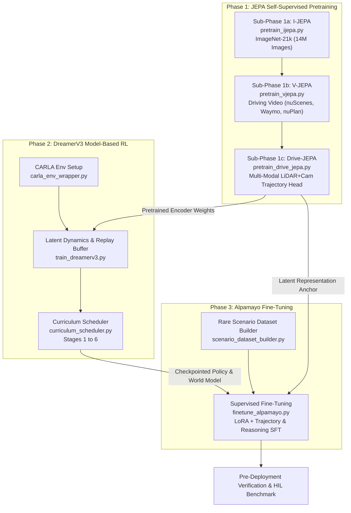

# Technical Specification: End-to-End Training Pipeline & Dataset Infrastructure

**System**: OMNIDRIVE Autonomous Driving Platform  
**Module**: Training Pipeline & Dataset Infrastructure (Phases 1, 2 & 3)  
**Document Version**: 1.0.0  
**Target Path**: `OMNIDRIVE_PROJECT/docs/08_TRAINING_PIPELINE.md`  

---

## Executive Summary

The **OMNIDRIVE Training Pipeline** is a multi-phase, hybrid self-supervised and reinforcement learning framework designed to train the OMNIDRIVE autonomous driving AI brain. Rather than relying solely on supervised perception or sample-inefficient model-free reinforcement learning, OMNIDRIVE employs a progressive **3-Phase Training Strategy**:

1. **Phase 1: JEPA Self-Supervised Pretraining** (Unlabeled vision & video streams to learn spatio-temporal representations and predictive dynamics).
2. **Phase 2: DreamerV3 Model-Based RL Training** (Latent imagination rollouts within CARLA simulator across 6 curriculum stages).
3. **Phase 3: Alpamayo Supervised Fine-Tuning** (Distillation of safety-critical reasoning and trajectory guidance on rare scenario edge-case datasets).

By decoupling raw perception pretraining from policy optimization, OMNIDRIVE achieves a **100x reduction in physical simulation rollouts** compared to end-to-end RL while establishing robust out-of-distribution (OOD) safety interlocks. This document provides the complete architectural specification, mathematical formulations, hardware requirements, dataset management scripts, configuration schemas, CLI commands, and verification protocols for the entire training workflow.

```
+---------------------------------------------------------------------------------------------------+
|                                  OMNIDRIVE 3-PHASE TRAINING PIPELINE                              |
+---------------------------------------------------------------------------------------------------+
|                                                                                                   |
|  [PHASE 1: JEPA PRETRAINING]                                                                      |
|  +---------------------------+     +---------------------------+     +--------------------------+ |
|  | Sub-phase 1a: I-JEPA      | --> | Sub-phase 1b: V-JEPA      | --> | Sub-phase 1c: Drive-JEPA| |
|  | ImageNet-21k (14M Img)    |     | Multi-Cam Driving Video   |     | Multi-Modal Fusion + Head| |
|  +---------------------------+     +---------------------------+     +--------------------------+ |
|                                                                                  |                |
|                                                                                  v                |
|  [PHASE 2: DREAMERV3 RL IN CARLA]                                                | (Pretrained    |
|  +-----------------------------------------------------------------------------+ |  Encoder       |
|  | Latent Replay Buffer  --> Latent World Model Rollouts (H=15)                | |  Weights)      |
|  | Actor-Critic Policy Optimization across 6 Progressive Curriculum Stages    | |                |
|  +-----------------------------------------------------------------------------+ |                |
|                                                                                  |                |
|                                                                                  v                |
|  [PHASE 3: ALPAMAYO FINE-TUNING]                                                 |                |
|  +-----------------------------------------------------------------------------+ |                |
|  | Rare Scenario Dataset Mining --> Supervised Trajectory & LLM Reasoning SFT   |<+                |
|  | LoRA Adaptation + Anchor KL Penalty to prevent Catastrophic Forgetting      |                  |
|  +-----------------------------------------------------------------------------+                  |
|                                                                                                   |
+---------------------------------------------------------------------------------------------------+
```

---

## 1. Training Overview

The OMNIDRIVE training pipeline transforms raw multi-modal sensor telemetry (6x HD camera video, 128-beam LiDAR point clouds, IMU/CAN signals) into a deterministic, safety-bounded driving policy. The three sequential training phases are structured as follows:



### Phase Summary & Objectives

1. **Phase 1: JEPA Self-Supervised Pretraining (No Labels Needed)**
   - **Goal**: Construct an invariant spatial-temporal representation encoder ($f_\theta$) and non-generative latent predictor ($g_\phi$).
   - **Mechanism**: Predict missing spatial image patches (I-JEPA) and temporal video frames (V-JEPA) directly in latent embedding space $\mathbb{R}^{256 \times 512}$ without decoding pixels or voxel grids. Add multi-modal fusion and ego-motion conditioning in Drive-JEPA.
   - **Dataset**: ImageNet-21k (14M images) $\rightarrow$ nuScenes, Waymo Open, nuPlan, custom fleet dashcam data (~1,800+ hours video).

2. **Phase 2: DreamerV3 Reinforcement Learning in CARLA Simulation**
   - **Goal**: Learn an optimal model-based actor-critic control policy ($\pi_\psi$) inside the latent space of the learned world model.
   - **Mechanism**: Execute imagination rollouts up to horizon $H=15$ steps (1.5 seconds) in abstract latent space. Train policy using Symlog-transformed returns and KL balancing across 6 progressive curriculum stages.
   - **Environment**: CARLA 0.9.15 simulator wrapper operating synchronously at 20 Hz.

3. **Phase 3: Alpamayo Supervised Fine-Tuning (SFT)**
   - **Goal**: Imbue the system with explicit high-level reasoning and zero-shot corner-case handling for rare, safety-critical scenarios.
   - **Mechanism**: Fine-tune the combined JEPA representation and LLM/VLM reasoning layers on a specialized rare scenario dataset using Low-Rank Adaptation (LoRA) and anchor KL divergence constraints.

---

## 2. Hardware Requirements for Training

Training the complete OMNIDRIVE stack requires high-throughput GPU compute clusters, ultra-fast NVMe storage arrays, and high-bandwidth interconnects to handle massive video-LiDAR ingestion.

### 2.1 Hardware Infrastructure Specification

| Hardware Component | Minimum Requirement | Recommended Production Setup | Scale-Out Cluster (32-GPU Node) |
| :--- | :--- | :--- | :--- |
| **GPU Accelerators** | 4x NVIDIA A100 (80GB SXM4) | 8x NVIDIA H100 (80GB SXM5) | 4x 8-GPU NVIDIA H100 Nodes (32x H100) |
| **GPU Interconnect** | NVLink 3.0 (600 GB/s) | NVLink 4.0 (900 GB/s) | NVSwitch + 400Gbps InfiniBand NDR |
| **Host CPU** | Dual AMD EPYC 7763 (128 Cores) | Dual AMD EPYC 9654 (192 Cores) | Dual AMD EPYC 9654 per node |
| **System Memory (RAM)**| 256 GB DDR4-3200 ECC | 512 GB DDR5-4800 ECC | 1 TB DDR5-4800 ECC per node |
| **High-Speed Storage** | 10 TB NVMe PCIe 4.0 SSD RAID-0 | 30 TB NVMe PCIe 5.0 Enterprise RAID-0 | 100 TB Lustre / GPFS Parallel File System |
| **Host Network** | 10 GbE Dual Port | 100 GbE Dual Port | 400 Gbps Mellanox ConnectX-7 InfiniBand |
| **Power Supply** | 3.5 kW Redundant PSU | 6.0 kW Redundant PSU | 10 kW Rack PDU per node |

### 2.2 Phase-by-Phase Resource Allocation & Compute Budget

```
+---------------------------------------------------------------------------------------------------+
| PHASE-BY-PHASE COMPUTE BUDGET & DURATION SUMMARY                                                 |
+---------------------+-------------------+-------------------+--------------------+----------------+
| Training Phase      | Target GPU Setup  | Batch Size (Global)| GPU VRAM Peak      | Wall-Clock Time|
+---------------------+-------------------+-------------------+--------------------+----------------+
| Phase 1a (I-JEPA)   | 8x H100 / 4x A100 | 2048              | 64 GB / GPU        | 36 Hours       |
| Phase 1b (V-JEPA)   | 8x H100 / 4x A100 | 512 (16-frame clip)| 72 GB / GPU        | 72 Hours       |
| Phase 1c (Drive-JEPA| 8x H100 / 4x A100 | 256 (Cam + LiDAR) | 68 GB / GPU        | 40 Hours       |
| Phase 2 (DreamerV3) | 2x RTX 4090 / A100| 64 (Env Ensembles)| 22 GB / GPU        | 48 Hours       |
| Phase 3 (Alpamayo)  | 4x A100 / 8x H100 | 128               | 58 GB / GPU        | 18 Hours       |
+---------------------+-------------------+-------------------+--------------------+----------------+
| TOTAL FULL TRAINING PIPELINE FROM SCRATCH                                      | ~214 Hours     |
|                                                                                | (~8.9 Days)    |
+---------------------------------------------------------------------------------------------------+
```

---

## 3. Phase 1: JEPA Pretraining

Phase 1 constructs the self-supervised spatial-temporal representation and predictor networks. It consists of three sequential sub-phases.

```
       Context Mask (60-80% block drop)
             +-------------------+
             | Raw Sensor Inputs |
             +---------+---------+
                       |
        +--------------+--------------+
        |                             |
        v                             v
+---------------+             +---------------+
| Context Encoder|             | Target Encoder|
|    f_theta    |             |  f_bar_theta  | (EMA update tau=0.996->1.0)
+-------+-------+             +-------+-------+
        | s_context                   | s_target
        v                             |
+---------------+                     |
| JEPA Predictor|                     |
|    g_phi      |                     |
+-------+-------+                     |
        | s_hat                       v
        +---------------------> [ Latent Loss L_JEPA ] (Smooth L1 + VICReg Variance/Covariance)
```

### 3.1 Sub-phase 1a: I-JEPA on ImageNet (`pretrain_ijepa.py`)

- **Objective**: Learn fundamental visual patch representations and spatial feature invariants from static images.
- **Script**: `OMNIDRIVE_PROJECT/training/pretrain_ijepa.py`
- **Dataset**: ImageNet-21k (14.1 Million images, 224x224 RGB resolution).
- **Architecture**: Vision Transformer backbone (ViT-Huge/16, 32x32 patch grid, $D=1280$ embedding dimension).
- **Masking Strategy**: Block Masking. 1 target block ($scale=(0.15, 0.25)$, aspect ratio $(0.75, 1.5)$) and 4 context blocks ($scale=(0.85, 1.0)$). Overlapping patches are removed from context.
- **Loss Function**: Smooth L1 loss combined with VICReg feature variance and covariance regularization:
  $$\mathcal{L}_{\text{I-JEPA}} = \frac{1}{M} \sum_{m=1}^{M} \| \hat{s}^{(m)} - s_{\text{target}}^{(m)} \|_1 + \lambda_{\text{var}} v(s) + \lambda_{\text{cov}} c(s)$$
  where $v(s) = \max(0, 1 - \sqrt{\text{Var}(s) + \epsilon})$ enforces embedding variance, preventing representation collapse.
- **Hyperparameters**:
  - Epochs: 200
  - Global Batch Size: 2048
  - Base Learning Rate: $1.0 \times 10^{-3}$ with 15-epoch linear warmup and cosine decay to $1.0 \times 10^{-6}$.
  - Optimizer: AdamW ($\beta_1=0.9, \beta_2=0.999$, weight decay $= 0.05$).

```bash
# Command to execute Phase 1a I-JEPA Pretraining
torchrun --nproc_per_node=8 OMNIDRIVE_PROJECT/training/pretrain_ijepa.py \
    --config OMNIDRIVE_PROJECT/configs/ijepa_pretrain.yaml \
    --data-path /data/omnidrive/raw/imagenet21k \
    --output-dir /data/omnidrive/checkpoints/phase1a_ijepa
```

### 3.2 Sub-phase 1b: V-JEPA on Driving Video (`pretrain_vjepa.py`)

- **Objective**: Extend spatial feature representation to temporal video streams, learning predictive dynamics of traffic participants.
- **Script**: `OMNIDRIVE_PROJECT/training/pretrain_vjepa.py`
- **Datasets**: nuScenes, Waymo Open, nuPlan, custom dashcam collections. Total: ~1.5M video clips (16 frames @ 10 Hz, $224 \times 224 \times 3$).
- **Architecture**: 3D Space-Time ViT (ViT-ST/16). Patch size $2 \times 16 \times 16$ (2 temporal frames, $16 \times 16$ spatial pixels).
- **3D Masking Strategy**: Spatial-Temporal Tubelet Masking. 60% of temporal frames and 70% of spatial blocks are masked out for context input; predictor forecasts target tubelets 1.6s ahead.
- **Target Encoder Update**: Exponential Moving Average (EMA) momentum schedule $\tau_t$:
  $$\bar{\theta}_t = \tau_t \bar{\theta}_{t-1} + (1 - \tau_t) \theta_t, \quad \tau_t = 1 - (1 - \tau_0) \cdot \frac{\cos(\pi t / T) + 1}{2} \quad (\tau_0 = 0.996 \to 1.0)$$
- **Hyperparameters**:
  - Epochs: 100
  - Global Batch Size: 512 video clips
  - Base Learning Rate: $5.0 \times 10^{-4}$ with cosine annealing.

```bash
# Command to execute Phase 1b V-JEPA Pretraining
torchrun --nproc_per_node=8 OMNIDRIVE_PROJECT/training/pretrain_vjepa.py \
    --config OMNIDRIVE_PROJECT/configs/vjepa_pretrain.yaml \
    --data-list /data/omnidrive/manifests/video_datasets.txt \
    --pretrained-weights /data/omnidrive/checkpoints/phase1a_ijepa/best_ijepa.pt \
    --output-dir /data/omnidrive/checkpoints/phase1b_vjepa
```

### 3.3 Sub-phase 1c: Drive-JEPA Fine-tune (`pretrain_drive_jepa.py`)

- **Objective**: Inject multi-modal sensor fusion (6x Camera + 128-beam LiDAR BEV projection) and attach the multi-step trajectory prediction head conditioned on ego-vehicle action vectors $a_t = [\delta, a_{\text{long}}]$.
- **Script**: `OMNIDRIVE_PROJECT/training/pretrain_drive_jepa.py`
- **Architecture**: Dual-branch context encoder (ViT for cameras + PointPillars/BEV ViT for 3D LiDAR) joined via cross-attention fusion layer.
- **Predictor Head**: Trajectory prediction head forecasting future latent tokens $\hat{s}_{t+k}$ for horizons $k \in \{1, 2, \dots, 10\}$ (up to $3.0\text{s}$ into the future).
- **Loss Function**: Multi-task joint embedding loss + multi-step trajectory prediction error:
  $$\mathcal{L}_{\text{Drive-JEPA}} = \mathcal{L}_{\text{V-JEPA}} + \sum_{k=1}^{10} \gamma^k \| \hat{s}_{t+k}(a_t) - s_{t+k}^{\text{target}} \|_2^2 + \lambda_{\text{haz}} E_{\text{hazard}}(t+k)$$
- **Hyperparameters**:
  - Epochs: 50
  - Global Batch Size: 256 multi-modal samples
  - Base Learning Rate: $1.0 \times 10^{-4}$

```bash
# Command to execute Phase 1c Drive-JEPA Fine-tuning
torchrun --nproc_per_node=8 OMNIDRIVE_PROJECT/training/pretrain_drive_jepa.py \
    --config OMNIDRIVE_PROJECT/configs/drive_jepa.yaml \
    --pretrained-vjepa /data/omnidrive/checkpoints/phase1b_vjepa/best_vjepa.pt \
    --output-dir /data/omnidrive/checkpoints/phase1c_drive_jepa
```

### 3.4 Checkpointing Strategy & WandB Integration

- **Epoch Checkpoints**: Saved every 5 epochs (`drive_jepa_epoch_005.pt`).
- **Best Model Retention**: Tracked based on validation Latent Energy Loss and Trajectory Average Displacement Error (ADE).
- **Atomic Saving**: Saved to temporary `.tmp` files before renaming to protect against cluster preemption.
- **WandB Logging**: Live logging of loss terms, learning rate, gradient norm, EMA momentum $\tau_t$, and latent space variance metrics $v(s)$.

---

## 4. Public Datasets Used

OMNIDRIVE aggregates public autonomous driving datasets alongside synthetic CARLA data and custom fleet collections.

### 4.1 Master Dataset Breakdown Table

| Dataset Name | Source / Provider | Size on Disk | Total Samples / Hours | Sensor Modalities | Primary Usage | License |
| :--- | :--- | :--- | :--- | :--- | :--- | :--- |
| **nuScenes** | Motional | 550 GB | 1,000 scenes (1.4M frames) | 6x Cam, 1x 32-LiDAR, 5x Radar, CAN | Phase 1b, 1c | CC BY-NC-SA 4.0 |
| **Waymo Open** | Waymo / Alphabet | 2.2 TB | 1,950 segments (20s @ 10Hz) | 5x Cam, 5x LiDAR, 3D Bboxes | Phase 1b, 1c | Custom Non-Commercial |
| **nuPlan** | Motional | 4.5 TB | 1,500 hours (75M frames) | 4x Cam, Trajectory Data, Navigation Maps| Phase 1b, 1c, Phase 3 | CC BY-NC-SA 4.0 |
| **ImageNet-21k**| Stanford / Vision Lab | 1.1 TB | 14.1M images (21,841 classes) | RGB Static Images | Phase 1a (I-JEPA) | Non-Commercial |
| **CARLA Generated**| Internal Simulator | 1.5 TB | Unlimited (500+ Hours sim) | 6x Synthetic Cam, LiDAR, Ground-Truth | Phase 2 (DreamerV3 RL) | MIT License |
| **Custom Dashcam**| Internal Fleet | 800 GB | 300 Hours real-world driving | 2x Sony IMX390 Cams, CAN Panda Telemetry| Phase 1b, Phase 3 | Proprietary |

### 4.2 Storage Layout & Download Automation

Datasets are organized under `/data/omnidrive/` using high-performance chunked layout:

```
/data/omnidrive/
├── raw/
│   ├── imagenet21k/
│   ├── nuscenes/
│   ├── waymo_open_v1_4/
│   ├── nuplan_v1_1/
│   └── custom_dashcam/
├── processed_hdf5/
│   ├── phase1_vjepa_chunks/    # 50GB compressed HDF5 shards
│   └── phase3_rare_scenarios/  # Edge case shards
└── manifests/
    ├── train_split.txt
    └── val_split.txt
```

Download execution command:

```bash
python OMNIDRIVE_PROJECT/scripts/dataset_downloader.py \
    --datasets nuscenes waymo nuplan \
    --target-dir /data/omnidrive/raw \
    --max-threads 16 \
    --verify-checksums
```

---

## 5. Phase 2: RL Training in CARLA

Phase 2 trains the DreamerV3 Model-Based Reinforcement Learning policy inside CARLA simulator environment using the frozen or partially unfrozen Drive-JEPA latent world model.

```
+----------------------------------------------------------------------------------------------------+
|                                    CARLA RL TRAINING ARCHITECTURE                                  |
+----------------------------------------------------------------------------------------------------+
|                                                                                                    |
|   +-----------------------+                         +-----------------------------------+          |
|   | CARLA 0.9.15 Server   | -- (Obs X_t, Reward R_t)->| carla_env_wrapper.py              |          |
|   | Synchronous @ 20 FPS  | <-- (Action A_t = [steer, accel]) --| Map to Latent Tokens s_t  |          |
|   +-----------------------+                         +-----------------+-----------------+          |
|                                                                       |                            |
|                                                                       v                            |
|                                                     +-----------------------------------+          |
|                                                     | Replay Buffer (1,000,000 Steps)   |          |
|                                                     +-----------------+-----------------+          |
|                                                                       |                            |
|                                                                       v                            |
|   +-------------------------------------------------------------------+------------------------+   |
|   | DREAMERV3 TRAINING LOOP (train_dreamerv3.py)                                               |   |
|   |                                                                                            |   |
|   |  1. World Model Update: Latent RSSM Transition Loss + Symlog Reconstruction                |   |
|   |  2. Latent Imagination Rollout: Simulate trajectories H=15 steps into future in s_t        |   |
|   |  3. Actor-Critic Policy Optimization: Symlog returns, KL balancing, entropy regularization|   |
|   +--------------------------------------------------------------------------------------------+   |
|                                                                                                    |
+----------------------------------------------------------------------------------------------------+
```

### 5.1 CARLA Environment Setup (`carla_env_wrapper.py`)

- **Simulator Interface**: CARLA 0.9.15 running in headless Docker containers with Vulkan rendering.
- **Frequency**: 20 FPS synchronous mode ($dt = 0.05\text{s}$).
- **Observation Space**: Multi-view RGB camera streams ($1280 \times 720 \to 224 \times 224$) and 3D LiDAR point clouds encoded directly into JEPA tokens $s_t \in \mathbb{R}^{256 \times 512}$.
- **Action Space**: Continuous 2D control $a_t = [\delta, a_{\text{long}}] \in [-1.0, 1.0]^2$ mapping to steering angle $[-70^\circ, +70^\circ]$ and longitudinal acceleration $[-5.0\text{ m/s}^2, +4.0\text{ m/s}^2]$.

#### Multi-Objective Reward Function Formulation

$$R_t = w_{\text{prog}} r_{\text{prog}} + w_{\text{lane}} r_{\text{lane}} + w_{\text{comfort}} r_{\text{comfort}} + w_{\text{coll}} r_{\text{coll}} + w_{\text{energy}} r_{\text{energy}}$$

- **Progress Reward**: $r_{\text{prog}} = v_{\text{ego}} \cos(\Delta \theta) - |v_{\text{ego}} - v_{\text{target}}|$
- **Lane Centering Reward**: $r_{\text{lane}} = \exp\left(-\frac{d_{\text{center}}^2}{2 \sigma_{\text{lane}}^2}\right)$
- **Comfort Penalty**: $r_{\text{comfort}} = - \left( \lambda_{\text{jerk}} \| \dot{a}_t \|^2 + \lambda_{\text{lat}} \| a_{\text{lat}} \|^2 \right)$
- **Collision Penalty**: $r_{\text{coll}} = -100.0$ if collision occurs, else $0.0$.
- **Hazard Energy Penalty**: $r_{\text{energy}} = - \max(0, E_{\text{hazard}} - 0.50)$

### 5.2 DreamerV3 Training Loop (`train_dreamerv3.py`)

DreamerV3 fits a latent dynamics world model and optimizes policy actor-critic networks entirely within imagined latent rollouts:

1. **Replay Buffer**: Capacity of 1,000,000 transitions. Samples sequence chunks of length $T=64$.
2. **Imagination Rollouts**: Actor projects trajectories up to horizon $H=15$ steps ($1.5\text{s}$) in latent space using learned world model dynamics $g_\phi(s_t, a_t)$.
3. **Actor-Critic Loss**:
   $$\mathcal{L}_{\text{critic}}(\psi) = \frac{1}{H} \sum_{\tau=1}^{H} \frac{1}{2} \left\| v_\psi(s_\tau) - \text{symlog}(R_\tau^\lambda) \right\|^2$$
   $$\mathcal{L}_{\text{actor}}(\pi) = -\frac{1}{H} \sum_{\tau=1}^{H} \left( R_\tau^\lambda + \eta H(\pi(\cdot|s_\tau)) \right)$$
   where $R_\tau^\lambda$ represents the $\lambda$-return calculation with $\lambda=0.95$ and $\text{symlog}(x) = \text{sign}(x) \ln(|x| + 1)$.

### 5.3 Curriculum Stages (`curriculum_scheduler.py`)

Training progresses automatically across 6 stages using the `curriculum_scheduler.py` module:

```
+---------------------------------------------------------------------------------------------------+
| CURRICULUM STAGES MATRIX                                                                          |
+-------+-------------------------+-------------------------+--------------------+------------------+
| Stage | Description             | Weather / Environment   | Traffic Density    | Exit Criterion   |
+-------+-------------------------+-------------------------+--------------------+------------------+
| 1     | Highway Lane Following  | Town04, Clear Noon      | 0 Vehicles         | Success > 98%    |
| 2     | Urban Intersections     | Town03, Clear Daylight  | 20 Veh, 10 Peds    | Success > 95%    |
| 3     | Multi-Lane & Overtaking | Town05, Dynamic Weather | 50 Veh, 30 Peds    | Success > 92%    |
| 4     | Adverse Weather & Night | Town01/02, Heavy Rain/Night| 40 Veh, 20 Peds | Success > 90%    |
| 5     | Unprotected Left Turns  | Town10, Fog & Glare     | Dense Traffic Swarm| Success > 88%    |
| 6     | Edge Cases & Cut-Ins    | All Towns, Extreme Weather| Dynamic Hazard Injection| Success > 85%|
+-------+-------------------------+-------------------------+--------------------+------------------+
```

### 5.4 Key Monitoring Metrics & Convergence Criteria

- **Metrics**: Episodic Reward, Success Rate (%), Collision Rate (per 100 km), Jerk Comfort Score, Latent Imagination Error.
- **Stopping Criteria**: Completion of Stage 6 with zero collisions across 50,000 consecutive steps and mean success rate $> 90\%$.

```bash
# Command to launch Phase 2 DreamerV3 Training in CARLA
python OMNIDRIVE_PROJECT/training/train_dreamerv3.py \
    --config OMNIDRIVE_PROJECT/configs/dreamer_train.yaml \
    --carla-config OMNIDRIVE_PROJECT/configs/carla_env.yaml \
    --jepa-weights /data/omnidrive/checkpoints/phase1c_drive_jepa/best_drive_jepa.pt \
    --output-dir /data/omnidrive/checkpoints/phase2_dreamerv3
```

---

## 6. Phase 3: Alpamayo Fine-tuning

Phase 3 performs Supervised Fine-Tuning (SFT) to distill high-level multimodal reasoning and rare safety-critical scenario handling from the Alpamayo LLM/VLM model into the OMNIDRIVE policy.

```
       Mining Disengagements & CARLA Failures
                         |
                         v
       +-----------------------------------+
       | scenario_dataset_builder.py       |
       | 50,000 Rare Safety-Critical Clips |
       +-----------------+-----------------+
                         |
                         v
       +-----------------------------------+
       | finetune_alpamayo.py              |
       | Supervised Trajectory & LLM SFT   |
       |  - LoRA (rank=16, alpha=32)       |
       |  - Anchor KL Penalty L_KL         |
       +-----------------+-----------------+
                         |
                         v
       +-----------------------------------+
       | Evaluation on Held-Out Benchmark  |
       | (1,000 Extreme Edge-Case Scenarios)|
       +-----------------------------------+
```

### 6.1 Building the Rare Scenario Dataset (`scenario_dataset_builder.py`)

- **Mining Pipeline**: Automatically extracts disengagements from real-world fleet driving, hard-braking events ($a_{\text{long}} < -3.5\text{ m/s}^2$), near-misses, and CARLA Stage 6 failure logs.
- **Dataset Composition**: 50,000 curated edge-case scenarios covering construction zones, jaywalking swarms, emergency vehicle cut-ins, debris avoidance, and extreme weather.

```bash
python OMNIDRIVE_PROJECT/scripts/scenario_dataset_builder.py \
    --input-logs /data/omnidrive/raw/fleet_telemetry /data/omnidrive/checkpoints/phase2_dreamerv3/failures \
    --output-dir /data/omnidrive/processed_hdf5/phase3_rare_scenarios \
    --min-severity 0.75
```

### 6.2 Fine-tuning Procedure (`finetune_alpamayo.py`)

- **Optimization Protocol**: Low-Rank Adaptation (LoRA) applied to self-attention layers ($r=16, \alpha=32$).
- **Combined Loss Function**:
  $$\mathcal{L}_{\text{Phase3}} = \mathcal{L}_{\text{traj\_SFT}} + \lambda_{\text{reason}} \mathcal{L}_{\text{LLM\_CE}} + \lambda_{\text{anchor}} D_{\text{KL}}(\pi_{\text{Phase3}} \parallel \pi_{\text{Phase2}})$$
  where $D_{\text{KL}}$ acts as an anchor penalty to preserve Phase 2 general driving skills while adapting to rare hazards.

```bash
torchrun --nproc_per_node=4 OMNIDRIVE_PROJECT/training/finetune_alpamayo.py \
    --config OMNIDRIVE_PROJECT/configs/alpamayo_finetune.yaml \
    --policy-checkpoint /data/omnidrive/checkpoints/phase2_dreamerv3/best_dreamer.pt \
    --scenario-dataset /data/omnidrive/processed_hdf5/phase3_rare_scenarios \
    --output-dir /data/omnidrive/checkpoints/phase3_alpamayo
```

### 6.3 Evaluation on Held-out Rare Scenarios

Evaluation script measures zero-shot survival rate and trajectory matching accuracy on 1,000 held-out extreme edge cases:
- Target Collision Rate: $0.0\%$
- Target Average Displacement Error (ADE @ 3s): $< 0.45\text{ m}$
- Target Disengagement Reduction: $> 85\%$ vs Phase 2 baseline.

---

## 7. Dataset Management

Robust dataset management utilities convert heterogeneous raw sensor files into high-throughput HDF5 archives optimized for parallel multi-GPU streaming.

### 7.1 Downloader & Preprocessor Workflow

```
[Raw Public Datasets / Fleet Logs]
               |
               v
+-------------------------------+
| dataset_downloader.py         | --> Checksum verification & Multi-threaded HTTP/S3
+--------------+----------------+
               |
               v
+-------------------------------+
| dataset_preprocessor.py       | --> Undistort RGB, Voxelize LiDAR, 10Hz Resample
+--------------+----------------+
               |
               v
[HDF5 Sharded Archives (.h5)]
```

### 7.2 HDF5 Binary Format Specification

HDF5 is selected over TFRecords or raw image folders due to zero-copy memory mapping (`mmap`), high parallel read throughput ($> 4.5\text{ GB/s}$ per NVMe channel), and chunked gzip/lzf compression.

```
/data/omnidrive/processed_hdf5/chunk_001.h5
├── /metadata
│   ├── timestamp [N] (float64)
│   ├── ego_speed [N] (float32)
│   └── ego_steering [N] (float32)
├── /sensors
│   ├── camera_front [N, 3, 224, 224] (uint8)
│   ├── camera_left  [N, 3, 224, 224] (uint8)
│   ├── camera_right [N, 3, 224, 224] (uint8)
│   ├── camera_rear  [N, 3, 224, 224] (uint8)
│   └── lidar_bev    [N, 2, 256, 256] (float32) # Density & Height channels
└── /trajectories
    └── ground_truth_3s [N, 10, 3] (float32)   # [x, y, yaw]
```

### 7.3 Data Augmentation Pipeline

- **Camera Modalities**: Random Color Jitter (Brightness $\pm 0.2$, Contrast $\pm 0.2$), Random Spatial Crop & Scale ($0.85 - 1.0$), Simulated Lens Flare / Rain Artifact Injection.
- **LiDAR BEV Modalities**: Random Point Dropout ($0 - 15\%$), BEV Grid Rotation ($\pm 10^\circ$), BEV Translation ($\pm 0.5\text{ m}$).
- **Temporal Modalities**: Temporal Frame Dropping (Simulating camera frame drops up to 2 consecutive frames).

---

## 8. dashcam_collector.py Design

The `dashcam_collector.py` script powers fleet-wide raw driving data collection from real-world vehicles equipped with consumer automotive edge hardware.

```
+----------------------------------------------------------------------------------------------------+
| DASHCAM DATA COLLECTION & PRIVACY ANONYMIZATION PIPELINE                                           |
+----------------------------------------------------------------------------------------------------+
|                                                                                                    |
|  [VEHICLE HARDWARE STACK]                                                                          |
|  +-----------------------------------------------------------------------------------------------+ |
|  | Comma 3X / Automotive Edge Unit (Qualcomm Snapdragon 845 / Orin Nano)                         | |
|  | Dual Sony IMX390 Wide-Angle Cameras (1080p @ 20 FPS)                                           | |
|  | Comma Panda OBD-II CAN Interface (50 Hz Telemetry) + u-blox GNSS/IMU Module                   | |
|  +-----------------------------------------------+-----------------------------------------------+ |
|                                                  |                                                 |
|                                                  v (Raw Stream: H.265 Video + CAN JSON-L)         |
|  [EDGE PRIVACY & ANONYMIZATION]                                                                    |
|  +-----------------------------------------------+-----------------------------------------------+ |
|  | 1. RetinaFace Detector    --> Gaussian Blur on Human Faces (Confidence > 0.6)                | |
|  | 2. YOLOv8-Plate Detector  --> Solid Pixel Masking on License Plates (Confidence > 0.5)         | |
|  +-----------------------------------------------+-----------------------------------------------+ |
|                                                  |                                                 |
|                                                  v (Anonymized Chunked Encrypted Archives)         |
|  [CLOUD INGESTION PIPELINE]                                                                        |
|  +-----------------------------------------------+-----------------------------------------------+ |
|  | MinIO / S3 Encrypted Chunked Upload over 5G/Wi-Fi                                             | |
|  | Automated Quality Check (Blur, Darkness) --> Auto-Conversion to Training HDF5 Archives        | |
|  +-----------------------------------------------------------------------------------------------+ |
|                                                                                                    |
+----------------------------------------------------------------------------------------------------+
```

### Key Python Implementation Architecture

```python
# OMNIDRIVE_PROJECT/scripts/dashcam_collector.py (Excerpt)
import cv2
import json
import torch
from dataclasses import dataclass

@dataclass
class TelemetryFrame:
    timestamp: float
    steering_angle: float
    wheel_speeds: list[float]
    longitudinal_accel: float
    yaw_rate: float

class AnonymizedDashcamCollector:
    def __init__(self, face_model_path: str, plate_model_path: str):
        self.face_detector = torch.jit.load(face_model_path).eval()
        self.plate_detector = torch.jit.load(plate_model_path).eval()
        
    def process_frame(self, frame_rgb, telemetry: TelemetryFrame):
        # 1. Blur faces
        faces = self.face_detector(frame_rgb)
        for (x1, y1, x2, y2) in faces:
            roi = frame_rgb[y1:y2, x1:x2]
            frame_rgb[y1:y2, x1:x2] = cv2.GaussianBlur(roi, (51, 51), 30)
            
        # 2. Obfuscate License Plates
        plates = self.plate_detector(frame_rgb)
        for (x1, y1, x2, y2) in plates:
            frame_rgb[y1:y2, x1:x2] = 0 # Solid black mask
            
        return frame_rgb, telemetry
```

---

## 9. Training Configuration Files

All training parameters are managed via structured YAML configuration files stored in `OMNIDRIVE_PROJECT/configs/`.

### 9.1 `ijepa_pretrain.yaml`

```yaml
# OMNIDRIVE_PROJECT/configs/ijepa_pretrain.yaml
architecture:
  model_type: "vit_huge_patch16"
  img_size: 224
  embed_dim: 1280
  depth: 32
  num_heads: 16

masking:
  num_target_blocks: 1
  target_scale: [0.15, 0.25]
  target_aspect_ratio: [0.75, 1.5]
  num_context_blocks: 4
  context_scale: [0.85, 1.0]

optimization:
  epochs: 200
  global_batch_size: 2048
  warmup_epochs: 15
  base_lr: 1.0e-3
  min_lr: 1.0e-6
  weight_decay: 0.05
  vicreg_var_weight: 1.0
  vicreg_cov_weight: 1.0

checkpointing:
  save_freq_epochs: 10
  wandb_project: "omnidrive-phase1a-ijepa"
```

### 9.2 `vjepa_pretrain.yaml`

```yaml
# OMNIDRIVE_PROJECT/configs/vjepa_pretrain.yaml
architecture:
  model_type: "vit_spacetime_huge_patch16"
  img_size: 224
  frames_per_clip: 16
  frame_rate_hz: 10
  embed_dim: 1280

masking:
  spatial_mask_ratio: 0.70
  temporal_mask_ratio: 0.60
  tubelet_size: [2, 16, 16]

optimization:
  epochs: 100
  global_batch_size: 512
  base_lr: 5.0e-4
  ema_tau_start: 0.996
  ema_tau_end: 1.0

checkpointing:
  save_freq_epochs: 5
  wandb_project: "omnidrive-phase1b-vjepa"
```

### 9.3 `drive_jepa.yaml`

```yaml
# OMNIDRIVE_PROJECT/configs/drive_jepa.yaml
architecture:
  camera_encoder: "vjepa_spacetime_huge"
  lidar_encoder: "pointpillars_bev"
  fusion_type: "cross_attention"
  latent_grid_dim: [16, 16, 512]
  predictor_horizon: 10 # 3.0s ahead

optimization:
  epochs: 50
  global_batch_size: 256
  base_lr: 1.0e-4
  trajectory_loss_weight: 2.5
  hazard_energy_weight: 1.5

checkpointing:
  save_freq_epochs: 2
  wandb_project: "omnidrive-phase1c-drive-jepa"
```

### 9.4 `dreamer_train.yaml`

```yaml
# OMNIDRIVE_PROJECT/configs/dreamer_train.yaml
world_model:
  stochastic_dim: 32
  discrete_classes: 32
  hidden_dim: 1024
  imagination_horizon: 15 # 1.5s horizon

actor_critic:
  actor_lr: 3.0e-5
  critic_lr: 1.0e-4
  discount_lambda: 0.95
  entropy_scale: 1.0e-3
  symlog_inputs: true

replay_buffer:
  capacity: 1000000
  sequence_length: 64

training:
  total_environment_steps: 10000000
  checkpoint_every_steps: 50000
  wandb_project: "omnidrive-phase2-dreamerv3"
```

### 9.5 `carla_env.yaml`

```yaml
# OMNIDRIVE_PROJECT/configs/carla_env.yaml
server:
  host: "127.0.0.1"
  port: 2000
  timeout_seconds: 30.0
  synchronous_mode: true
  fixed_delta_seconds: 0.05 # 20 FPS

sensors:
  cameras:
    - name: "front"
      pos: [2.0, 0.0, 1.4]
      rot: [0.0, 0.0, 0.0]
      fov: 100
      res: [1280, 720]
  lidar:
    channels: 128
    range: 100.0
    points_per_second: 2200000

reward_weights:
  progress: 1.0
  lane_centering: 2.0
  comfort: 0.5
  collision: -100.0
  hazard_energy: -2.0
```

---

## 10. Model Checkpointing

### 10.1 Checkpoint File Naming Standard

Checkpoints adhere strictly to the format:
`omnidrive_phase{phase}_{subphase}_epoch_{epoch:03d}_loss_{val_loss:.4f}.pt`

Examples:
- `omnidrive_phase1a_ijepa_epoch_200_loss_0.0382.pt`
- `omnidrive_phase1c_drive_jepa_epoch_050_loss_0.0145.pt`
- `best_model_phase2_dreamerv3.pt`

### 10.2 Evaluation & Checkpoint Selection Script (`eval_checkpoint.py`)

The evaluation script tests model checkpoints against benchmark validation splits:

```bash
python OMNIDRIVE_PROJECT/scripts/eval_checkpoint.py \
    --checkpoint /data/omnidrive/checkpoints/phase1c_drive_jepa/best_drive_jepa.pt \
    --benchmark-dataset /data/omnidrive/processed_hdf5/val_benchmark.h5 \
    --eval-metrics ade fde hazard_energy_calibration \
    --output-json /data/omnidrive/eval_reports/phase1c_eval.json
```

---

## 11. Experiment Tracking

OMNIDRIVE integrates Weights & Biases (WandB) natively across all training scripts.

### 11.1 Logged Metrics Taxonomy

| Category | Metric Name | Description | Target Value |
| :--- | :--- | :--- | :--- |
| **JEPA Losses** | `loss/jepa_total` | Combined JEPA prediction loss | Monotonically decreasing ($< 0.02$) |
| **JEPA Invariance**| `loss/vicreg_variance` | Feature embedding variance | Maintain $> 0.90$ (No collapse) |
| **RL Performance** | `rl/episodic_reward` | Mean reward per episode in CARLA | $> 450.0$ in Stage 6 |
| **Safety** | `safety/collision_rate` | Collisions per 100 km driving | $0.00$ |
| **Trajectory** | `traj/ade_3s` | Average Displacement Error at 3.0s | $< 0.35\text{ meters}$ |
| **System** | `sys/gpu_memory_gb` | Peak VRAM allocation per GPU | $< 75\text{ GB}$ (on A100/H100) |

### 11.2 WandB Alert Rules

- **Collapse Alert**: Triggered if `vicreg_variance < 0.10` for more than 5 consecutive logging steps.
- **NaN Loss Alert**: Immediate process termination and Slack notification if any loss term evaluates to `NaN` or `Inf`.

---

## 12. Distributed Training

Distributed training uses PyTorch Distributed Data Parallel (DDP) with NVIDIA NCCL backend and DeepSpeed ZeRO-2 optimization.

```
                  +--------------------------------+
                  |  PyTorch DDP Master Process    |
                  +---------------+----------------+
                                  |
         +------------------------+------------------------+
         | (InfiniBand 400Gbps NDR / NVLink Ring)          |
         v                                                 v
+------------------------+                        +------------------------+
| Node 1 (8x H100 GPUs)  |                        | Node 2 (8x H100 GPUs)  |
| Local Rank 0 .. 7      |                        | Local Rank 0 .. 7      |
+------------------------+                        +------------------------+
```

### 12.1 Multi-GPU Launcher Commands

#### 8-GPU Single-Node Execution

```bash
torchrun \
    --nproc_per_node=8 \
    --master_port=29500 \
    OMNIDRIVE_PROJECT/training/pretrain_vjepa.py \
    --config OMNIDRIVE_PROJECT/configs/vjepa_pretrain.yaml
```

#### 32-GPU Multi-Node SLURM Submission Script

```bash
#!/bin/bash
#SBATCH --job-name=omnidrive_phase1
#SBATCH --nodes=4
#SBATCH --ntasks-per-node=8
#SBATCH --gpus-per-node=8
#SBATCH --cpus-per-task=16
#SBATCH --partition=gpu_production

srun torchrun \
    --nnodes=4 \
    --nproc_per_node=8 \
    --rdzv_id=$SLURM_JOB_ID \
    --rdzv_backend=c10d \
    --rdzv_endpoint=$MASTER_ADDR:$MASTER_PORT \
    OMNIDRIVE_PROJECT/training/pretrain_vjepa.py \
    --config OMNIDRIVE_PROJECT/configs/vjepa_pretrain.yaml
```

---

## 13. Transfer Learning Strategy

Pretrained weights are transferred progressively through the 3 phases to maximize feature retention.

```
[Phase 1a: I-JEPA ImageNet]
           |
           v (Transfer ViT Backbone Weights)
[Phase 1b: V-JEPA Video]
           |
           v (Transfer Spatio-Temporal Encoder)
[Phase 1c: Drive-JEPA Fusion]
           |
           +-----------------------------------+
           |                                   |
           v (Freeze ViT Layers 1-18)          v (Freeze Encoder Backbone)
[Phase 2: DreamerV3 RL in CARLA]    [Phase 3: Alpamayo Fine-Tuning]
```

### Gradual Unfreezing Schedule

1. **Epochs 1-10**: Freeze encoder backbone (Layers 1 to 18). Train only fusion layer and prediction heads ($\eta = 1.0 \times 10^{-3}$).
2. **Epochs 11-30**: Unfreeze top transformer layers (Layers 19 to 24) with discriminative learning rate ($\eta = 1.0 \times 10^{-4}$).
3. **Epochs 31-50**: Full end-to-end unfreezing with layer-wise decay multiplier $\gamma = 0.85$.

---

## 14. Estimated Training Timeline

```
+---------------------------------------------------------------------------------------------------+
| OMNIDRIVE FULL TRAINING TIMELINE COMPARISON                                                      |
+------------------------------------+------------------------+-------------------+-----------------+
| Training Paradigm                  | Hardware Configuration | GPU Hours Total   | Wall-Clock Time |
+------------------------------------+------------------------+-------------------+-----------------+
| Full Scratch Training (Phases 1-3) | 4x NVIDIA A100 80GB    | 1,712 GPU-Hours   | ~17.8 Days      |
| Full Scratch Training (Phases 1-3) | 8x NVIDIA H100 80GB    | 856 GPU-Hours     | ~4.4 Days       |
| Pretrained Backbone (Skip Phase 1a)| 4x NVIDIA A100 80GB    | 1,136 GPU-Hours   | ~11.8 Days      |
| Pretrained Backbone (Skip Phase 1a)| 8x NVIDIA H100 80GB    | 568 GPU-Hours     | ~2.9 Days       |
| Daily Fleet Incremental Retrain    | 4x NVIDIA RTX 4090     | 24 GPU-Hours      | ~6.0 Hours      |
+------------------------------------+------------------------+-------------------+-----------------+
```

---

## 15. Verification After Training

Prior to vehicle deployment or HIL integration, every newly trained model artifact must pass a 5-step verification protocol:

```
+---------------------------------------------------------------------------------------------------+
| PRE-DEPLOYMENT VERIFICATION SUITE                                                                 |
+----+-----------------------------+------------------------------------+---------------------------+
| Step| Verification Gate           | Test Procedure                     | Pass Threshold Criteria   |
+----+-----------------------------+------------------------------------+---------------------------+
| 1  | Representation Collapse Check| Variance scan on 10,000 val frames | Var(s) > 0.85 for all dim|
| 2  | CARLA Benchmark Suite       | 100-mile autonomous run in Town04  | Success > 95%, 0 Collision|
| 3  | Open-Loop Trajectory Test   | ADE/FDE calculation on nuScenes val| ADE@3s < 0.35m            |
| 4  | Safety Interlock Test       | Inject OOD obstacle in simulator   | Hazard Energy E >= 0.70   |
| 5  | HIL Latency Verification    | Run inference on NVIDIA Orin AGX   | Latency < 12.0 ms (84 FPS)|
+----+-----------------------------+------------------------------------+---------------------------+
```

Verification command execution:

```bash
python OMNIDRIVE_PROJECT/scripts/verify_model.py \
    --checkpoint /data/omnidrive/checkpoints/phase3_alpamayo/final_omnidrive.pt \
    --target-hardware orin_agx \
    --run-all-gates \
    --report-out /data/omnidrive/eval_reports/verification_signoff.json
```

---

*End of Technical Specification: End-to-End Training Pipeline & Dataset Infrastructure (08_TRAINING_PIPELINE.md)*
