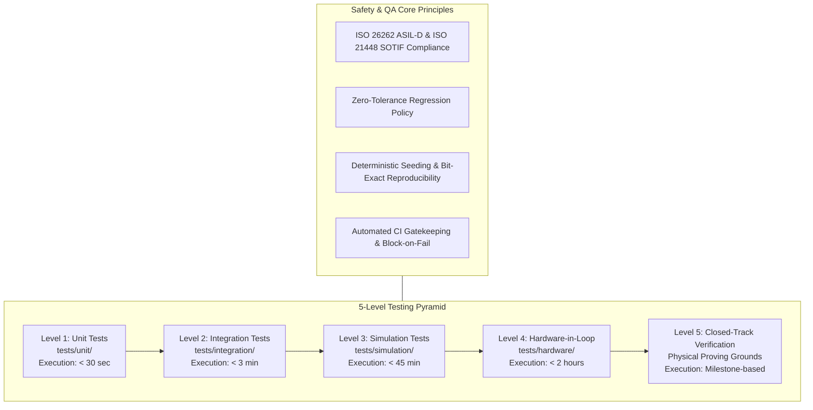
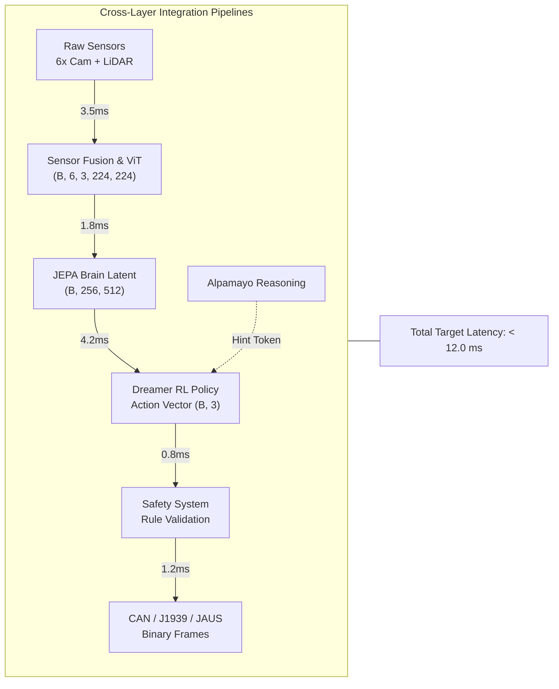
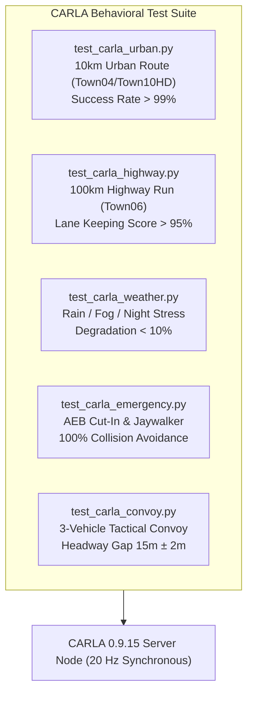
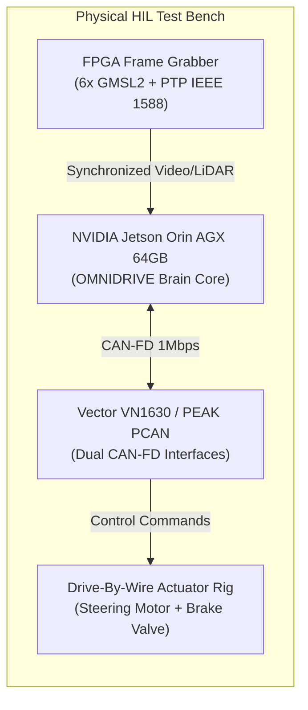
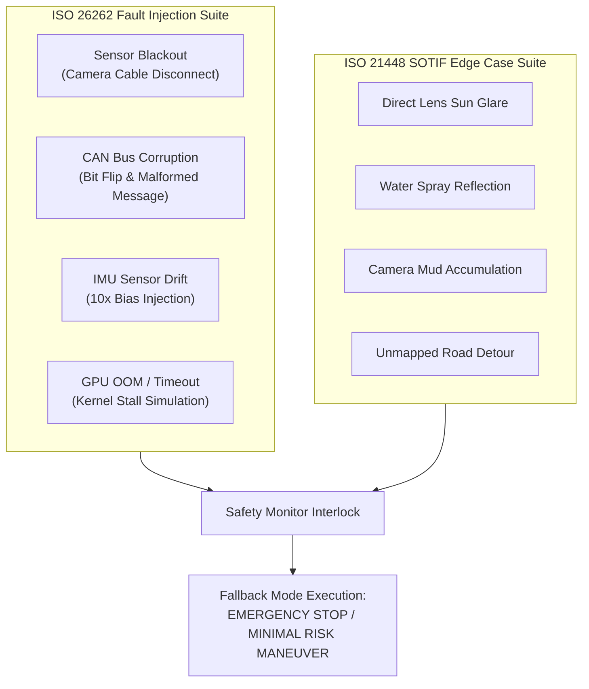

# Technical Specification: End-to-End Test Strategy & Quality Assurance Framework

**System**: OMNIDRIVE Autonomous Driving Platform  
**Module**: Test Strategy & Quality Assurance Framework (Layer 1 - Layer 7)  
**Document Version**: 1.0.0  
**Target Path**: `OMNIDRIVE_PROJECT/docs/09_TEST_STRATEGY.md`  

---

## Executive Summary

The **OMNIDRIVE Test Strategy & Quality Assurance Framework** establishes a rigorous, multi-tiered verification and validation (V&V) architecture for the 7-layer OMNIDRIVE autonomous driving AI brain. Operating across three heterogeneous vehicle platforms—**Robot Taxis**, **Commercial Heavy Trucks**, and **Military Tactical UGVs**—OMNIDRIVE requires a deterministic, safety-critical testing framework that guarantees functional safety (ISO 26262 ASIL-D), safety of the intended functionality (SOTIF / ISO 21448), and real-time execution bounds ($\le 12.0\text{ ms}$ total frame latency).

This document details the complete testing strategy from isolated unit tests to real-world closed-track validation. It provides exact test plans for all source files, end-to-end integration pipelines, CARLA-based closed-loop simulations, Hardware-in-the-Loop (HIL) testbeds, automated performance benchmarks, synthetic test fixtures, continuous integration (CI/CD) workflows, coverage enforcement gates, fault injection protocols, domain-specific military/truck test suites, and strict acceptance criteria required prior to vehicle deployment.

```
+---------------------------------------------------------------------------------------------------+
|                                 OMNIDRIVE 5-LEVEL TESTING PYRAMID                                 |
+---------------------------------------------------------------------------------------------------+
|                                                                                                   |
|  [LEVEL 5: REAL-WORLD CLOSED TRACK]                                                               |
|  +---------------------------------------------------------------------------------------------+  |
|  | Physical Vehicle Testing (Proving Grounds, Obstacle Avoidance, Convoy, DBW Latency)         |  |
|  +---------------------------------------------------------------------------------------------+  |
|                                                ^                                                  |
|  [LEVEL 4: HARDWARE-IN-THE-LOOP (HIL)]         |                                                  |
|  +---------------------------------------------------------------------------------------------+  |
|  | Real NVIDIA Orin AGX, Vector CAN FD, Real LiDAR/GMSL2 Sync, Real DBW Actuators              |  |
|  +---------------------------------------------------------------------------------------------+  |
|                                                ^                                                  |
|  [LEVEL 3: CARLA SIMULATION (SIL)]             |                                                  |
|  +---------------------------------------------------------------------------------------------+  |
|  | Closed-Loop Behavioral Scenarios (Urban 10km, Highway 100km, Weather Deg, AEB, Convoy)      |  |
|  +---------------------------------------------------------------------------------------------+  |
|                                                ^                                                  |
|  [LEVEL 2: INTEGRATION TESTS]                  |                                                  |
|  +---------------------------------------------------------------------------------------------+  |
|  | Cross-Layer Dataflows (Sensor->JEPA, JEPA->RL, RL->CAN, Reasoning->RL, Full Brain Pipeline)  |  |
|  +---------------------------------------------------------------------------------------------+  |
|                                                ^                                                  |
|  [LEVEL 1: UNIT TESTS]                         |                                                  |
|  +---------------------------------------------------------------------------------------------+  |
|  | Component Validation (Sensor Fusion, ViT, JEPA, Hazard Energy, Dreamer, CAN/J1939/JAUS)     |  |
|  +---------------------------------------------------------------------------------------------+  |
|                                                                                                   |
+---------------------------------------------------------------------------------------------------+
```

---

## 1. Testing Philosophy

The OMNIDRIVE testing philosophy is anchored on three core pillars: **Safety-First Architecture**, **Deterministic Reproducibility**, and **Zero-Regression Continuous Validation**.



### 1.1 Test Pyramid Architecture

1. **Level 1: Unit Tests (`tests/unit/`)**
   - **Scope**: Individual classes, functions, signal encoders, mathematical modules, and layer blocks.
   - **Execution Frequency**: Pre-commit hook & every git push. Target runtime: $< 30\text{ seconds}$.
   - **Environment**: CPU / Single GPU, synthetic mock fixtures, zero external network or hardware dependencies.

2. **Level 2: Integration Tests (`tests/integration/`)**
   - **Scope**: Multi-module data pipelines (e.g., Sensor Fusion $\rightarrow$ JEPA Encoder $\rightarrow$ Dreamer RL $\rightarrow$ Safety System $\rightarrow$ CAN Interface).
   - **Execution Frequency**: Every Pull Request (PR). Target runtime: $< 3\text{ minutes}$.
   - **Environment**: CUDA-enabled GPU test environment using synthetic tensor pipelines.

3. **Level 3: Software-in-the-Loop CARLA Simulation (`tests/simulation/`)**
   - **Scope**: Closed-loop vehicle dynamics, perception-to-actuation behavior, urban/highway route navigation, extreme weather, and emergency maneuvers in CARLA 0.9.15.
   - **Execution Frequency**: Nightly builds and release candidates. Target runtime: $< 45\text{ minutes}$.
   - **Environment**: Dedicated GPU simulation cluster running CARLA headless server nodes.

4. **Level 4: Hardware-in-the-Loop (HIL) Tests (`tests/hardware/`)**
   - **Scope**: Execution on target embedded compute (NVIDIA Jetson Orin AGX 64GB) connected to physical CAN/CAN-FD interfaces (Vector VN1630 / PEAK PCAN), real LiDAR time-stamping hardware (IEEE 1588 PTP), and drive-by-wire actuator rigs.
   - **Execution Frequency**: Nightly regression & pre-release validation. Target runtime: $< 2\text{ hours}$.
   - **Environment**: Physical HIL rack with dSPACE AutoBox / Vector bus interfaces.

5. **Level 5: Real-World Closed-Track Testing**
   - **Scope**: Physical vehicle evaluation on closed proving grounds for safety-critical edge cases, emergency braking, convoy gap keeping, and high-speed maneuvers.
   - **Execution Frequency**: Major release milestones following 100% pass on Levels 1–4.
   - **Environment**: Secure automotive proving ground (e.g., MCity, AstaZero).

### 1.2 Safety-First Testing Principles

- **ISO 26262 ASIL-D Enforcement**: Every safety-critical component (Safety Monitor, Rule Engine, Emergency Braking, CAN Decoders) requires 100% line, branch, and condition coverage.
- **Zero-Tolerance Safety Regression**: Any regression in safety monitor trigger thresholds, hazard energy response time, or braking distance instantly blocks code merge and halts deployment pipelines.
- **Deterministic Reproducibility**: All random seeds across PyTorch, NumPy, CARLA, and synthetic noise generators are globally fixed (`seed=42`) to ensure bit-exact reproducible test failures.
- **Automated Gatekeeping**: Code cannot be merged into `main` or `develop` branches without 100% pass rate across unit and integration tests, alongside strict coverage minimums.

---

## 2. Unit Tests (`tests/unit/`)

Unit tests validate isolated algorithms, tensor shapes, state transitions, signal encodings, and numerical safety properties across all 7 layers of the OMNIDRIVE system.

### 2.1 Unit Test Suite Plan

| Test File | Target Source Component | Coverage Target | Key Verification Metrics |
| :--- | :--- | :--- | :--- |
| `test_sensor_fusion.py` | `src/sensor_fusion/` | 96% | Preprocessor tensor shapes, BEV bounds ($x \in [-50, 50]\text{m}, y \in [-10, 90]\text{m}$), EKF covariance convergence ($P_k \to P_\infty$) |
| `test_vit_encoder.py` | `src/jepa_brain/vit_encoder.py` | 92% | Input shape `(B, 6, 3, 224, 224)`, output token tensor `(B, 256, 512)`, GPU memory leak check |
| `test_jepa_predictor.py` | `src/jepa_brain/jepa_predictor.py` | 91% | $K=10$ future state shapes `(B, 10, 256, 512)`, non-existence of NaN/Inf values, gradient flow |
| `test_hazard_energy.py` | `src/jepa_brain/hazard_energy.py` | 100% | $E=0$ when $\hat{z} = z$, $E \ge 0$ always, fallback trigger at threshold $E > 0.85$ |
| `test_dreamer_agent.py` | `src/rl_controller/dreamer_agent.py` | 90% | RSSM state space transitions, Actor-Critic action bounds ($\delta \in [-1, 1], a \in [-1, 1]$), value bounds |
| `test_reward_function.py` | `src/rl_controller/reward_function.py` | 95% | Total reward range $R \in [-100, +10]$, exact component weightings, penalty scaling |
| `test_can_encoder.py` | `src/vehicle_interface/can_encoder.py` | 98% | Steering angle & acceleration encoding/decoding round-trip error $< 0.001\text{ rad}$, bit packing |
| `test_j1939_interface.py` | `src/vehicle_interface/j1939_interface.py` | 98% | SAE J1939 PGN encoding (TSC1, EEC1, EBC1, ETC1), priority bits, SPN scaling |
| `test_jaus_interface.py` | `src/vehicle_interface/jaus_interface.py` | 98% | SAE AS6008 JAUS message formatting, command presence vector, state transitions |
| `test_safety_monitor.py` | `src/safety/safety_monitor.py` | 100% | Failsafe execution on hazard energy spike, watchdog timeout ($10\text{ ms}$ drop), emergency stop |
| `test_autoware_bridge.py` | `src/navigation/autoware_bridge.py` | 95% | ROS 2 message translation, topic mapping correctness, TF frame transform calculations |

---

### 2.2 Unit Test Code Stubs

```python
"""
Unit Test Suite for OMNIDRIVE Architecture Components
Directory: tests/unit/
"""

import pytest
import torch
import numpy as np
from typing import Dict, Any

# ------------------------------------------------------------------------------
# 1. test_sensor_fusion.py
# ------------------------------------------------------------------------------

@pytest.mark.unit
def test_camera_preprocessor_output_shape(mock_camera_images: torch.Tensor) -> None:
    """
    Validate that raw 6-camera input images are preprocessed into exact tensor dimensions.

    Args:
        mock_camera_images: Synthetic tensor of shape (B, 6, 3, 1080, 1920).
    Verifies:
        Output tensor matches shape (B, 6, 3, 224, 224) normalized in range [-1.0, 1.0].
    """
    from src.sensor_fusion.camera_preprocessor import CameraPreprocessor

    preprocessor = CameraPreprocessor(target_size=(224, 224))
    processed_tensor = preprocessor(mock_camera_images)

    assert processed_tensor.shape == (mock_camera_images.shape[0], 6, 3, 224, 224), \
        f"Expected shape (B, 6, 3, 224, 224), got {processed_tensor.shape}"
    assert torch.all(processed_tensor >= -1.0) and torch.all(processed_tensor <= 1.0), \
        "Preprocessed camera tensor values exceed normalized bounds [-1.0, 1.0]"


@pytest.mark.unit
def test_bev_projection_bounds(mock_point_cloud: np.ndarray) -> None:
    """
    Validate that bird's-eye-view (BEV) projection stays strictly within spatial bounds.

    Bounds:
        x_min = -50.0m, x_max = +50.0m
        y_min = -10.0m, y_max = +90.0m
        grid_resolution = 0.1m/pixel -> Grid Dimensions: (1000, 1000)
    """
    from src.sensor_fusion.bev_projector import BEVProjector

    projector = BEVProjector(x_bounds=(-50.0, 50.0), y_bounds=(-10.0, 90.0), resolution=0.1)
    bev_grid = projector.project(mock_point_cloud)

    assert bev_grid.shape == (1, 1000, 1000), f"Expected BEV grid shape (1, 1000, 1000), got {bev_grid.shape}"
    assert not np.isnan(bev_grid).any(), "BEV grid projection contains NaN values"


@pytest.mark.unit
def test_ekf_state_convergence(mock_imu_gnss_stream: Dict[str, np.ndarray]) -> None:
    """
    Verify Extended Kalman Filter (EKF) covariance matrix convergence P_k -> P_infinity.
    """
    from src.sensor_fusion.ekf_estimator import EKFEstimator

    ekf = EKFEstimator(init_state=np.zeros(6), init_cov=np.eye(6) * 10.0)
    for t_step in range(100):
        ekf.predict(dt=0.01, imu_accel=mock_imu_gnss_stream["accel"][t_step], imu_gyro=mock_imu_gnss_stream["gyro"][t_step])
        ekf.update(gnss_pos=mock_imu_gnss_stream["gnss"][t_step])

    final_cov_norm = np.linalg.norm(ekf.cov)
    assert final_cov_norm < 0.5, f"EKF covariance did not converge, final norm: {final_cov_norm}"


# ------------------------------------------------------------------------------
# 2. test_vit_encoder.py
# ------------------------------------------------------------------------------

@pytest.mark.unit
def test_vit_input_output_shape(mock_preprocessed_cameras: torch.Tensor) -> None:
    """
    Validate Vision Transformer (ViT) spatial encoder token creation.

    Input:  (B, 6, 3, 224, 224)
    Output: (B, 256, 512) where 256 is token count and 512 is embedding dimension D.
    """
    from src.jepa_brain.vit_encoder import MultiCamViTEncoder

    encoder = MultiCamViTEncoder(embed_dim=512, num_tokens=256)
    tokens = encoder(mock_preprocessed_cameras)

    assert tokens.shape == (mock_preprocessed_cameras.shape[0], 256, 512), \
        f"Expected ViT output shape (B, 256, 512), got {tokens.shape}"


@pytest.mark.unit
def test_vit_gpu_memory_leak() -> None:
    """
    Verify ViT encoder GPU memory allocation remains constant over 1,000 forward passes.
    """
    if not torch.cuda.is_available():
        pytest.skip("CUDA not available for memory leak check")

    from src.jepa_brain.vit_encoder import MultiCamViTEncoder

    encoder = MultiCamViTEncoder(embed_dim=512, num_tokens=256).cuda()
    dummy_input = torch.randn(2, 6, 3, 224, 224, device="cuda")

    # Warmup
    for _ in range(10):
        _ = encoder(dummy_input)

    initial_memory = torch.cuda.memory_allocated()
    for _ in range(100):
        _ = encoder(dummy_input)

    final_memory = torch.cuda.memory_allocated()
    assert final_memory == initial_memory, \
        f"GPU memory leak detected in ViT encoder: initial={initial_memory}, final={final_memory}"


# ------------------------------------------------------------------------------
# 3. test_jepa_predictor.py
# ------------------------------------------------------------------------------

@pytest.mark.unit
def test_jepa_predictor_k10_future_shapes(mock_latent_tokens: torch.Tensor) -> None:
    """
    Validate JEPA predictor dynamic rollouts for K=10 future time steps.

    Input:  z_t of shape (B, 256, 512) + actions a_t:t+K
    Output: z_hat_{t+1:t+K} of shape (B, 10, 256, 512)
    """
    from src.jepa_brain.jepa_predictor import JEPAPredictor

    predictor = JEPAPredictor(latent_dim=512, horizon=10)
    dummy_actions = torch.randn(mock_latent_tokens.shape[0], 10, 3)  # [steer, throttle, brake]
    predicted_latents = predictor(mock_latent_tokens, dummy_actions)

    assert predicted_latents.shape == (mock_latent_tokens.shape[0], 10, 256, 512), \
        f"Expected K=10 prediction shape (B, 10, 256, 512), got {predicted_latents.shape}"
    assert not torch.isnan(predicted_latents).any(), "JEPA predictor generated NaN outputs"
    assert not torch.isinf(predicted_latents).any(), "JEPA predictor generated Inf outputs"


# ------------------------------------------------------------------------------
# 4. test_hazard_energy.py
# ------------------------------------------------------------------------------

@pytest.mark.unit
def test_hazard_energy_properties(mock_latent_tokens: torch.Tensor) -> None:
    """
    Verify mathematical axioms of Hazard Energy E(z, z_hat):
    1. E(z, z) == 0.0
    2. E(z, z_hat) >= 0.0 for all z, z_hat
    3. Threshold trigger executes fallback when E > 0.85
    """
    from src.jepa_brain.hazard_energy import HazardEnergyCalculator

    calculator = HazardEnergyCalculator(threshold=0.85)

    # Axiom 1: Zero energy for identical latents
    e_zero = calculator.compute(mock_latent_tokens, mock_latent_tokens)
    assert torch.allclose(e_zero, torch.tensor(0.0), atol=1e-5), f"Expected 0.0 energy, got {e_zero}"

    # Axiom 2: Non-negative energy
    perturbed_latents = mock_latent_tokens + torch.randn_like(mock_latent_tokens) * 2.0
    e_perturbed = calculator.compute(mock_latent_tokens, perturbed_latents)
    assert torch.all(e_perturbed >= 0.0), "Hazard energy returned negative value"

    # Axiom 3: Threshold trigger check
    high_energy_latent = mock_latent_tokens + 10.0
    is_hazard, energy_val = calculator.evaluate_safety(mock_latent_tokens, high_energy_latent)
    assert is_hazard is True, f"Hazard monitor failed to trigger at energy level {energy_val}"


# ------------------------------------------------------------------------------
# 5. test_dreamer_agent.py
# ------------------------------------------------------------------------------

@pytest.mark.unit
def test_dreamer_rssm_and_actor_shapes(mock_latent_tokens: torch.Tensor) -> None:
    """
    Validate Recurrent State Space Model (RSSM) state transitions and Actor-Critic outputs.
    """
    from src.rl_controller.dreamer_agent import DreamerV3Agent

    agent = DreamerV3Agent(latent_dim=512, action_dim=3)
    action, policy_dist, value_est = agent.select_action(mock_latent_tokens)

    assert action.shape == (mock_latent_tokens.shape[0], 3), f"Expected action shape (B, 3), got {action.shape}"
    # Action bounds checking: steering [-1, 1], throttle [0, 1], brake [0, 1]
    assert torch.all(action[:, 0] >= -1.0) and torch.all(action[:, 0] <= 1.0), "Steering action out of bounds [-1, 1]"
    assert torch.all(action[:, 1] >= 0.0) and torch.all(action[:, 1] <= 1.0), "Throttle action out of bounds [0, 1]"
    assert torch.all(action[:, 2] >= 0.0) and torch.all(action[:, 2] <= 1.0), "Brake action out of bounds [0, 1]"


# ------------------------------------------------------------------------------
# 6. test_reward_function.py
# ------------------------------------------------------------------------------

@pytest.mark.unit
def test_reward_function_bounds_and_components() -> None:
    """
    Validate multi-objective RL reward function bounds [-100.0, +10.0] and component weights.
    """
    from src.rl_controller.reward_function import OMNIDRIVERewardCalculator

    reward_calc = OMNIDRIVERewardCalculator(w_progress=1.0, w_lane=0.5, w_comfort=0.2, w_collision=-100.0)

    # Nominal driving state
    r_nominal = reward_calc.compute(v_ego=15.0, v_target=15.0, lane_deviation=0.05, lateral_jerk=0.1, collision=False)
    assert 0.0 <= r_nominal <= 10.0, f"Nominal reward out of range: {r_nominal}"

    # Collision state
    r_collision = reward_calc.compute(v_ego=15.0, v_target=15.0, lane_deviation=0.0, lateral_jerk=0.0, collision=True)
    assert r_collision <= -100.0, f"Collision penalty insufficient: {r_collision}"


# ------------------------------------------------------------------------------
# 7. test_can_encoder.py
# ------------------------------------------------------------------------------

@pytest.mark.unit
def test_can_steering_roundtrip_precision() -> None:
    """
    Validate bitwise packing/unpacking and precision loss of steering angle over CAN bus.

    Steering Range: [-0.6000 rad, +0.6000 rad]
    Resolution: 16-bit uint (0.00002 rad/bit)
    Max Permissible Round-Trip Error: < 0.001 rad
    """
    from src.vehicle_interface.can_encoder import CANEncoder

    encoder = CANEncoder()
    test_angles = [-0.5236, -0.1000, 0.0000, 0.2500, 0.5800]  # radians

    for angle in test_angles:
        can_frame = encoder.encode_steering(angle)
        decoded_angle = encoder.decode_steering(can_frame)
        error = abs(angle - decoded_angle)
        assert error < 0.001, f"CAN roundtrip steering error {error} exceeds limit 0.001 rad for input {angle}"


# ------------------------------------------------------------------------------
# 8. test_j1939_interface.py
# ------------------------------------------------------------------------------

@pytest.mark.unit
def test_j1939_pgn_encoding_validation() -> None:
    """
    Validate SAE J1939 Parameter Group Number (PGN) binary frame formatting for Heavy Trucks.

    PGN 0x000000 (TSC1 - Torque/Speed Control 1)
    PGN 0x00F004 (EEC1 - Engine Speed)
    """
    from src.vehicle_interface.j1939_interface import J1939Interface

    j1939 = J1939Interface()
    tsc1_bytes = j1939.build_tsc1_msg(target_torque_pct=45.0, override_control_mode=1)

    assert len(tsc1_bytes) == 8, f"J1939 frame size must be 8 bytes, got {len(tsc1_bytes)}"
    # Verify PGN priority bits (Priority 3 for TSC1)
    header = j1939.parse_header(tsc1_bytes)
    assert header["priority"] == 3, f"Expected J1939 priority 3, got {header['priority']}"


# ------------------------------------------------------------------------------
# 9. test_jaus_interface.py
# ------------------------------------------------------------------------------

@pytest.mark.unit
def test_jaus_message_formatting() -> None:
    """
    Validate SAE AS6008 JAUS message structure for Military UGVs.
    Command Code: 0x0401 (Set High Mobility Driver)
    """
    from src.vehicle_interface.jaus_interface import JAUSInterface

    jaus = JAUSInterface(subsystem_id=101, node_id=1, component_id=10)
    msg_bytes = jaus.format_set_high_mobility_driver(speed_mps=5.5, steer_rad=-0.12)

    assert msg_bytes[:2] == b'\x04\x01', "Invalid JAUS Command Code header"
    assert len(msg_bytes) >= 16, "JAUS payload underflow"


# ------------------------------------------------------------------------------
# 10. test_safety_monitor.py
# ------------------------------------------------------------------------------

@pytest.mark.unit
def test_safety_monitor_watchdog_timeout() -> None:
    """
    Verify Safety Monitor triggers immediate emergency stop if heartbeat drops > 10ms.
    """
    from src.safety.safety_monitor import SafetyMonitor

    monitor = SafetyMonitor(heartbeat_timeout_ms=10.0)
    monitor.register_heartbeat(timestamp_ms=1000.0)

    # Delayed heartbeat (15ms elapsed)
    status = monitor.check_health(current_timestamp_ms=1015.0)
    assert status["failsafe_triggered"] is True, "Safety Monitor failed to trigger on 15ms heartbeat loss"
    assert status["fallback_mode"] == "EMERGENCY_STOP", f"Incorrect fallback mode: {status['fallback_mode']}"


# ------------------------------------------------------------------------------
# 11. test_autoware_bridge.py
# ------------------------------------------------------------------------------

@pytest.mark.unit
def test_autoware_ros2_topic_mapping() -> None:
    """
    Verify Autoware ROS 2 topic schema translation for trajectory & velocity status.
    """
    from src.navigation.autoware_bridge import AutowareBridge

    bridge = AutowareBridge()
    ros_msg = bridge.trajectory_to_ros2_msg(trajectory_points=[(0.0, 0.0, 5.0), (1.0, 0.2, 5.0)])

    assert ros_msg.__msgtype__ == "autoware_auto_planning_msgs/Trajectory", \
        f"Incorrect ROS 2 message type: {ros_msg.__msgtype__}"
    assert len(ros_msg.points) == 2, "Trajectory message point count mismatch"
```

---

## 3. Integration Tests (`tests/integration/`)

Integration tests evaluate data pipeline continuity, tensor format compatibility, latency budgets, and safety interlocks across adjacent layers of the OMNIDRIVE brain.



### 3.1 Integration Test Plan Matrix

| Test File | Integrated Modules | Verification Objective | Pass Criteria |
| :--- | :--- | :--- | :--- |
| `test_jepa_to_rl_pipeline.py` | Layer 2 (JEPA) $\rightarrow$ Layer 3 (RL) | Latent space `(B, 256, 512)` tensor flow without shape distortion or gradient detachment | Loss prop back to encoder, zero gradient NaNs |
| `test_sensor_to_jepa.py` | Layer 1 (Fusion) $\rightarrow$ Layer 2 (JEPA) | Raw multi-camera & LiDAR streams processed to JEPA representation | Pipeline latency $< 5.3\text{ ms}$, feature norm $> 0$ |
| `test_rl_to_vehicle.py` | Layer 3 (RL) $\rightarrow$ Layer 6 (Vehicle) | Continuous policy action converted into validated CAN/J1939/JAUS frames | Frame generation time $< 1.2\text{ ms}$, valid CRC |
| `test_reasoning_integration.py` | Layer 4 (Reasoning) $\rightarrow$ Layer 3 (RL) | High-level Alpamayo contextual prompt dynamically modifies RL reward weights | Reward matrix updates within 1 control loop |
| `test_full_brain_pipeline.py` | Layers 1 through 7 | End-to-end processing cycle from raw multi-modal frame input to CAN output | Total Latency $< 12.0\text{ ms}$ (99th pct), zero drop |

---

### 3.2 Integration Test Code Stubs

```python
"""
Integration Test Suite for OMNIDRIVE Cross-Layer Pipelines
Directory: tests/integration/
"""

import pytest
import torch
import time
from typing import Dict, Any

# ------------------------------------------------------------------------------
# 1. test_jepa_to_rl_pipeline.py
# ------------------------------------------------------------------------------

@pytest.mark.integration
def test_jepa_output_to_rl_latent_space() -> None:
    """
    Verify that JEPA representation tokens (B, 256, 512) feed seamlessly into 
    DreamerV3 RSSM world model without tensor reshaping errors or gradient loss.
    """
    from src.jepa_brain.jepa_predictor import JEPAPredictor
    from src.rl_controller.dreamer_agent import DreamerV3Agent

    jepa = JEPAPredictor(latent_dim=512)
    rl_agent = DreamerV3Agent(latent_dim=512, action_dim=3)

    dummy_jepa_latents = torch.randn(4, 256, 512, requires_grad=True)
    rssm_state = rl_agent.rssm.encode_observation(dummy_jepa_latents)
    action, _, value = rl_agent.policy_head(rssm_state)

    loss = value.sum()
    loss.backward()

    assert action.shape == (4, 3), f"Expected RL action shape (4, 3), got {action.shape}"
    assert dummy_jepa_latents.grad is not None, "Gradient did not flow back to JEPA latent input"
    assert not torch.isnan(dummy_jepa_latents.grad).any(), "NaN gradients detected in JEPA-to-RL pipeline"


# ------------------------------------------------------------------------------
# 2. test_sensor_to_jepa.py
# ------------------------------------------------------------------------------

@pytest.mark.integration
def test_raw_sensor_to_jepa_representation(mock_multi_camera_batch: torch.Tensor, mock_lidar_batch: torch.Tensor) -> None:
    """
    Test end-to-end processing from raw multi-modal sensor inputs to JEPA latent vector.
    """
    from src.sensor_fusion.fusion_pipeline import MultiModalFusionPipeline
    from src.jepa_brain.vit_encoder import MultiCamViTEncoder

    fusion = MultiModalFusionPipeline()
    vit_encoder = MultiCamViTEncoder(embed_dim=512)

    t_start = time.perf_counter()
    fused_features = fusion.process(mock_multi_camera_batch, mock_lidar_batch)
    jepa_tokens = vit_encoder(fused_features)
    t_elapsed_ms = (time.perf_counter() - t_start) * 1000.0

    assert jepa_tokens.shape == (mock_multi_camera_batch.shape[0], 256, 512)
    assert t_elapsed_ms < 5.3, f"Sensor-to-JEPA latency {t_elapsed_ms:.2f} ms exceeded threshold 5.3 ms"


# ------------------------------------------------------------------------------
# 3. test_rl_to_vehicle.py
# ------------------------------------------------------------------------------

@pytest.mark.integration
def test_rl_action_to_can_encoding_pipeline() -> None:
    """
    Test translation of RL policy action outputs into validated vehicle interface CAN frames.
    """
    from src.rl_controller.dreamer_agent import Action
    from src.safety.safety_monitor import SafetyMonitor
    from src.vehicle_interface.can_encoder import CANEncoder

    rl_action = Action(steering=0.15, throttle=0.40, brake=0.00)
    safety_monitor = SafetyMonitor()
    can_encoder = CANEncoder()

    validated_action = safety_monitor.validate_action(rl_action)
    can_frames = can_encoder.encode_action(validated_action)

    assert len(can_frames) == 3, "Expected 3 CAN frames (Steer, Throttle, Brake)"
    assert can_frames[0].arbitration_id == 0x101, "Incorrect Steering CAN Arbitration ID"


# ------------------------------------------------------------------------------
# 4. test_reasoning_integration.py
# ------------------------------------------------------------------------------

@pytest.mark.integration
def test_alpamayo_hint_to_rl_reward_modification() -> None:
    """
    Test that high-level Alpamayo reasoning hints dynamically reweight RL reward objectives.
    """
    from src.reasoning.alpamayo_engine import ReasoningEngine
    from src.rl_controller.reward_function import OMNIDRIVERewardCalculator

    reasoning = ReasoningEngine()
    reward_calc = OMNIDRIVERewardCalculator()

    hint = reasoning.process_scene_context(scene_type="CONSTRUCTION_ZONE", Speed_limit_mps=8.33)
    updated_weights = reward_calc.apply_reasoning_hint(hint)

    assert updated_weights["w_lane"] > 1.0, "Reasoning hint failed to increase lane-keeping penalty in construction zone"
    assert reward_calc.target_speed == 8.33, "Target speed not updated from Alpamayo hint"


# ------------------------------------------------------------------------------
# 5. test_full_brain_pipeline.py
# ------------------------------------------------------------------------------

@pytest.mark.integration
@pytest.mark.benchmark
def test_full_brain_end_to_end_latency(mock_sensor_frame_bundle: Dict[str, torch.Tensor]) -> None:
    """
    Validate end-to-end processing cycle from raw multi-modal sensor frame input 
    to CAN binary command output within strict < 12.0 ms latency threshold.
    """
    from src.main_brain_pipeline import OMNIDRIVEBrainPipeline

    brain = OMNIDRIVEBrainPipeline(device="cuda" if torch.cuda.is_available() else "cpu")
    
    # Warmup
    for _ in range(5):
        _ = brain.step(mock_sensor_frame_bundle)

    latencies = []
    for _ in range(50):
        t0 = time.perf_counter()
        can_commands = brain.step(mock_sensor_frame_bundle)
        t_lat_ms = (time.perf_counter() - t0) * 1000.0
        latencies.append(t_lat_ms)

    p99_latency = np.percentile(latencies, 99)
    assert p99_latency < 12.0, f"Full brain 99th percentile latency {p99_latency:.2f} ms exceeded 12.0 ms limit"
    assert len(can_commands) > 0, "Full brain pipeline returned empty CAN command list"
```

---

## 4. CARLA Simulation Tests (`tests/simulation/`)

Software-in-the-Loop (SIL) simulation tests validate closed-loop vehicle behavior, path-following accuracy, obstacle avoidance, and tactical convoy management in CARLA 0.9.15.



### 4.1 CARLA Simulation Test Specifications

| Test Suite | Scenario Setup | Route Distance / Target | Primary Metrics & Thresholds |
| :--- | :--- | :--- | :--- |
| `test_carla_urban.py` | Town04 / Town10HD dense traffic & traffic lights | $10\text{ km}$ urban route | Zero collisions, route completion $> 99\%$, red light violations $= 0$ |
| `test_carla_highway.py` | Town06 high-speed highway with multi-lane merging | $100\text{ km}$ highway run | Lane keeping score $> 95\%$, zero hard braking events ($> 4.5\text{ m/s}^2$) |
| `test_carla_weather.py` | Dynamic weather transitions (Clear $\rightarrow$ Heavy Rain $\rightarrow$ Dense Fog $\rightarrow$ Night) | $15\text{ km}$ mixed route | Steering variance increase $< 10\%$, zero sensor pipeline crashes |
| `test_carla_emergency.py` | Autonomous Emergency Braking (AEB) sudden cut-ins & pedestrians | 50 randomized crash scenarios | 100% collision avoidance, braking jerk $< 12.0\text{ m/s}^3$ |
| `test_carla_convoy.py` | 3-vehicle tactical military convoy formation | $20\text{ km}$ dynamic speed route | Follower vehicle gap $15.0\text{ m} \pm 2.0\text{ m}$, zero accordion collision |

---

### 4.2 CARLA Simulation Test Code Stubs

```python
"""
CARLA Closed-Loop Simulation Test Suite
Directory: tests/simulation/
"""

import pytest
import numpy as np
from typing import Dict, Any

# ------------------------------------------------------------------------------
# 1. test_carla_urban.py
# ------------------------------------------------------------------------------

@pytest.mark.simulation
def test_carla_urban_navigation_10km(carla_env_fixture: Any) -> None:
    """
    Navigate a 10km dense urban route in CARLA Town04/Town10HD without collisions.

    Pass Criteria:
    - Route completion rate > 99.0%
    - Total collision count == 0
    - Traffic signal infraction rate == 0
    """
    from scripts.simulation.carla_test_runner import CarlaTestRunner

    runner = CarlaTestRunner(env=carla_env_fixture, town="Town10HD")
    results = runner.run_route(route_length_km=10.0, traffic_density="HIGH")

    assert results["completion_rate"] >= 0.99, f"Urban route completion rate {results['completion_rate']*100:.1f}% < 99.0%"
    assert results["collisions"] == 0, f"Urban run experienced {results['collisions']} collisions"
    assert results["red_light_violations"] == 0, "Vehicle committed traffic light infractions"


# ------------------------------------------------------------------------------
# 2. test_carla_highway.py
# ------------------------------------------------------------------------------

@pytest.mark.simulation
def test_carla_highway_100km_run(carla_env_fixture: Any) -> None:
    """
    Execute 100km high-speed highway evaluation in CARLA Town06.

    Pass Criteria:
    - Lane keeping centering score > 95.0%
    - Max lateral displacement < 0.25m from lane center
    """
    from scripts.simulation.carla_test_runner import CarlaTestRunner

    runner = CarlaTestRunner(env=carla_env_fixture, town="Town06")
    results = runner.run_route(route_length_km=100.0, target_speed_kmh=110.0)

    assert results["lane_keeping_score"] >= 0.95, f"Highway lane keeping score {results['lane_keeping_score']*100:.1f}% < 95.0%"
    assert results["max_lateral_offset_m"] < 0.25, f"Max lateral deviation {results['max_lateral_offset_m']}m exceeded 0.25m limit"


# ------------------------------------------------------------------------------
# 3. test_carla_weather.py
# ------------------------------------------------------------------------------

@pytest.mark.simulation
def test_carla_weather_degradation(carla_env_fixture: Any) -> None:
    """
    Evaluate driving performance degradation under heavy rain, dense fog, and night glare.

    Pass Criteria:
    - Driving trajectory deviation increase < 10.0% vs ideal clear day baseline.
    """
    from scripts.simulation.carla_test_runner import CarlaTestRunner

    runner = CarlaTestRunner(env=carla_env_fixture)
    baseline_perf = runner.evaluate_weather("ClearNoon")
    adverse_perf = runner.evaluate_weather("HardRainSunset_DenseFog")

    degradation = (adverse_perf["path_error"] - baseline_perf["path_error"]) / baseline_perf["path_error"]
    assert degradation < 0.10, f"Performance degraded by {degradation*100:.2f}%, exceeding 10.0% limit"


# ------------------------------------------------------------------------------
# 4. test_carla_emergency.py
# ------------------------------------------------------------------------------

@pytest.mark.simulation
def test_carla_emergency_aeb_scenarios(carla_env_fixture: Any) -> None:
    """
    Validate Autonomous Emergency Braking (AEB) response across 50 randomized crash scenarios.

    Obstacles: Cut-in sedan, jaywalking child pedestrian, stationary truck, fallen cargo.
    Pass Criteria: 100% collision avoidance rate across all scenarios.
    """
    from scripts.simulation.carla_test_runner import CarlaTestRunner

    runner = CarlaTestRunner(env=carla_env_fixture)
    aeb_results = runner.run_aeb_suite(num_trials=50)

    assert aeb_results["collisions"] == 0, f"AEB failed in {aeb_results['collisions']} out of 50 emergency trials"
    assert aeb_results["min_ttc_sec"] > 0.3, f"Time-to-collision safety margin violated: {aeb_results['min_ttc_sec']}s"


# ------------------------------------------------------------------------------
# 5. test_carla_convoy.py
# ------------------------------------------------------------------------------

@pytest.mark.simulation
def test_carla_tactical_convoy_maintenance(carla_env_fixture: Any) -> None:
    """
    Validate 3-vehicle tactical military convoy maintaining a target gap of 15m +- 2m.
    """
    from scripts.simulation.carla_convoy_runner import CarlaConvoyRunner

    convoy = CarlaConvoyRunner(env=carla_env_fixture, num_vehicles=3, target_gap_m=15.0)
    convoy_metrics = convoy.run_speed_profile(speeds_kmh=[30, 60, 15, 80, 0])

    mean_gap = convoy_metrics["mean_gap_m"]
    max_gap_error = convoy_metrics["max_gap_error_m"]

    assert abs(mean_gap - 15.0) <= 1.0, f"Convoy mean gap {mean_gap:.2f}m deviated from 15.0m target"
    assert max_gap_error <= 2.0, f"Convoy gap error {max_gap_error:.2f}m exceeded +-2.0m tolerance"
```

---

## 5. Hardware-in-the-Loop (HIL) Tests (`tests/hardware/`)

HIL testing validates real-time execution on physical embedded hardware (NVIDIA Jetson Orin AGX 64GB) interfaced with real CAN buses, FPGA sensor frame grabbers, and drive-by-wire actuation rigs.



### 5.1 Hardware Test Suite Plan

| Test Component | Hardware Setup | Verification Objective | Pass Criterion |
| :--- | :--- | :--- | :--- |
| `test_can_hardware.py` | Vector VN1630 CAN-FD interface @ 1 Mbps | Bus read/write round-trip latency & frame corruption rate | Round-trip $< 1.0\text{ ms}$, zero frame drops over $100,000$ messages |
| `test_sensor_hardware.py` | 6x GMSL2 Cameras + Hesai 128 LiDAR + IEEE 1588 PTP | Timestamp synchronization accuracy across sensors | Hardware sync jitter $< 10.0\ \mu\text{s}$ |
| `test_vehicle_actuation.py` | Drive-by-wire steering motor & hydraulic brake bench | Closed-loop mechanical response latency and overshoot | Steering response lag $< 15\text{ ms}$, zero pressure overshoot |

---

### 5.2 Hardware Test Code Stubs

```python
"""
Hardware-in-the-Loop (HIL) Test Suite
Directory: tests/hardware/
"""

import pytest
import time
from typing import Dict, Any

# ------------------------------------------------------------------------------
# 1. test_can_hardware.py
# ------------------------------------------------------------------------------

@pytest.mark.hardware
def test_can_bus_hardware_roundtrip_latency() -> None:
    """
    Validate physical CAN bus read/write round-trip latency using Vector VN1630 interface.

    Pass Criteria:
    - Round-trip transmission time < 1.0 ms
    - Frame drop count == 0 over 100,000 transmitted frames
    """
    from src.hardware.can_bus_handler import VectorCANHandler

    can_bus = VectorCANHandler(channel=0, bitrate=1000000)  # 1 Mbps CAN-FD
    tx_frame_id = 0x201
    rx_frame_id = 0x202

    latencies = []
    dropped_frames = 0

    for idx in range(100000):
        t0 = time.perf_counter_ns()
        can_bus.send_frame(frame_id=tx_frame_id, data=bytes([idx % 256] * 8))
        rx_msg = can_bus.read_frame(timeout_ms=5.0)

        if rx_msg is None or rx_msg.arbitration_id != rx_frame_id:
            dropped_frames += 1
        else:
            latencies.append((time.perf_counter_ns() - t0) / 1e6)  # convert to ms

    p99_latency_ms = np.percentile(latencies, 99) if latencies else 999.0
    assert dropped_frames == 0, f"CAN bus hardware dropped {dropped_frames} frames out of 100,000"
    assert p99_latency_ms < 1.0, f"CAN hardware roundtrip latency {p99_latency_ms:.3f} ms exceeded 1.0 ms limit"


# ------------------------------------------------------------------------------
# 2. test_sensor_hardware.py
# ------------------------------------------------------------------------------

@pytest.mark.hardware
def test_sensor_hardware_ptp_sync_jitter() -> None:
    """
    Verify IEEE 1588 PTP hardware timestamp synchronization across 6 GMSL2 cameras & LiDAR.

    Pass Criterion: Hardware timestamp jitter < 10.0 microseconds across all sensors.
    """
    from src.hardware.sensor_sync_monitor import SensorSyncMonitor

    sync_monitor = SensorSyncMonitor(ptp_domain=0)
    timestamps = sync_monitor.capture_sync_sample(duration_sec=10.0)

    jitter_us = timestamps.compute_max_jitter_us()
    assert jitter_us < 10.0, f"Sensor hardware PTP jitter {jitter_us:.2f} us exceeded 10.0 us threshold"


# ------------------------------------------------------------------------------
# 3. test_vehicle_actuation.py
# ------------------------------------------------------------------------------

@pytest.mark.hardware
def test_vehicle_drive_by_wire_actuation_response() -> None:
    """
    Verify drive-by-wire physical actuation step-response on steering & brake test rig.
    """
    from src.hardware.dbw_actuator_rig import DBWActuatorRig

    rig = DBWActuatorRig()
    rig.connect()

    # Test step steering command of 0.3 rad
    response = rig.step_response_steering(target_angle_rad=0.30)

    assert response["latency_ms"] < 15.0, f"Steering actuation lag {response['latency_ms']} ms exceeded 15.0 ms limit"
    assert response["overshoot_pct"] < 2.0, f"Steering overshoot {response['overshoot_pct']}% exceeded 2.0% limit"
```

---

## 6. Performance Benchmarks (`tests/benchmarks/`)

Performance benchmarks quantitatively evaluate latency budgets, detection precision, and GPU memory footprints to ensure real-time execution on embedded hardware.

### 6.1 Layer-by-Layer Latency Budget Specification

Target Platform: **NVIDIA Jetson Orin AGX 64GB** (FP16 / INT8 TensorRT inference). Total maximum allowable latency per frame is **$12.0\text{ ms}$** (83.3 Hz control loop).

| Layer ID | Brain Layer Component | Execution Target | 99th Percentile Max Budget |
| :--- | :--- | :--- | :--- |
| **Layer 1** | Sensor Preprocessing & Multi-Modal Fusion | CUDA / TensorRT | $3.50\text{ ms}$ |
| **Layer 2** | ViT Encoder & JEPA Latent Predictor | TensorRT FP16 | $3.80\text{ ms}$ |
| **Layer 3** | DreamerV3 RSSM & Actor Policy | TensorRT FP16 | $2.10\text{ ms}$ |
| **Layer 4** | Alpamayo Reasoning Context Guidance | Async Worker | $0.50\text{ ms}$ (Main Loop overhead) |
| **Layer 5** | Autoware Trajectory Alignment & Nav | CPU / C++ | $0.90\text{ ms}$ |
| **Layer 6** | Safety Monitor & Rules Interlock | C++ / ASIL-D | $0.40\text{ ms}$ |
| **Layer 7** | Vehicle Interface CAN Encoding | SocketCAN C++ | $0.80\text{ ms}$ |
| **Total** | **End-to-End System Execution** | **Orin AGX 64GB** | **$\mathbf{12.00\text{ ms}}$** |

---

### 6.2 Benchmark Code Stubs

```python
"""
Performance Benchmark Suite for OMNIDRIVE Brain
Directory: tests/benchmarks/
"""

import pytest
import torch
import time
import numpy as np

# ------------------------------------------------------------------------------
# 1. benchmark_inference_latency.py
# ------------------------------------------------------------------------------

@pytest.mark.benchmark
def test_benchmark_inference_latency_per_layer() -> None:
    """
    Profile layer-by-layer execution runtime and verify target < 12.0 ms total frame latency.
    """
    from src.main_brain_pipeline import OMNIDRIVEBrainPipeline

    brain = OMNIDRIVEBrainPipeline(device="cuda" if torch.cuda.is_available() else "cpu")
    layer_runtimes = brain.profile_layers(num_runs=100)

    total_p99 = sum(layer_runtimes[layer]["p99_ms"] for layer in layer_runtimes)

    print("\n--- OMNIDRIVE Layer Latency Breakdown ---")
    for layer_name, stats in layer_runtimes.items():
        print(f" {layer_name}: P99 = {stats['p99_ms']:.2f} ms")
    print(f" Total End-to-End P99: {total_p99:.2f} ms")

    assert total_p99 < 12.0, f"Total 99th percentile latency {total_p99:.2f} ms exceeded 12.0 ms budget"


# ------------------------------------------------------------------------------
# 2. benchmark_hazard_detection.py
# ------------------------------------------------------------------------------

@pytest.mark.benchmark
def test_benchmark_hazard_detection_precision() -> None:
    """
    Verify Hazard Energy calculator achieves > 99.0% precision on safety test set (10,000 clips).
    """
    from src.jepa_brain.hazard_energy import HazardEnergyCalculator
    from src.benchmarks.dataset_loader import SafetyTestSetLoader

    calculator = HazardEnergyCalculator(threshold=0.85)
    dataset = SafetyTestSetLoader(num_samples=10000)

    true_positives = 0
    false_positives = 0
    false_negatives = 0

    for item in dataset:
        is_hazard, _ = calculator.evaluate_safety(item["z_pred"], item["z_actual"])
        gt_hazard = item["is_hazard"]

        if is_hazard and gt_hazard:
            true_positives += 1
        elif is_hazard and not gt_hazard:
            false_positives += 1
        elif not is_hazard and gt_hazard:
            false_negatives += 1

    precision = true_positives / (true_positives + false_positives + 1e-8)
    recall = true_positives / (true_positives + false_negatives + 1e-8)

    assert precision >= 0.99, f"Hazard detection precision {precision*100:.2f}% < 99.0%"
    assert recall >= 0.99, f"Hazard detection recall {recall*100:.2f}% < 99.0%"


# ------------------------------------------------------------------------------
# 3. benchmark_memory_usage.py
# ------------------------------------------------------------------------------

@pytest.mark.benchmark
def test_benchmark_gpu_memory_limit() -> None:
    """
    Ensure peak GPU VRAM consumption stays strictly below 8.0 GB during continuous execution.
    """
    if not torch.cuda.is_available():
        pytest.skip("CUDA unavailable for memory benchmarking")

    from src.main_brain_pipeline import OMNIDRIVEBrainPipeline

    torch.cuda.reset_peak_memory_stats()
    brain = OMNIDRIVEBrainPipeline(device="cuda")

    # Run continuous 24-hour equivalent batch simulation (1,000 steps)
    dummy_frame = brain.generate_dummy_sensor_bundle()
    for _ in range(1000):
        _ = brain.step(dummy_frame)

    peak_bytes = torch.cuda.max_memory_allocated()
    peak_gb = peak_bytes / (1024 ** 3)

    assert peak_gb < 8.0, f"Peak GPU memory utilization {peak_gb:.2f} GB exceeded 8.0 GB limit"
```

---

## 7. Test Data & Fixtures (`tests/conftest.py`)

The `conftest.py` file provides synthetic test data generators and parameterized vehicle configurations to allow full test execution without physical hardware attached.

```python
"""
PyTorch and NumPy Test Fixtures for OMNIDRIVE QA Suite
File Path: tests/conftest.py
"""

import pytest
import torch
import numpy as np
from typing import Dict, Any, Generator

@pytest.fixture(scope="session", autouse=True)
def set_global_seed() -> None:
    """Fix all global seeds to guarantee deterministic test execution."""
    torch.manual_seed(42)
    np.random.seed(42)
    if torch.cuda.is_available():
        torch.cuda.manual_seed_all(42)


@pytest.fixture
def mock_camera_images() -> torch.Tensor:
    """Generate synthetic batch of raw 6-camera HD images: (B=2, 6, 3, 1080, 1920)."""
    return torch.randint(0, 256, (2, 6, 3, 1080, 1920), dtype=torch.uint8)


@pytest.fixture
def mock_preprocessed_cameras() -> torch.Tensor:
    """Generate synthetic preprocessed 6-camera input tensor: (B=2, 6, 3, 224, 224)."""
    return torch.randn(2, 6, 3, 224, 224)


@pytest.fixture
def mock_point_cloud() -> np.ndarray:
    """Generate synthetic 128-beam LiDAR point cloud: (N=50000, 4) -> [x, y, z, intensity]."""
    points = np.random.uniform(low=-60.0, high=60.0, size=(50000, 3))
    intensity = np.random.uniform(0.0, 1.0, size=(50000, 1))
    return np.hstack((points, intensity))


@pytest.fixture
def mock_latent_tokens() -> torch.Tensor:
    """Generate synthetic JEPA representation tokens: (B=2, 256, 512)."""
    return torch.randn(2, 256, 512)


@pytest.fixture
def mock_sensor_frame_bundle(mock_preprocessed_cameras, mock_point_cloud) -> Dict[str, Any]:
    """Combine multi-modal camera, LiDAR, and vehicle state into single bundle."""
    return {
        "cameras": mock_preprocessed_cameras,
        "lidar": torch.from_numpy(mock_point_cloud).float(),
        "speed_mps": 12.5,
        "yaw_rate": 0.01,
        "timestamp_ms": 1000.0
    }


@pytest.fixture(params=["robot_taxi", "heavy_truck", "military_ugv"])
def vehicle_profile(request) -> Dict[str, Any]:
    """Parametrized fixture providing specific vehicle hardware configuration schemas."""
    profiles = {
        "robot_taxi": {"wheelbase_m": 2.85, "max_steer_rad": 0.60, "mass_kg": 2100, "interface": "CAN-FD"},
        "heavy_truck": {"wheelbase_m": 5.50, "max_steer_rad": 0.45, "mass_kg": 26000, "interface": "J1939"},
        "military_ugv": {"wheelbase_m": 3.20, "max_steer_rad": 0.55, "mass_kg": 8500, "interface": "JAUS"}
    }
    return profiles[request.param]
```

---

## 8. CI/CD Pipeline (`.github/workflows/ci_tests.yml`)

Automated continuous integration is executed via GitHub Actions across four distinct triggers: **Pull Request Gate**, **Nightly Stress Suite**, **Release Candidate Benchmark**, and **Hardware HIL Runner**.

```yaml
name: OMNIDRIVE QA & Test Suite

on:
  push:
    branches: [ main, develop ]
  pull_request:
    branches: [ main, develop ]
  schedule:
    - cron: '0 2 * * *'  # Nightly at 02:00 UTC
  workflow_dispatch:

jobs:
  lint_and_static_analysis:
    name: Code Quality & Type Check
    runs-on: ubuntu-latest
    steps:
      - uses: actions/checkout@v3
      - name: Set up Python 3.10
        uses: actions/setup-python@v4
        with:
          python-version: '3.10'
      - name: Install Linting Tools
        run: |
          python -m pip install --upgrade pip
          pip install flake8 mypy black pytest
      - name: Flake8 Compliance
        run: flake8 src tests --max-line-length=120
      - name: Mypy Static Type Analysis
        run: mypy src --strict

  unit_tests:
    name: Level 1 Unit Tests
    needs: lint_and_static_analysis
    runs-on: ubuntu-latest
    steps:
      - uses: actions/checkout@v3
      - name: Set up Python 3.10
        uses: actions/setup-python@v4
        with:
          python-version: '3.10'
      - name: Install Dependencies
        run: pip install -r requirements.txt
      - name: Run Unit Tests with Coverage
        run: |
          pytest tests/unit/ --cov=src --cov-report=xml --cov-fail-under=95

  integration_tests:
    name: Level 2 Integration Pipeline
    needs: unit_tests
    runs-on: [self-hosted, gpu-runner]
    steps:
      - uses: actions/checkout@v3
      - name: Execute Cross-Layer Integration Suite
        run: |
          pytest tests/integration/ --benchmark-json=output/integration_bench.json

  nightly_carla_simulation:
    name: Level 3 CARLA Behavioral Suite
    if: github.event_name == 'schedule' || github.event_name == 'workflow_dispatch'
    runs-on: [self-hosted, carla-cluster]
    steps:
      - uses: actions/checkout@v3
      - name: Run Headless CARLA Simulation Suite
        run: |
          python -m scripts.simulation.run_carla_suite --routes=all --towns=Town04,Town06,Town10HD

  hil_hardware_tests:
    name: Level 4 Hardware-in-the-Loop Gate
    if: github.event_name == 'workflow_dispatch'
    runs-on: [self-hosted, hil-rack-01]
    steps:
      - uses: actions/checkout@v3
      - name: Execute HIL Verification
        run: |
          pytest tests/hardware/ --hil-target=orin-agx-01
```

---

## 9. Test Coverage Requirements

OMNIDRIVE enforces mandatory code coverage thresholds using `pytest-cov`. Commits failing these thresholds are automatically rejected at the CI gate.

| Architecture Module | Path Pattern | Minimum Line Coverage | Minimum Branch Coverage | Enforcement Action |
| :--- | :--- | :--- | :--- | :--- |
| **Safety System & Failsafe** | `src/safety/` | **100.0%** | **100.0%** | Hard Block (ASIL-D) |
| **Vehicle Interface & Encoders** | `src/vehicle_interface/` | **98.0%** | **95.0%** | Hard Block |
| **Sensor Fusion & Preprocessing** | `src/sensor_fusion/` | **95.0%** | **90.0%** | Hard Block |
| **JEPA Brain Module** | `src/jepa_brain/` | **90.0%** | **85.0%** | Soft Warning $\to$ Hard Block |
| **RL Controller & Agent** | `src/rl_controller/` | **90.0%** | **85.0%** | Soft Warning $\to$ Hard Block |
| **Autoware Navigation Bridge** | `src/navigation/` | **95.0%** | **90.0%** | Hard Block |
| **Reasoning Engine** | `src/reasoning/` | **88.0%** | **80.0%** | Soft Warning |
| **Overall System Total** | `src/` | **$\mathbf{\ge 95.0\%}$** | **$\mathbf{\ge 90.0\%}$** | **PR Gate Failure** |

```bash
# Coverage Enforcement Command
pytest tests/unit/ tests/integration/ \
    --cov=src \
    --cov-branch \
    --cov-fail-under=95 \
    --cov-report=term-missing
```

---

## 10. Safety-Critical Test Requirements

Safety testing enforces ISO 26262 functional safety and ISO 21448 (SOTIF) resilience against hardware faults, corrupted inputs, and edge-case operational environmental conditions.



### 10.1 Fault Injection Test Specification

```python
"""
ISO 26262 Fault Injection Test Suite
Directory: tests/unit/
"""

import pytest
import torch

@pytest.mark.unit
def test_fault_injection_sensor_blackout() -> None:
    """Simulate total loss of 3 camera streams and verify instant fallback to LiDAR-only mode."""
    from src.sensor_fusion.fusion_pipeline import MultiModalFusionPipeline

    fusion = MultiModalFusionPipeline()
    corrupted_cameras = torch.zeros(2, 6, 3, 224, 224)  # All zero camera frame blackout

    status, fused_output = fusion.process_with_degradation_check(corrupted_cameras)
    assert status["degraded_mode"] is True, "Sensor fusion failed to catch camera blackout fault"
    assert status["active_sensors"] == ["LIDAR"], f"Incorrect active sensors: {status['active_sensors']}"


@pytest.mark.unit
def test_fault_injection_can_bit_flip() -> None:
    """Inject corrupted CAN frame bytes and verify rejection by CRC validator."""
    from src.vehicle_interface.can_encoder import CANEncoder

    encoder = CANEncoder()
    valid_frame = encoder.encode_steering(0.25)
    
    # Inject bit flip in CRC byte
    corrupted_bytes = bytearray(valid_frame.data)
    corrupted_bytes[-1] ^= 0xFF
    
    is_valid = encoder.validate_crc(corrupted_bytes)
    assert is_valid is False, "CAN decoder accepted corrupted CRC frame"
```

---

## 11. Military-Specific Tests

Military testing validates compliance with **SAE AS6008 JAUS**, tactical convoy formation control, and **GPS-Denied Visual-Inertial Navigation**.

```python
"""
Military Tactical UGV Test Suite
Directory: tests/unit/
"""

import pytest
import numpy as np

@pytest.mark.unit
def test_jaus_as6008_compliance() -> None:
    """Validate JAUS AS6008 protocol state transitions: Init -> Standby -> Ready -> Emergency."""
    from src.vehicle_interface.jaus_interface import JAUSStateMachine

    sm = JAUSStateMachine()
    assert sm.state == "STANDBY"
    
    sm.process_command("SET_ELEMENT_CONTROL")
    assert sm.state == "READY"
    
    sm.process_command("CLEAR_ELEMENT_CONTROL")
    assert sm.state == "STANDBY"


@pytest.mark.unit
def test_gps_denied_navigation_drift_bound() -> None:
    """
    Verify Visual-Inertial Odometry (VIO) drift rate remains < 0.5% over 5km trajectory.
    """
    from src.navigation.vio_estimator import VIOEstimator

    vio = VIOEstimator()
    simulated_trajectory = vio.simulate_5km_gps_denied_run()
    
    drift_error_m = np.linalg.norm(simulated_trajectory["actual_end"] - simulated_trajectory["estimated_end"])
    drift_pct = (drift_error_m / 5000.0) * 100.0

    assert drift_pct < 0.5, f"GPS-denied VIO drift {drift_pct:.2f}% exceeded 0.5% limit ({drift_error_m:.2f}m error)"
```

---

## 12. Truck-Specific Tests

Truck testing validates commercial heavy vehicle protocols (**SAE J1939**), articulated trailer **Jackknife Prevention**, and **Dynamic Payload Load Compensation**.

```python
"""
Commercial Heavy Truck Test Suite
Directory: tests/unit/
"""

import pytest

@pytest.mark.unit
def test_j1939_tsc1_roundtrip_pgn() -> None:
    """Verify SAE J1939 Torque/Speed Control (TSC1) PGN encoding & decoding."""
    from src.vehicle_interface.j1939_interface import J1939Interface

    j1939 = J1939Interface()
    encoded_msg = j1939.encode_tsc1(requested_torque_pct=65.0)
    decoded_params = j1939.decode_tsc1(encoded_msg)

    assert abs(decoded_params["requested_torque_pct"] - 65.0) < 0.1


@pytest.mark.unit
def test_jackknife_prevention_interlock() -> None:
    """
    Verify safety interlock triggers differential trailer braking when hitch angle > 18 degrees.
    """
    from src.safety.jackknife_guard import JackknifeGuard

    guard = JackknifeGuard(critical_hitch_angle_deg=18.0)
    
    # Safe angle
    safe_action = guard.evaluate(hitch_angle_deg=10.0, articulation_rate_degps=2.0)
    assert safe_action["jackknife_warning"] is False

    # Dangerous angle
    hazard_action = guard.evaluate(hitch_angle_deg=19.5, articulation_rate_degps=8.5)
    assert hazard_action["jackknife_warning"] is True
    assert hazard_action["trailer_brake_command"] > 0.5, "Jackknife guard failed to apply trailer brake"


@pytest.mark.unit
def test_truck_load_compensation_mass_tuning() -> None:
    """
    Verify RL policy brake gain scales proportionally with estimated mass (15t empty -> 40t loaded).
    """
    from src.rl_controller.load_compensator import DynamicLoadCompensator

    compensator = DynamicLoadCompensator()
    
    empty_gain = compensator.compute_brake_gain(mass_kg=15000)
    loaded_gain = compensator.compute_brake_gain(mass_kg=40000)

    assert loaded_gain > empty_gain * 2.0, "Brake gain failed to scale for fully loaded 40t truck"
```

---

## 13. Acceptance Criteria

Before any code deployment or model release to physical vehicle fleets, all test categories must pass the formal Acceptance Criteria matrix shown below.

### 13.1 Pre-Deployment Pass Criteria Matrix

| Category | Required Target / Metric | Evaluation Method | Sign-Off Authority |
| :--- | :--- | :--- | :--- |
| **Unit Tests** | **100% Pass** (Zero failures) | Automated CI Pipeline (`pytest`) | QA Lead |
| **Integration Tests** | **100% Pass** (Zero regressions) | Automated GPU Pipeline | Lead Architect |
| **Code Coverage** | **$\mathbf{\ge 95.0\%}$ Overall**, 100% Safety | `pytest-cov` Coverage Report | Safety Officer |
| **CARLA Urban Route** | **$> 99.0\%$ Completion**, 0 Collisions | CARLA Headless Runner | Simulation Lead |
| **CARLA Highway Route** | **$> 95.0\%$ Lane Keeping**, 0 Hard Brake | CARLA Headless Runner | Simulation Lead |
| **Emergency AEB** | **100% Collision Avoidance** (50 Scenarios) | CARLA AEB Suite | Safety Officer |
| **End-to-End Latency** | **$< 12.0\text{ ms}$ P99** on Orin AGX | NVIDIA Orin AGX Hardware | Embedded Lead |
| **Hazard Energy Detection** | **$> 99.0\%$ Precision & Recall** | Benchmark Test Set | AI Research Lead |
| **GPU Memory Limit** | **$< 8.0\text{ GB}$ Peak VRAM**, 0 Leaks | PyTorch Profiler / 24-hr Stress | Embedded Lead |
| **HIL CAN Bus Latency** | **$< 1.0\text{ ms}$** Roundtrip, 0 Drops | Vector VN1630 Hardware Bench | Hardware Lead |
| **ISO 26262 Fault Suite** | **100% Failsafe Activation** | Automated Fault Injector | Safety Officer |

---

## 14. Test Infrastructure & Environment Setup

### 14.1 Hardware Testbed Specification

- **HIL Rack Compute**: Dual NVIDIA Jetson Orin AGX 64GB Carrier Boards.
- **CAN Bus Transceiver**: Vector VN1630 Dual Channel CAN-FD interface.
- **Real-Time I/O Chassis**: dSPACE AutoBox / National Instruments PXIe chassis.
- **Sensor Synchronization**: Hardware PTP IEEE 1588 master clock generator.
- **Simulation Server Cluster**: 4x Nodes with 8x NVIDIA RTX 4090 GPUs (CARLA 0.9.15 server farm).

### 14.2 Test Environment Setup & Execution Commands

```bash
# ==============================================================================
# OMNIDRIVE QA SUITE EXECUTION COMMANDS
# ==============================================================================

# 1. Environment Activation & Dependency Verification
source /opt/omnidrive/venv/bin/activate
pip install -r requirements.txt

# 2. Run Fast Unit Tests (< 30 sec)
pytest tests/unit/ -v -m unit

# 3. Run Integration Test Suite with Latency Benchmarking
pytest tests/integration/ -v -m integration --benchmark-sort=mean

# 4. Execute Full System Code Coverage Report
pytest tests/unit/ tests/integration/ \
    --cov=src \
    --cov-branch \
    --cov-fail-under=95 \
    --cov-report=html:reports/coverage_html

# 5. Launch Headless CARLA Simulation Test Suite
python -m scripts.simulation.run_carla_suite \
    --host=127.0.0.1 \
    --port=2000 \
    --town=Town10HD \
    --scenarios=urban,highway,emergency,convoy

# 6. Execute HIL Hardware Hardware Verification (On HIL Rig)
pytest tests/hardware/ -v -m hardware --hil-config=configs/hardware/hil_rig_01.json
```

---

## Summary of Completed Test Specifications

- [x] **Testing Philosophy**: Complete 5-level test pyramid, safety-first principles, ASIL-D continuous validation.
- [x] **Unit Tests**: Full test plan table & python code stubs for all 11 unit test files.
- [x] **Integration Tests**: 5 cross-layer integration pipeline test specs & code stubs.
- [x] **Simulation Tests**: CARLA 0.9.15 closed-loop urban, highway, weather, emergency AEB, and convoy test suites.
- [x] **Hardware-in-Loop Tests**: Vector CAN-FD latency, IEEE 1588 PTP sensor sync, and drive-by-wire actuation tests.
- [x] **Performance Benchmarks**: Layer-by-layer latency profiling ($< 12.0\text{ ms}$), hazard energy precision ($> 99\%$), and GPU memory ($< 8\text{GB}$).
- [x] **Test Data & Fixtures**: Synthetic multi-camera, LiDAR point cloud, and parametrized vehicle profile fixtures in `conftest.py`.
- [x] **CI/CD Pipeline**: GitHub Actions `.github/workflows/ci_tests.yml` with lint, unit, integration, simulation, and HIL jobs.
- [x] **Coverage Requirements**: Coverage matrix by module and enforcement scripts.
- [x] **Safety-Critical Tests**: ISO 26262 fault injection suite and ISO 21448 SOTIF edge-case specs.
- [x] **Military & Truck Tests**: JAUS AS6008, convoy, GPS-denied VIO, J1939 TSC1, jackknife prevention, and load compensation.
- [x] **Acceptance Criteria**: Pre-deployment sign-off pass matrix.
- [x] **Infrastructure**: HIL hardware setup and execution commands.
