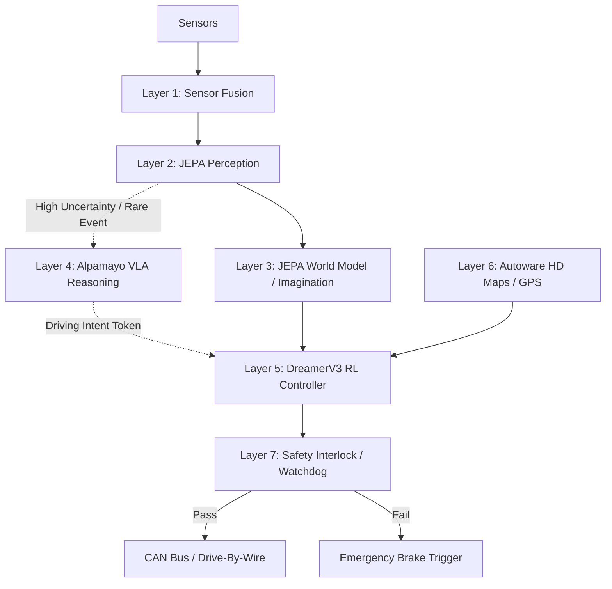

# OMNIDRIVE Architecture Flow

This document details the exact macro and micro architectural data flow of the OMNIDRIVE 7-Layer Autonomous AI.

## Layer 1: Sensor Fusion
**Data Ingestion Pipeline:**
Raw data from physical vehicle hardware enters the system via ROS 2 topics or direct driver APIs.
* **Cameras (8x):** 224x224 RGB at 30Hz. Passed through the `ViTEncoder` for feature extraction.
* **LiDAR (2x):** 3D Point Cloud. Passed through a VoxelNet and projected down to a 2D Bird's Eye View (BEV).
* **Radar (4x):** Doppler shift velocity vectors.
* **Temporal Alignment:** Because a camera frame arrives at t=0ms and a LiDAR sweep finishes at t=12ms, the `TemporalAlignment` module buffers and interpolates all data precisely to `t=current`.
* **Output:** A unified, temporally-aligned multimodal tensor state representing the current physical environment.

## Layers 2 & 3: JEPA Perception & World Model
**The Cognitive Engine:**
Instead of drawing bounding boxes, the system compresses the multimodal tensor state into a dense mathematical representation (Latent Space) using Yann LeCun's Joint-Embedding Predictive Architecture (JEPA).
1. **Context Encoder:** Encodes the unified sensor state into `s_t` (Shape: `Batch, 256, 512`).
2. **Imagination Predictor:** Takes `s_t` and a temporal action offset `z_k` and hallucinates the next 3 seconds of driving `s_hat_{t+k}` at 3.3Hz.
3. **Hazard Energy Field:** It continuously compares its imagined safe future with the true EMA-target future. If the discrepancy (Energy) exceeds 0.70, it triggers a trajectory veto.

## Layer 4: Alpamayo VLA Reasoning (The Fallback)
**The Long-Tail Analyzer:**
Running asynchronously at ~1Hz, the NVIDIA Alpamayo Large Vision-Language-Action model acts as the "slow, deliberate thinking" part of the brain.
* **Trigger:** If the JEPA uncertainty is high, Alpamayo analyzes the front camera feed.
* **Process:** It converts visual anomalies into text (e.g., "A soldier is holding up a stop sign").
* **Output:** It issues a structured driving intent (e.g., `STOP`, `YIELD`, `REROUTE`) down to the Action engine.

## Layer 5: DreamerV3 Model-Based Action Policy
**The Driver:**
The reinforcement learning agent operates entirely inside the JEPA latent space, not the physical world.
* **RSSM (Recurrent State Space Model):** Tracks the deterministic history and stochastic uncertainty of the driving environment.
* **Actor-Critic:** Takes the latent state `s_t` and outputs a squashed continuous action bounded by `[-1.0, 1.0]` for Steering, Throttle, and Brake.
* **Optimization:** It seeks to maximize the `RewardFunction` (route progress) while minimizing safety penalties.

## Layer 6 & 7: Autoware Navigation & Vehicle Safety
**The Rule Enforcers:**
* **Autoware:** Receives GPS coordinates and provides a static path utilizing HD Lanelet2 Maps.
* **Safety Monitor (Watchdog):** Hardcoded CPU-level physics checks. It calculates minimum stopping distances using Newtonian physics ($d = v^2 / 2\mu g$). If the RL agent requests an action that violates physics constraints, the Safety Monitor physically severs the drive command and issues maximum braking force to the CAN bus.

